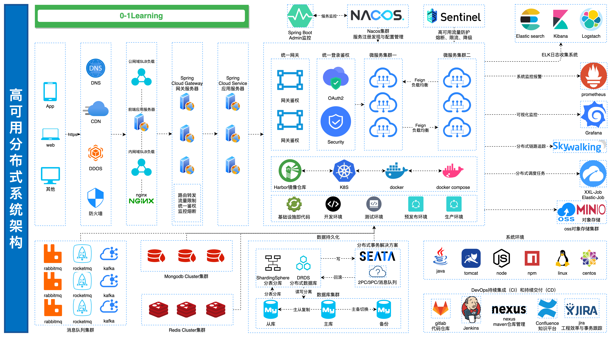

## 项目介绍

`0-1Learning` 项目致力于帮助开发者跨越外行到内行的技术屏障，实现 **0-1** 的技术突破。

### 高可用分布式系统架构（Highly available distributed system architecture）



### 系统技术栈


### 学习路线图（Learning roadmap）

#### 后端路线图（Backend-Roadmap）

#### 运维路线图（Devops-Roadmap）

#### 前端路线图（Frontend-Roadmap）

#### Android路线图（Android-Roadmap）

### 0-1Learning项目组织目录
``````
0-1Learning
├── algorithm -- 算法
    ├── LeetCode -- LeetCode
    ├── logical-question    逻辑算法问题
    ├── Lookup -- 查询算法
    └── sort -- 排序算法
├── android -- 安卓
    ├── 0-1java -- 从0到1学android
        ├── 01认识Android
        ├── 02四大组件——活动Activity
        ├── 03四大组件——服务Service
        ├── 04四大组件——内容提供者content provider
        ├── 05四大组件——广播接收器broadcast receiver
        ├── 06UI和控件
        ├── 07碎片
        ├── 08数据存储
        ├── 09多媒体技术
        ├── 10网络技术
        └── 11Android特色开发
    ├── android-framework -- android系统
    ├── android-senior -- android高级
    ├── android-source-code -- android源码
    ├── android-ui -- android UI
    └── android-widget -- android 小组件
├── bigdata -- 大数据
    ├── hadoop -- hadoop/hdfs
    ├── hive -- sql操作大数据
    ├── scala -- 函数编程
    └── spark -- 大数据计算
├── blockchain -- 区块链
├── computer-network -- 计算机网络结构
├── computer-os -- 计算操作系统
├── data-structure -- 数据结构
├── database -- 数据库
    ├── 0-1database -- 从0到1学database
        ├── 01数据库基础
        ├── 02编写简单的查询语句
        ├── 03条件查询和数据排序
        ├── 04单行函数
        ├── 05多表查询
        ├── 06分组函数
        ├── 07子查询
        ├── 08数据操作与事务控制
        ├── 09表和约束
        └── 10数据库其他对象
    ├── database-senior -- database高级
    ├── database-sql-case -- database数据库案例
    └── mysql开发规范
├── design-pattern -- 设计模式
├── git -- 版本控制
├── html -- html网页
    ├── 0-1html -- 从0到1学html
    ├── 0-1vue -- 从0到1学vue
        ├── 01数据库基础
        ├── 02编写简单的查询语句
        ├── 03条件查询和数据排序
        ├── 04单行函数
        ├── 05多表查询
        ├── 06分组函数
        ├── 07子查询
        ├── 08数据操作与事务控制
        ├── 09表和约束
        └── 10数据库其他对象
    ├── vue-senior -- vue高级 
    ├── vue-widget -- vue小组件
├── interview -- 面试题和面试经验
    ├── interview-case -- 面试题与面试案例 
    └── 简历与自我介绍
└── ios -- ios技术栈
    ├── 0-1ios -- 从0到1学ios
        ├── 01认识Ios
        ├── 02用户界面
        ├── 03界面优化
        ├── 04系统功能
        ├── 05数据存储
        ├── 06多媒体技术
        ├── 07网络技术
        └── 08IOS特色开发
    └── swift语法
└── java -- java技术栈
    ├── 0-1java -- 从0到1学java
        ├── 01认识Java
        ├── 02Java虚拟机简介
        ├── 03变量和运算符
        ├── 04流程控制语句
        ├── 05数组
        ├── 06函数
        ├── 07面对对象基础
        ├── 08面对对象高级特性
        ├── 09异常处理
        ├── 10工具类
        ├── 11集合
        ├── 12文件与流IO
        ├── 13多线程编程
        └── 14网络编程
    ├── java-expand -- java拓展
    ├── java-concurrent -- java并发编程
    ├── java-sourch-code -- java源码
    ├── java-senior -- java高级
    ├── java-spring -- java spring
    ├── java-spring-cloud -- java spring cloud
    ├── jvm -- java虚拟机
    └── java编程规范 --
├── linux -- linux常用操作和命令
    ├── linux软件安装 -- 
    └── linux常用命令 -- 
├── middleware -- 中间件
    ├── docker -- 容器化技术
    ├── elasticSearch -- 搜索引擎
    ├── Grafana -- 可视化工具
    ├── Grafana -- 分布式消息队列
    ├── Kibana -- ES是可视化管理工具
    ├── knife4j -- swagger文档聚合
    ├── minio -- 对象存储中间件
    ├── nacos -- alibaba服务发现与配置管理
    ├── Nginx -- nginx安装、配置
    ├── Prometheus -- Prometheus系统监控报警
    ├── skywalking -- 调用链监控
    ├── xxl-job -- 分布式调度任务
    ├── kafka -- 分布式消息队列
    ├── mongodb -- nosql数据库
    ├── redis -- redis缓存
    └── zookeeper -- 分布式调度
├── orther -- 其他
    ├── key words -- 常见技术关键词释义
    ├── knowledge -- 零散知识点
    ├── Mac-brew使用
    ├── Mac-IDEA快捷键
    ├── Mac-Xcode快捷键
    ├── Mac快捷键
    ├── markdown语法
    ├── oh-my-zsh命令行工具
    ├── vpn代理说明
    ├── 常用软件及安装 -- 常用软件整理收集
    └── 开发软件和环境 -- 各编辑器及环境
└── static -- 静态文件包
``````

## 文档链接
* [逻辑算法](https://github.com/soonphe/0-1Learning/tree/master/algorithm)
    * [leecode](https://github.com/soonphe/0-1Learning/tree/master/algorithm/LeeCode)
    * [logical-question(逻辑题)](https://github.com/soonphe/0-1Learning/tree/master/algorithm/logical-question)

* [java(java技术栈)](https://github.com/soonphe/0-1Learning/tree/master/java)
    * [0-1java(从0到1学java)](https://github.com/soonphe/0-1Learning/tree/master/java/0-1java)
    * [java-concurrent(java并发)](https://github.com/soonphe/0-1Learning/tree/master/java/java-concurrent)
    * [java-senior(java高级)](https://github.com/soonphe/0-1Learning/tree/master/java/java-senior)
    * [java-spring(java-spring相关)](https://github.com/soonphe/0-1Learning/tree/master/java/java-spring)
    * [java-spring-cloud](https://github.com/soonphe/0-1Learning/tree/master/java/java-spring-cloud)
    * [java-源码](https://github.com/soonphe/0-1Learning/tree/master/java/java源码)
    * [java-应用拓展](https://github.com/soonphe/0-1Learning/tree/master/java/java应用拓展)
    * [jvm(java虚拟机)](https://github.com/soonphe/0-1Learning/tree/master/java/jvm)
    * [java编程规范](https://github.com/soonphe/0-1Learning/tree/master/java/java编程规范.md)

* [android(android技术栈)](https://github.com/soonphe/0-1Learning/tree/master/java)
    * [0-1android(从0到1学android)](https://github.com/soonphe/0-1Learning/tree/master/android/0-1android)
    * [android-framework(android系统)](https://github.com/soonphe/0-1Learning/tree/master/android/android-framework)
    * [android-senior(android高级)](https://github.com/soonphe/0-1Learning/tree/master/android/android-senior)
    * [android-ui(android UI相关)](https://github.com/soonphe/0-1Learning/tree/master/android/android-ui)
    
* [database(数据库)](https://github.com/soonphe/0-1Learning/tree/master/database)
    * [0-1database(从0到1学android)](https://github.com/soonphe/0-1Learning/tree/master/database/0-1database)
    * [database-senior(android高级)](https://github.com/soonphe/0-1Learning/tree/master/database/database-senior)
    * [mysql开发规范](https://github.com/soonphe/0-1Learning/tree/master/database/mysql开发规范.md)


## 感谢其他开源作者
>  [LearningNotes](https://github.com/francistao/LearningNotes "")

## 公众号

`0-1Learning`项目全套学习教程连载中，关注公众号「**罗晓胜**」第一时间获取。

加微信群交流，公众号后台回复「**加群**」即可。


## 许可证

Copyright (c) 2020 soonphe