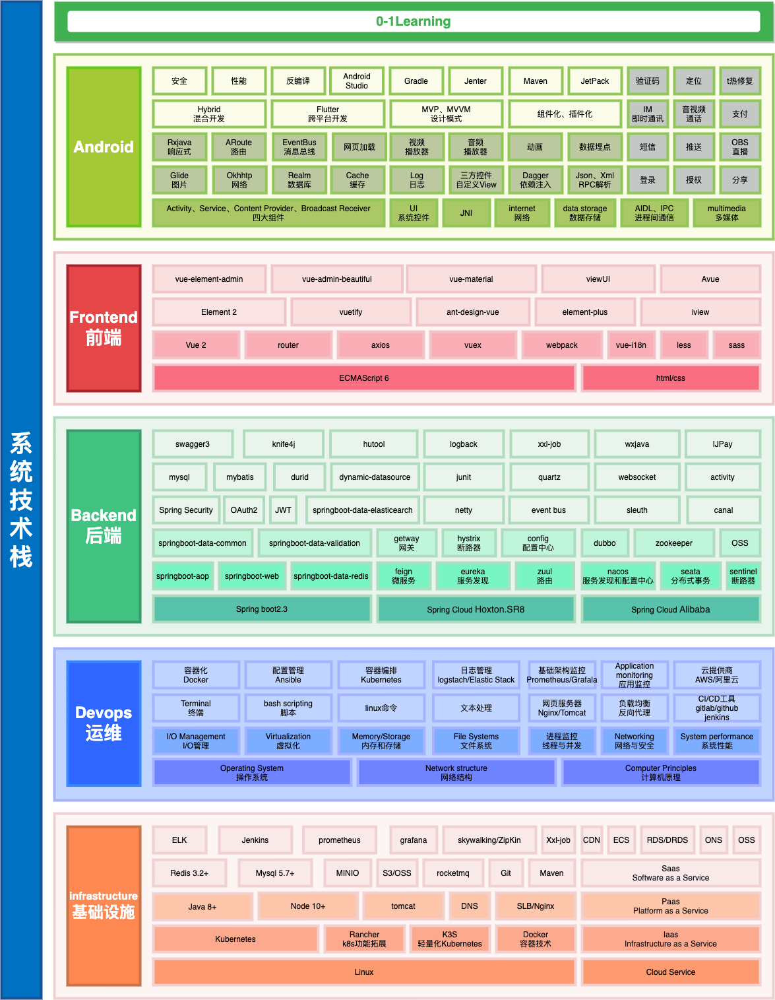
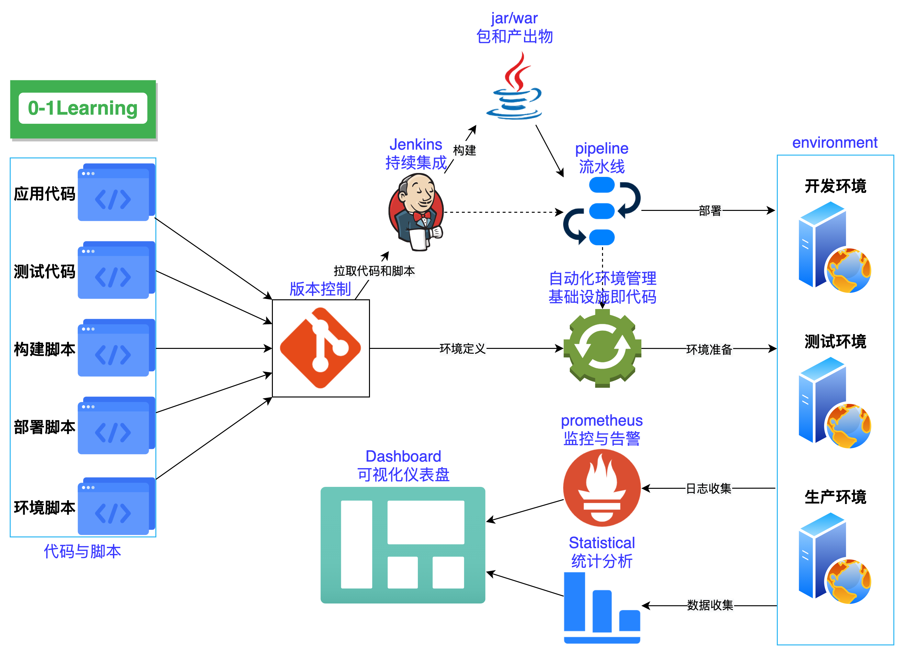

# 0-1Learning

<p align="center">
  
</p>
<p align="center">
  <a href=""></a>
  <a href=""></a>
</p>
<div align="center">
  <h3>
    <strong>Chinese</strong> | <a href="https://github.com/soonphe/0-1Learning/blob/master/README_EN.md">English</a>
  </h3>
</div>

## 目录
- [项目介绍](#项目介绍)
  - [高可用分布式系统架构](#高可用分布式系统架构)
  - [系统技术栈](#系统技术栈)
  - [系统持续交付流水线图](#系统持续交付流水线图)
  - [项目组织目录](#项目组织目录)
- [作者想说的一些话](#作者想说的一些话)
- [在哪里可以免费看我的文章](#在哪里可以免费看我的文章)
  - [github](#github)
  - [公众号](#公众号)
- [在哪里可以免费看我的视频](#在哪里可以免费看我的视频)
  - [YouTube](#YouTube)
  - [tiktok](#tiktok)
- [鸣谢其他开源项目](#鸣谢其他开源项目)


## 项目介绍

`0-1Learning` 项目致力于技术学习的全过程，整理技术思路和经验总结，帮助开发者跨越外行到内行的技术屏障，或许对你有些许帮助，能站在巨人的肩膀上，实现 **0-1** 的技术突破。


### 高可用分布式系统架构(Highly available distributed system architecture)
分布式早已不是一个新鲜词汇了，一个成熟的分布式系统必然会涉及到高可用设计，在有限的资源情况下保证服务的高可用运行

如下，这些技术也许你已经不是很陌生，但也许你还是一个新手，还没接触过以下这些，那么请记住以下这些，以后免不了会打很多交道。


> 这张图基本涵盖了现阶段一个分布式系统所涉及的各个核心组件，对可拓展的组件也可以直接进行添加。图中只有一个组件的并不是指只有一个单节点，各组件可以单节点也可以组成集群对外提供服务。


### 系统技术栈



> 本来还有画一个`学习路线图`（Learning roadmap），帮助新手朋友快速找到一条通往技术大神之路，想了想有些和技术栈重叠太多，索性就合二为一，路线图直接参照下图即可。


### 系统持续交付流水线图


> 比起一般的`项目开发流程图`千人前面，我觉得持续交付这张图更有意义，项目流程怎么开发，最终还是要落到人身上去实现，而人恰恰是不能当做一个稳定节点去进行计算的。
> 对于持续开发交付，应该有这么样一个自动化的过程。在不断的需求迭代中，版本控制，做好持续集成赋能，自动打包和部署，环境初始化完成再分配，最后再形式一个可视化的操作面板，流程可控透明，直接呈现给用户。


### 项目组织目录
``````
0-1Learning
├── algorithm -- 算法
    ├── case -- 常见算法案例
    ├── logical-question    逻辑算法问题
    └── sort -- 常见排序算法
├── android -- 安卓
    ├── 0-1java -- 从0到1学android
        ├── 01认识Android
        ├── 02四大组件——活动Activity
        ├── 03四大组件——服务Service
        ├── 04四大组件——内容提供者content provider
        ├── 05四大组件——广播接收器broadcast receiver
        ├── 06UI和控件
        ├── 07碎片
        ├── 08数据存储
        ├── 09多媒体技术
        ├── 10网络技术
        └── 11Android特色开发
    ├── android-senior -- android高级
    ├── android-source-code -- android源码
    ├── android-ui -- android UI
    └── android-widget -- android 小组件
├── bigdata -- 大数据
    ├── hadoop -- hadoop/hdfs
    ├── hive -- sql操作大数据
    ├── scala -- 函数编程
    └── spark -- 计算引擎
├── blockchain -- 区块链
    ├── solidity -- 智能合约编程语言
    └── web3 -- 框架
├── computer-network -- 计算机网络结构
├── computer-os -- 计算操作系统
├── data-structure -- 数据结构
├── database -- 数据库
    ├── 0-1database -- 从0到1学database
        ├── 01数据库基础
        ├── 02编写简单的查询语句
        ├── 03条件查询和数据排序
        ├── 04单行函数
        ├── 05多表查询
        ├── 06分组函数
        ├── 07子查询
        ├── 08数据操作与事务控制
        ├── 09表和约束
        └── 10数据库其他对象
    ├── database-senior -- database高级
    ├── database-sql-case -- database数据库案例
    └── mysql开发规范
├── design -- 设计
├── design-pattern -- 设计模式
├── document -- 文档管理桂芬 
├── git -- 版本控制
├── html -- html网页
    ├── 0-1html -- 从0到1学html
    ├── 0-1vue -- 从0到1学vue
        ├── 01数据库基础
        ├── 02编写简单的查询语句
        ├── 03条件查询和数据排序
        ├── 04单行函数
        ├── 05多表查询
        ├── 06分组函数
        ├── 07子查询
        ├── 08数据操作与事务控制
        ├── 09表和约束
        └── 10数据库其他对象
    ├── vue-senior -- vue高级 
    ├── vue-widget -- vue小组件
├── interview -- 面试题和面试经验
    ├── interview-case -- 面试题与面试案例 
    └── interview-summary -- 面试总结
└── ios -- ios技术栈
    ├── 0-1ios -- 从0到1学ios
        ├── 01认识Ios
        ├── 02用户界面
        ├── 03界面优化
        ├── 04系统功能
        ├── 05数据存储
        ├── 06多媒体技术
        ├── 07网络技术
        └── 08IOS特色开发
    └── swift语法
└── java -- java技术栈
    ├── 0-1java -- 从0到1学java
        ├── 01认识Java
        ├── 02Java虚拟机简介
        ├── 03变量和运算符
        ├── 04流程控制语句
        ├── 05数组
        ├── 06函数
        ├── 07面对对象基础
        ├── 08面对对象高级特性
        ├── 09异常处理
        ├── 10工具类
        ├── 11集合
        ├── 12文件与流IO
        ├── 13多线程编程
        └── 14网络编程
    ├── java-concurrent -- java并发编程
    ├── java-expand -- java拓展
    ├── java-reading-notes -- java读书笔记
    ├── java-senior -- java高级
    ├── java-sourch-code -- java源码
    ├── java-spring -- 
    ├── java-spring-boot -- 
    ├── java-spring-cloud -- 
    ├── jvm -- java虚拟机
    └── java编程规范 --
├── linux -- linux常用操作和命令
    ├── linux软件安装 -- 
    └── linux常用命令 -- 
├── middleware -- 中间件
    ├── docker -- 容器化技术
    ├── elasticSearch -- 搜索引擎
    ├── Grafana -- 可视化工具
    ├── Grafana -- 分布式消息队列
    ├── Kibana -- ES是可视化管理工具
    ├── knife4j -- swagger文档聚合
    ├── minio -- 对象存储中间件
    ├── nacos -- alibaba服务发现与配置管理
    ├── Nginx -- nginx安装、配置
    ├── Prometheus -- Prometheus系统监控报警
    ├── skywalking -- 调用链监控
    ├── xxl-job -- 分布式调度任务
    ├── kafka -- 分布式消息队列
    ├── mongodb -- nosql数据库
    ├── redis -- redis缓存
    └── zookeeper -- 分布式调度
├── other -- 其他
├── tools -- 工具整理
    ├── Mac-homebrew使用
    ├── Mac-IDEA快捷键
    ├── Mac-Xcode快捷键
    ├── Mac快捷键
    ├── oh-my-zsh命令行工具
    ├── vpn代理说明
    └── 常用软件及安装
└── static -- 静态文件包
``````

## 作者想说的一些话


## 在哪里可以免费看我的文章

### github
>  [0-1Learning](https://github.com/soonphe/0-1Learning "")
> 

### 公众号
公众号已发布 `0-1Learning` 部分文章，另有更多好文，等待你的探索，关注公众号「**罗晓胜**」第一时间获取。


## 在哪里可以免费看我的视频

文字终究表达有限，视频效果会比文字好很多。

**视频内容想到哪就拍到哪了，什么好玩就拍什么了，也不想给自己规定个什么内容了，以后的事，谁说得准呢！**

尽量会在全平台投稿，Youtube、tiktok、B站等，关注「**罗晓胜**」第一时间获取。

如有任何疑问给我留言吧，能力范围内都会回复！记得互动支持喔！

> `注意，作者不会主动联系任何人`，**任何冒充作者主动联系你都是骗子！！！**
> 
> `注意，涉及金钱交易的，请核实再核实后操作，以免上当受骗`


## 鸣谢其他开源项目
好多项目都不开源了，这里有借鉴其他开源项目，本项目也会一直开源


## 许可证

Copyright (c) 2020 soonphe