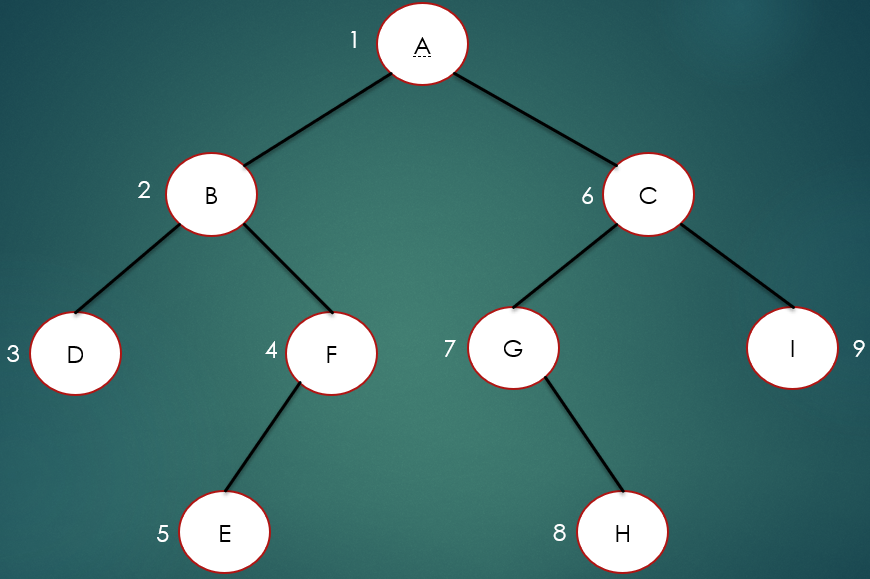

# 0-1Learning


## 二叉树的四种遍历方式

### 前言
二叉树的遍历（traversing binary tree）是指从根结点出发，按照某种次序依次访问二叉树中所有的结点，使得每个结点被访问依次且仅被访问一次。
四种遍历方式分别为：先序遍历、中序遍历、后序遍历、层序遍历。

### 创建一个二叉树
遍历之前，我们首先介绍一下，如何创建一个二叉树，在这里用的是先建左树在建右树的方法，

首先要声明结点TreeNode类，代码如下：
````
public class TreeNode {
    public int data;
    public TreeNode leftChild;
    public TreeNode rightChild;

    public TreeNode(int data){
        this.data = data;
    }

}
````
再来创建一颗二叉树：
````
    /**
     * 构建二叉树
     * @param list   输入序列
     * @return
     */
    public static TreeNode createBinaryTree(LinkedList<Integer> list){
        TreeNode node = null;
        if(list == null || list.isEmpty()){
            return null;
        }
        Integer data = list.removeFirst();
        if(data!=null){
            node = new TreeNode(data);
            node.leftChild = createBinaryTree(list);
            node.rightChild = createBinaryTree(list);
        }
        return node;
    }
````

###


### 前序遍历
如上图所示，前序遍历结果为：ABDFECGHI

实现代码如下：
````
    /**
     * 二叉树前序遍历   根-> 左-> 右
     * @param node    二叉树节点
     */
    public static void preOrderTraveral(TreeNode node){
        if(node == null){
            return;
        }
        System.out.print(node.data+" ");
        preOrderTraveral(node.leftChild);
        preOrderTraveral(node.rightChild);
    }
````


### 中序遍历
再者就是中序遍历，所谓的中序遍历就是先访问左节点，再访问根节点，最后访问右节点，

````
    /**
     * 二叉树中序遍历   左-> 根-> 右
     * @param node   二叉树节点
     */
    public static void inOrderTraveral(TreeNode node){
        if(node == null){
            return;
        }
        inOrderTraveral(node.leftChild);
        System.out.print(node.data+" ");
        inOrderTraveral(node.rightChild);
    }
````


### 后序遍历
最后就是后序遍历，所谓的后序遍历就是先访问左节点，再访问右节点，最后访问根节点。
如上图所示，后序遍历结果为：DEFBHGICA

实现代码如下：
````
    /**
     * 二叉树后序遍历   左-> 右-> 根
     * @param node    二叉树节点
     */
    public static void postOrderTraveral(TreeNode node){
        if(node == null){
            return;
        }
        postOrderTraveral(node.leftChild);
        postOrderTraveral(node.rightChild);
        System.out.print(node.data+" ");
    }
````

### 归纳总结
还是一样，先看非递归前序遍历

首先申请一个新的栈，记为stack；
声明一个结点treeNode，让其指向node结点；
如果treeNode的不为空，将treeNode的值打印，并将treeNode入栈，然后让treeNode指向treeNode的右结点，
重复步骤3，直到treenode为空；
然后出栈，让treeNode指向treeNode的右孩子
重复步骤3，直到stack为空.

实现代码如下：
````
public static void preOrderTraveralWithStack(TreeNode node){
        Stack<TreeNode> stack = new Stack<TreeNode>();
        TreeNode treeNode = node;
        while(treeNode!=null || !stack.isEmpty()){
            //迭代访问节点的左孩子，并入栈
            while(treeNode != null){
                System.out.print(treeNode.data+" ");
                stack.push(treeNode);
                treeNode = treeNode.leftChild;
            }
            //如果节点没有左孩子，则弹出栈顶节点，访问节点右孩子
            if(!stack.isEmpty()){
                treeNode = stack.pop();
                treeNode = treeNode.rightChild;
            }
        }
    }
````


