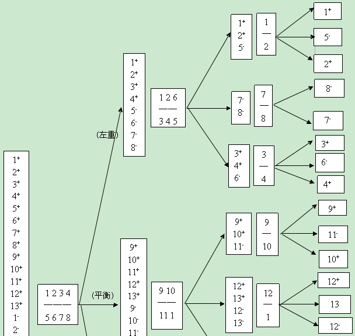
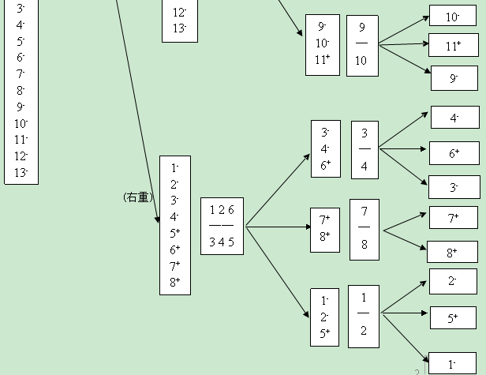

# 0-1Learning

## 称球问题

### 问题

有13个球，其中12个重量相同，只有一个次品不知道是轻了还是重了。请用天平称三次，将这个次品找出来。

### 问题分析
  13个球要称量，肯定要分成3堆。因为去天平比重肯定是两边数量相等的个数才知道是哪边有次品。
  问题的关键是怎么分，更为关键的是不放到天平上的那堆放多少个，不外乎只能考虑3，5，7个。
  若放7个，怕是傻了，次品不知道是轻或重，剩下两次怎么分得清？3个，太天真了。
  最可能是5个。蒙对了这数目，省你不少力气，不然要多费一层思考的堆栈来排除了。
  

  
### 类似问题
  问题2：有12个球，已知其中11个重量相同，另一个不知道是否是次品。请用天平称三次，确定其中有无次品，如果有的话，将这个次品找出来，并确定其是偏轻还是偏重。
  
### 问题拓展

    称球问题的一般性问题如下：

    用天平称k次，在n个球中找出唯一的一个重量不标准的次品球，n最大是多少？如何找？其中关于这个次品球的说法，通常有3种变形：

    1. 已知次品球是更轻(或更重)；

    2. 不知次品球的轻重，找出它即可，无需确定其轻重；(例如问题1)

    3、不知次品球的轻重，找出它并确定其轻重。(例如问题2)

    在这3种情形下，n的最大值分别如下：

    1. 已知次品球是更轻(或更重)，这时n的最大值 = 3^k；

    2. 不知次品球的轻重，这时n的最大值 = (3^k-1)/2；

    3. 不知次品球的轻重，找出它并确定其轻重，这时n的最大值 = (3^k-3)/2。
    
    对于第1种情况，如果已知次品比正品重(或轻)，就把这堆球三等分，将任意两堆放到天平两边称一次，即可确定次品是在哪一堆，一直重复这三等分法，就能确定次品是哪一个。所以称k次最多可以分辨3^k个球。
    对于后面2种情况：研究一般性问题最好的方法是先看简单特殊的问题，从直观中找出思路。