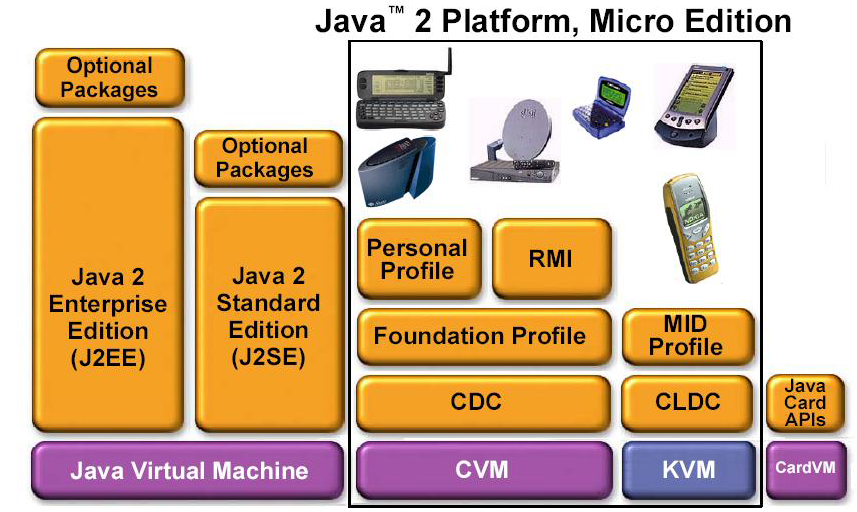

# 0-1Learning


## 认识Java

## 目录
- [Java简介](#Java简介)
- [Java语言的版本](#Java语言的版本)
- [Java语言是什么？它的主要特点？](#Java语言是什么？它的主要特点？)
- [JDK安装与环境配置](#JDK安装与环境配置)
- [Mac下查看已安装的jdk版本及其安装目录](#Mac下查看已安装的jdk版本及其安装目录)
- [第一个Java程序](#第一个Java程序)
- [注释的使用](#注释的使用)
- [空白符和行号](#空白符和行号)
- [类和主函数](#类和主函数)
- [修饰符](#修饰符)


### Java简介
* JVM是Java Virtual Machine（Java虚拟机）的缩写，
* JVM是一种用于计算设备的规范，它是一个虚构出来的计算机，是通过在实际的计算机上仿真模拟各种计算机功能来实现的。
* Java语言的一个非常重要的特点就是与平台的无关性。而使用Java虚拟机是实现这一特点的关键
* JVM屏蔽了与具体操作系统平台相关的信息，使Java程序只需生成在Java虚拟机上运行的目标代码（字节码）,就可以在多种平台上不加修改地运行。JVM在执行字节码时，实际上最终还是把字节码解释成具体平台上的机器指令执行。

### Java语言的版本
* Java Enterprise Edition(J2EE) 采用标准化的模块组件，为企业级应用提供了标准平台，简化复杂的企业级编程。并已经成为一种软件架构和企业级开发的设计思想。
* Java Standard Edition(J2SE) 包含标准的JDK、开发工具、运行时环境和类库。适合开发桌面应用程序和底层应用程序。同时它也是Java EE的基础平台。
* Java Micro Edition(J2ME) 包含高度优化精简的java运行时环境，专门针对一些小型的消费电子产品。


### Java语言是什么？它的主要特点？
> Java语言是什么
> 
> Sun的定义：一种简单、面向对象、分布式、跨平台、半编译半解释、健壮、安全、高性能、多线程的动态的语言。 实际上它不仅是一门语言，更是一个平台。它还提供了开发类库、运行环境、部署环境等一系列支持。

Java语言的特点：
- 简单
- 跨平台
- 面向对象
- 分布式
- 半编译半解释
- 健壮
- 安全
- 性能很优异
- 多线程
- 动态
    
**面向对象的特征** **Everything is object**
  * **继承**	是一种联结类的层次模型，并且允许和鼓励类的重用，它提供了一种  明确表述共性的方法。对象的一个新类可以从现有的类中派生，这个过程称为类继承。新类继承了原始类的特性，新类称为原始类的派生类（子类），而原始类称为新类的基类（父类）。派生类可以从它的基类那里继承方法和实例变量，并且类可以修改或增加新的方法使之更适合特殊的需要
  * **封装**	是把过程和数据包围起来，对数据的访问只能通过已定义的界面。面 向对象设计始于这个基本概念，即现实世界可以被描绘成一系列完全自治、封装 的对象，这些对象通过一个受保护的接口访问其他对象。
  * **多态**	多态性是指允许不同类的对象对同一消息作出响应。多态性包括参数  化多态性和包含多态性。多态性语言具有灵活、抽象、行为共享、代码共享的优势，很好的解决了应用程序函数同名问题。
  * **抽象**	就是忽略一个主题中与当前目标无关的那些方面，以便更充分地注意 与当前目标有关的方面。抽象并不打算了解全部问题，而只是选择其中的一部分， 暂时不用部分细节。抽象包括两个方面，一是过程抽象，二是数据抽象。

**健壮**
* Java提供了自动垃圾收集机制来进行内存管理，并检测程序 对内存的访问，确定合法并不会引起任何问题后，才允许访问。
* Java还提供了异常处理机制用来检查编译及运行时可能出现 的问题，帮助程序员消除错误，防止系统崩溃。

**Java语言与C/C++的比较**
* 自动内存管理：Java对于内存的分配是动态的，并具有垃圾 回收机制。
* 不在类外定义全局变量。
* Java中将不再使用goto语句。
* Java中取消了指针。
* 运行时系统对类型转换进行类型相容性检查
* Java不支持头文件，使用import与其它类通讯。
* Java中不包含结构和联合；所有的内容都封装在类中。
* Java中不支持宏，它通过final关键字来声明一个常量。
* Java不支持多重继承，可以通过Java中的接口实现多重继承 的功能。

### JDK安装与环境配置
* 安装jdk1.8
* 配置环境变量：
   1. JAVA_HOME: your_path\Java\jdk1.8.0_04
   2. Path:your_path\Java\jdk1.8.0_04\bin(注意：要写在所有值的最前端否则找 不到该路径)
   3. CLASSPATH:	.这个“ . ”表示：指向当前目录。
   4. 在命令提示行下：javac	-version  或使用`java -version`	回车运行，如果能看到版本信息则OK.

* mac环境变量：
```
#java
JAVA_HOME=/Library/Java/JavaVirtualMachines/jdk1.8.0_211.jdk/Contents/Home
export JAVA_HOME
CLASS_PATH="$JAVA_HOME/lib"
PATH=".$PATH:$JAVA_HOME/bin"
```

### Mac下查看已安装的jdk版本及其安装目录
查看JDK详细信息，如安装路径、是否多个版本等：
```
/usr/libexec/java_home -V
```
可以看到，JDK bin目录：cd /Library/Java/JavaVirtualMachines/jdk1.8.0_211.jdk/Contents/Home/bin/

如果不小心安装了多个jdk，如存在Oracle JDK等，想要移除
```
移除Oracle JDK：
sudo rm -fr /Library/Internet\ Plug-Ins/JavaAppletPlugin.plugin
```

### 第一个Java程序
▊ 如何写第一个Java程序

```
public class HelloWorld {
    public static void main(String args[ ]) {
        System.out.println(“Hello World!”);
    }
}
```

**保存 HelloWorld 源代码**
* 所有代码必须保存为扩展名 .java,源文件名称必须和类名相同,class 关键字后面的即类名
* 正确的文件名为：HelloWorld.java
* 编译源代码：javac HelloWorld.java
* 运行程序：java HelloWorld

这是所有Java程序员入门时都写过的代码，放到JDK中运行（JDK是运行java程序必备的环境，这也是写Java代码之前必装的软件，没有JDK就执行不了Java程序）

那么就有以下几个问题

1.我用什么写

老实说，你可以用记事本写，就是新建一个txt文档，使用ctrl+c，和ctrl+v 复制粘贴代码就行，然后改一下文件后缀，例：HelloWorld.java

当然，熟悉的人一般会用编辑器开发，例如IDEA或者Eclipse，这比文本写代码要方便、快捷、效率得多，当然，他们的本质都是敲写代码

2.我放在哪

放哪都行，放桌面或者放文件夹都可以，不过我建议最好一开始就养好习惯，专门的东西放到专门的地方，建好文件夹，要知道养成一个良好的习惯会在将来给你带来的好处会越来愈多，写代码只是软件行业中很小的一部分，决定你高度的，最重要的还是思维和习惯，这个就不展开讲了。

3.我怎么运行

java执行程序有两步，

第一步是编译，命令行输入`javac HelloWorld.java `生成 HelloWorld.class 文件,这里的class文件是jdk会执行的文件，日后我们部署也是用class文件或class文件集合，class文件是编译之后的字节码文件，class文件是可以运行在任何支持Java虚拟机的硬件平台和操作系统上的二进制文件，现在记住这些名词就行。

第二步执行，命令行输入`java HelloWorld`，然后你就会在窗口看到Hello World的输出。

很简单对吧，其实就是很简单的，你要干嘛，把程序写好，交给他执行就可以了，现在的编程语言都是高级语言，相比以前那些晦涩难懂的语言已经进步太多了。

你可能不要只写这么一个Hello World，但是你能写出来这个程序，就已经算是开始入门软件开发了。

很多很复杂的东西就是这么一个个简单的东西拼凑起来的，不要急，后面要学的东西还很多，学不完的你放心。

**Java运行的原理**
1. 编译源文件：java源代码被java编译器编译（Compile)。如果这时产生错误，我们称为编译错误。如果没有错误，则生成字节码 （byte code）。

    程序在操作系统中运行，最终都要变成为二进制的CPU指令，即本地代码（机器码）。这里的字节码和本地码都是二进制代码，很相似，只有略微区别。字节码是和平台无关的二进制代码，而本地代码则和平台密切相关。

2. 运行字节码：这里，java字节码被装载到java虚拟机中，解释成本地代码再运行。如果此时产生错误，我们称之为运行时错误 （Runtime）。

### 注释的使用
```
1. 单行注释
// test
2. 多行注释
/**
 * 
 * @author xxx
 * @since 1.0
 */
```

### 空白符和行号
```
01	/*
02	* HelloWorld example
03	*/
04	
05	public class HelloWorld {
06	
07	    public static void main(String args[ ]) {
08	
09	        System.out.println(“Hello World!”);
10	
11	    }
12	
13	}
```
第4行就是空白符，还有哪些空白符？

行号一般由编程工具自动生成，方便程序的调试。在书写源代码时不要录入行号！
    
### 类和主函数
* 类，是Java程序最基本的组件，包含了程序运行需要的所有属性和方法，class 关键字后面的即类名，源文件名称必须和类名相同
* 主函数，方法main()是Java程序运行的起始点，即入口
* main()方法必须是public static void 类型的，java中必须有main函数，java虚拟机通过main方法找到需要启动的运行程内序，并且检查main函数容所在类是否被java虚拟机装载。如果没有装载，那么就装载该类，并且装载所有相关的其他类。因此程序在运行的时候，第一个执行的方法就是main()方法。通常情况下，如果要运行一个类的方法，必须首先实例化出来这个类的一个对象，然后通过"对象名.方法名()"的方式来运行方法，但是因为main是程序的入口，这时候还没有实例化对象，因此将main方法声明为static的，这样这个方法就可以直接通过“类名.方法名()”的方式来调用。
* main()方法变量，当缺少String[]args时，虽然编译可以通过，但是运行时无法获取有效的main方法，运行时候会报错。但方法参数名字args可以改变。
* main()方法返回值：对于java中的main方法，jvm有限制，不能有返回值，因此返回值类型为void。

### 修饰符
* 访问控制修饰符：Java中，可以使用访问控制符来保护对类、变量、方法和构造方法的访问。Java 支持 4 种不同的访问权限。
    * default (即默认，什么也不写）: 只能在同一包内可见，不使用任何修饰符。使用对象：类、接口、变量、方法。
    * private : 在同一类内可见。使用对象：变量、方法。 注意：不能修饰外部类
    * public : 对所有类可见。使用对象：类、接口、变量、方法
    * protected : 对同一包内的类和所有子类可见。使用对象：变量、方法。 注意：不能修饰外部类。

* 非访问修饰符：为了实现一些其他的功能，Java 也提供了许多非访问修饰符。
    * static 修饰符，用来修饰类方法和类变量。
    * final 修饰符，用来修饰类、方法和变量，final 修饰的类不能够被继承，修饰的方法不能被继承类重新定义，修饰的变量为常量，是不可修改的。
    * abstract 修饰符，用来创建抽象类和抽象方法。
    * synchronized 和 volatile 修饰符，主要用于线程的编程。
    