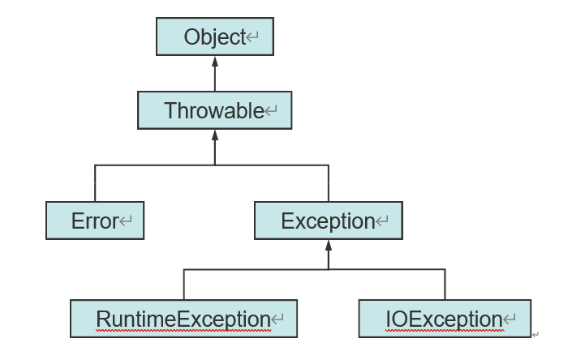

# 0-1Learning


## 异常处理

### 简介
* 异常是程序中的一些错误，但并不是所有的错误都是异常，并且错误有时候是可以避免的。比如说，你的代码少了一个分号，那么运行出来结果是提示是错误 java.lang.Error；如果你用System.out.println(100/0)，那么你是因为你用0做了除数，会抛出 java.lang.ArithmeticException 的异常。

### 要点
* 异常类的继承关系
* 抓抛模型
* try-catch-finally关键字
* throw和throws关键字

### 异常是什么
* 异常 是在程序执行过程中发生的一些不希望发生的事情，这些事情如果不被好好处理，就会导致奇怪的结果或者是程序终结。Exception Hander是那些当异常发生时处理这些异常的代码。java和javascript都用try／catch来处理异常。​
* 程序运行过程时都可能发生会打断程序正常执行的事件。比如除数为零0、数组下标越界、文件找不到、内存不足等。

* Java异常处理
    * 利用抓抛模型处理异常
    * 利用面向对象的方法来处理异常

### 异常类型
* 产生一个异常就是由系统（JVM）自动的实例化一个异常类的 对象。
    * 称为抛出异常

* 异常的继承树
    * 检查性异常（checked exception）
    * 非检查性异常（unchecked exception）


### Java异常架构
#### Throwable 结构
    * Throwable是 Java 语言中所有错误或异常的超类。 
    * Throwable包含了其线程创建时线程执行堆栈的快照，它提供了printStackTrace()等接口用于获取堆栈跟踪数据等信息。
    * Throwable包含两个子类:
        * Error
            * 和Exception一样， Error也是Throwable的子类。 它用于指示合理的应用程序不应该试图捕获的严重问题，大多数这样的错误都是异常条件。 
            * 和RuntimeException一样， 编译器也不会检查Error。
        * Exception
            * Exception及其子类是 Throwable 的一种形式，它指出了合理的应用程序想要捕获的条件。
            * RuntimeException
                * RuntimeException是那些可能在 Java 虚拟机正常运行期间抛出的异常的超类。 
                * 编译器不会检查RuntimeException异常。 例如，除数为零时，抛出ArithmeticException异常。RuntimeException是ArithmeticException的超类。当代码发生除数为零的情况时，倘若既"没有通过throws声明抛出ArithmeticException异常"，也"没有通过try...catch...处理该异常"，也能通过编译。这就是我们所说的"编译器不会检查RuntimeException异常"！ 
                * 如果代码会产生RuntimeException异常，则需要通过修改代码进行避免。 例如，若会发生除数为零的情况，则需要通过代码避免该情况的发生！


#### Throwable三种类型： 
* 被检查的异常(Checked Exception)
* 运行时异常(RuntimeException)
* 错误(Error)。
1. 运行时异常 
    * 定义 : RuntimeException及其子类都被称为运行时异常。 
    * 特点 : Java编译器不会检查它。 也就是说，当程序中可能出现这类异常时，倘若既"没有通过throws声明抛出它"，也"没有用try-catch语句捕获它"，还是会编译通过。例如，除数为零时产生的ArithmeticException异常，数组越界时产生的IndexOutOfBoundsException异常，fail-fail机制产生的ConcurrentModificationException异常等，都属于运行时异常。 
    * 虽然Java编译器不会检查运行时异常，但是我们也可以通过throws进行声明抛出，也可以通过try-catch对它进行捕获处理。 
    * 如果产生运行时异常，则需要通过修改代码来进行避免。 例如，若会发生除数为零的情况，则需要通过代码避免该情况的发生！

2. 被检查的异常 
    * 定义 :  Exception类本身，以及Exception的子类中除了"运行时异常"之外的其它子类都属于被检查异常。 
    * 特点 : Java编译器会检查它。 此类异常，要么通过throws进行声明抛出，要么通过try-catch进行捕获处理，否则不能通过编译。
    * 例如，CloneNotSupportedException就属于被检查异常。当通过clone()接口去克隆一个对象，而该对象对应的类没有实现Cloneable接口，就会抛出CloneNotSupportedException异常。 
    * 被检查异常通常都是可以恢复的。

3. 错误 
    * 定义 : Error类及其子类。 
    * 特点 : 和运行时异常一样，编译器也不会对错误进行检查。 
    * 当资源不足、约束失败、或是其它程序无法继续运行的条件发生时，就产生错误。程序本身无法修复这些错误的。例如，VirtualMachineError就属于错误。 
    * 按照Java惯例，我们是不应该是实现任何新的Error子类的！

* 说明： 对于上面的3种结构，我们在抛出异常或错误时，到底该哪一种？《Effective Java》中给出的建议是： 对于可以恢复的条件使用被检查异常，对于程序错误使用运行时异常。


### 常见异常
* 运行时异常：
    * ArithmeticException:算术溢出异常
    * ClassCastException:类型转换异常
    * IllegalClassFormatException：方法参数的数据类型不正确
    * NullPointerException:空指针异常
    * ArrayIndexOutOfBoundsException:数组越界


* 检查异常：
    * ClassNotFoundException：找不到类异常
    * InterruptedException:中断异常
    * IOException：输入输出流异常
    * FileNotFoundException:找不到文件异常


### 方法调用堆栈
* 后进先出

### 抛出异常对象
``````
Exception in thread "main" 
    java.lang.ArrayIndexOutOfBoundsException: 5 
    at Sample.methodThree(Sample.java:17)
    at Sample.methodTwo(Sample.java:13) 
    at Sample.methodOne(Sample.java:9) 
    at Sample.main(Sample.java:5)
Press any key to continue...
``````

### 捕获异常
* try块和catch块try块和catch块
* catch块，是用来捕获并处理try块抛出的异常的代码块。没有try块，catch块不能单独存在。我们可以有多个catch块，以捕获不同类型的异常。

``````
try{
	System.out.println(arr[3]);
	System.out.println("Three"); 19	
} catch(ArrayIndexOutOfBoundsException ex){
    System.out.println("catched"); 
}

``````

### 抓抛模型
* 如果程序抛出多个不同类型的异常，我们需要多个catch()语句来处理。
* 和特殊异常类相关联的catch()块必须写在和普 通异常类相关联的catch() 之前。

### finally块
* 在try-catch之后存在finally 块，表示执行try-catch块以后，无论有无抛出Exception，最后必须执行finally块的代码。
* 通常在finally块中编写将资源返还给系统的语句，它一般包括：
* 释放动态分配的内存块
* 关闭文件
* 关闭数据库结果集
* 关闭与数据库建立的连接

### throw语句
* 二次抛出
``````
catch(Exception e) {
System.out.println("一个异常已经产生"); throw e;
}

throw new IOException();
``````

#### throws声明方法抛出异常
* throws用来声明一个成员函数可能抛出的各种“异常”
* 位置：函数头的后面
* 方法中如果抛出：
    * 非检查性异常：去除Bug，直到不抛出异常；
    * 检查性异常
* 不进行处理，编译通不过。
* 在该函数内try-catch，把异常处理掉。那么不往上一级抛出异常，程序正常执行，上一级方法并不知道曾经产生异常。
* 用throws声明方法抛出异常，不进行处理。谁调用谁 负责处理。


``````
01	class ThrowsDemo{
02	public static void proc( ) throws IOException{ 
03		System.out.println("inside proc");
04		throw new IOException("ThrowsDemo"); 
05	}
06	public static void main(String args[ ]){ 
07		try{
08	        proc ();
09	    }catch(IOException e){
10		    System.out.println("caught"+e); 
11	    }
12	}
13 }
``````

### 用户自定义异常

* 如果Java提供的异常类型不能满足程序设计的需要，我们可以
定义自己的异常类型。

* 继承Exception类或其子类


