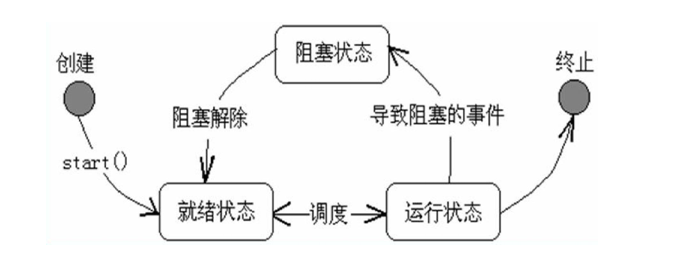
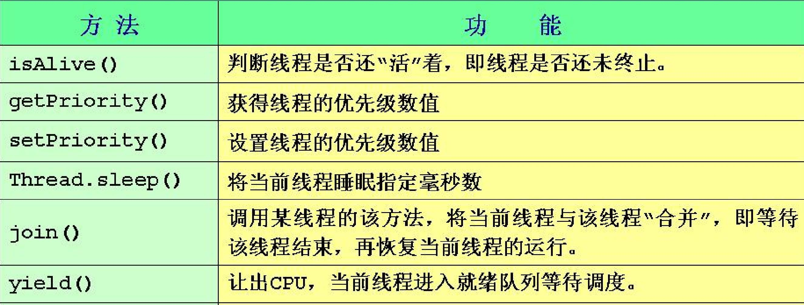

# 0-1Learning


## 多线程编程

### 简介
进程和线程

一个程序就是一个进程，而一个程序中的多个任务则被称为线程。

进程是表示资源分配的基本单位，线程是进程中执行运算的最小单位，亦是调度运行的基本单位。

进程才是资源分配的最小单位，线程是CPU分配的最小单位，线程所拥有的最重要的资源是：它拥有独立的CUP时间片。

一个进程中的所有线程共享进程中的全局变量，堆和环境字符串。但它拥有自己的栈（即存放局部变量的地方）。

​举个例子：

打开你的计算机上的任务管理器，会显示出当前机器的所有进程，QQ，360等，当QQ运行时，就有很多子任务在同时运行。比如，当你边打字发送表情，边好友视频时这些不同的功能都可以同时运行，其中每一项任务都可以理解成“线程”在工作。

### 要点
* 多线程简介
    * 多线程模型
* 多线程实现的两种方式
    * 实现Runnable接口
    * 继承Thread类
* 线程的属性和控制
    * 线程状态及其生命周期
    * 线程类的主要方法
    * 休眠和中断
* 多线程同步/通信问题
    * 线程同步，锁和死锁


### 多线程简介
#### 基本概念
    * 进程计算机在执行的程序的实体
    * e.g. 一个.class文件 一个.exe文件 ……
    * 线程 一个程序内部的顺序控制流
    * 一个进程中可以包含 一个或多个线程，一个线程就是一个程序内部的一条执行线索

#### 进程/线程区别
* 进程和线程的区别
    * 每个进程都有独立的代码和数据空间，进程的切换 会有很大的开销
    * 同一类线程共享代码和数据空间，每个线程有独立 运行的栈和程序计数器，线程切换的开销小
* 多进程和多线程
    * 多进程：在操作系统中能同时运行多个任务（程序）
    * 多线程：在同一应用程序中有多个顺序流同时执行
    
#### 多线程实现的两种方式
* 多线程的实现
(1)	创建线程类
        * 继承Thread类	或
        * 实现Runnable接口
(2)	通过Thread类构造器来创建线程对象
        * Thread( )
        * Thread(Runnable target)
(3)	通过start()方法激活线程对象

* 创建线程的两种方式 — 线程类
    * 继承Thread类—— java.lang.Thread
    * 实现Runnable接口 —— java.lang.Runnable

* run( )方法 — 线程运行体
    * 要将一段代码（线程体）在一个新的线程上运行，该代码应该在一 个线程类的run( )函数中
        * 写一个类implements Runnable接口，且必须覆盖Runnable接口中的run( )方法
        * 写一个类extends Thread类，且必须重写Thread类的run( )方法

* 继承Thread类
    * 定义线程类继承Thread类
    * 覆盖run( )方法public void run( )
``````
public class ThreadDemo extends Thread{

    public void run(){
        //代码块
    }
}
public class TestThread{

    public static void(string[] args){
        ThreadDemo t = new ThreadDemo();
        t.start;
        //代码块
    }
    public void run(){
        //代码块
    }
}
//说明 run( ) 与 start( ): run是单线程运行，start是多线程执行
``````
* 实现Runnable接口
    * 定义线程类实现
Runnable接口
线程共享同样的数据和代码
    * 覆盖Runnable接口中的唯一的方法public void run( )
``````
public class RunnableDemo implement Runnable{

    public void run(){
        //代码块
    }
}
``````
* 两种方式的比较
    * 使用Runnable接口可以避免由于JAVA的单继承性带来的局限
    * 适合多个相同的程序代码的线程去处理同一资源情况，把线程同 程序的代码、数据有效的分离
        * 推荐使用实现Runnable

### 线程状态及其生命周期

* 线程的状态及其生命周期
    * 一个 Thread 对象在它的整个生存期中能以几种不同的状态存在

* start( ) — 方法使线程处于可以运行的状态，但不一定意味着该线程立即开始运行

### 线程类的主要方法
* 线程中的主要方法 —— java.lang.Thread


### 线程的优先级
* 线程的优先级
    * Java提供一个线程调度器来监控程序中启动后进入就绪状态的所用线程，线程调度器按照线程的优先级来决定应调度哪个线程来执 行
* 线程的优先级用数字表示，范围从1到10，一个线程缺省的优先级是5
        * Thread.MIN_PRIORITY = 1
        * Thread.NORM_PRIORITY = 5
        * Thread.MAX_PRIORITY = 10

* 线程优先级方法
    * getPriority( ) —— 确定线程的优先级
    * setPriority( ) ——	设置线程的优先级

### 线程的休眠
* 线程的休眠
    * sleep( )
        * 让线程中止一段时间的静态方法
        * Thread.sleep(long millis) — 暂时停止执行millis毫秒
        * 在睡眠期满的瞬间，再次调用该线程不一定会恢复它的执行
    * join()
        * 导致当前线程等待，直到调用这个 join 方法的线程终止
        * join( )	join(long millis)	join(long millis,int nanos)
    * yield()
        * 为其他可运行的线程提供执行机会
        * 静态方法 — Thread.yield( )

### 线程的中断   
* 线程的终止
    * 自动终止 — 一个线程完成执行后，不能再次运行
    * 手动终止
        * stop( ) —— 已过时，基本不用
        * interrupt( ) —— 粗暴的终止方式
        * 可通过使用一个标志指示 run 方法退出，从而终止线程—— 推荐使用

### 线程的高级操作
* 线程的高级操作
    * Object类中线程的相关方法：
        * void wait()：导致当前的线程等待，直到其他线程调用此对象的notify方法或notifyAll方法
        * void notify()：唤醒在此对象监视器上等待的单个线程。
        * void notifyAll()：唤醒在此对象监视器上等待的所有线程。

### 线程同步
* 有时两个或多个线程可能会试图同时访问一个资源
    * 例如，一个线程可能尝试从一个文件中读取数据，而另一个线程 则尝试在同一文件中修改数据
    * 在此情况下，数据可能会变得不一致

* 为了确保在任何时间点一个共享的资源只被一个线程使用，使用了“同步”
    * 当一个线程运行到需要同步的语句后，CPU不去执行其他线程中的、可能影响当前线程中的下一句代码的执行结果的代码块，必须等 到下一句执行完后才能去执行其他线程中的相关代码块，这就是 线程同步


### 锁
* 实现同步的两种方式
    * 锁定方法  
    synchronized void methodA() {	}
    * 锁定方法代码块  
    synchronized (Object) {
    //要同步的语句
    }

* 一旦一个包含锁定方法（用synchronized修饰）的线程被CPU调用，其 他线程就无法调用相同对象的锁定方法。当一个线程在一个锁定方法内部，  所有试图调用该方法的同实例的其他线程必须等待
    * 注意事项：
        * 受到synchronized保护的程序代码块和方法中，要访问的对象属性必须设定为private，因为如果不设定为private，那么就可 以用不同的方式来访问它，这样就达不到保护的效果了

* 实现同步的两种方式—两种方式的优缺点
    * 锁定方法
        * 优点：可以显示的知道哪些方法是被锁定的
        * 缺点：
            * 方法中有些程序时不需要保护的，如果该方法执行会花很长时间，那么其他人就要花较多时间等待锁被归还；
            * 只能取得自己对象的锁，有时候程序设计的需求，可能会需要取得其他对象的锁；
    * 锁定代码块
        * 优点：
            * 可以针对某段程序代码锁定， 不需要浪费时间在别的
            * 程序代码上,可以取得不同对象的锁
        * 缺点：方法中有些程序时不需要保护的，如果该方法执行会花很长时间，那么其他人就要花较多时间等待锁被归还；
        只能取得自己对象的锁，有时候程序设计的需求，可能会需要取得其他对象的锁；

### 死锁
* 死锁
    * 乱用synchronized可能会造成系统打死锁(Dead Lock)的状况！
    * 锁的归还几种方式：
        * 基本上执行完锁定的程序代码后，锁就会自动归还；
        * 用break语句跳出锁定的语句块，不过这对于写在方法声明的synchronized没有作用；
        * 遇到return语句；
        * 遇到了异常；


