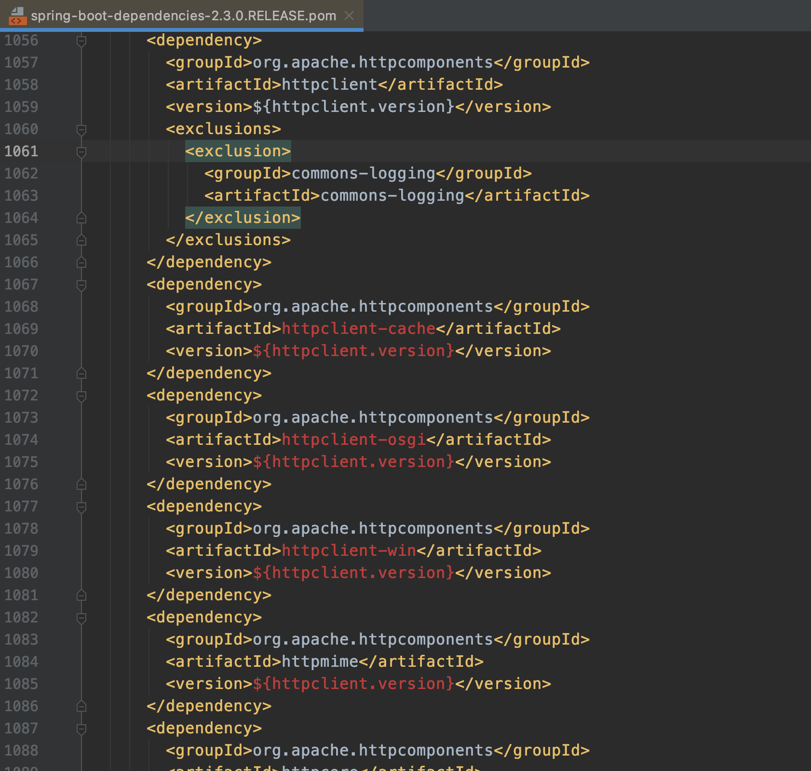

# 0-1Learning


## HttpClient

### Httpclient依赖
>仔细观察springboot项目，依赖于spring-boot-starter-parent
parent的父依赖spring-boot-dependencies已集成了httpclient的依赖包



### 代码实现
```
public class HttpUtil {

    private static Logger sysLog = LoggerFactory.getLogger("sysLog");

    /**
     * get请求：参数直接拼接到URL后面，即http://test.com?a=1&b=2的形式
     *
     * @param url 请求地址
     * @return
     */
    public static String get(String url) {
        String result = null;
        CloseableHttpClient httpClient = HttpClients.createDefault();
        HttpGet httpgets = new HttpGet(url);
        CloseableHttpResponse response = null;
        try {
//            httpgets.addHeader("Content-Type", "text/html;charset=UTF-8");
            response = httpClient.execute(httpgets);
            if (response != null && response.getStatusLine().getStatusCode() == 200) {
                HttpEntity entity = response.getEntity();
                result = entityToString(entity);
            }
            return result;
        } catch (IOException e) {
            sysLog.info(e.getMessage());
        } finally {
            closeHttpClient(httpClient, response);
        }
        return null;
    }

    /**
     * https请求
     *
     * @param url
     * @return
     */
    public static String httpsGet(String url) {
        String result = null;
        CloseableHttpClient httpClient = null;
        CloseableHttpResponse response = null;
        try {
            httpClient = SSLClientCustom.getHttpClinet();
            HttpGet httpgets = new HttpGet(url);
            RequestConfig requestConfig = RequestConfig.custom()
                    .setConnectTimeout(10000)
                    .setConnectionRequestTimeout(10000)
                    .setSocketTimeout(10000)
                    .setRedirectsEnabled(true).build();
            httpgets.setConfig(requestConfig);
//            httpgets.addHeader("Content-Type", "text/html;charset=UTF-8");
            response = httpClient.execute(httpgets);
            if (response != null && response.getStatusLine().getStatusCode() == 200) {
                HttpEntity entity = response.getEntity();
                result = entityToString(entity);
            }
            return result;
        } catch (Exception e) {
            sysLog.info(e.getMessage());
        } finally {
            closeHttpClient(httpClient, response);
        }
        return null;
    }

    /**
     * get请求，参数放在map中
     *
     * @param url 请求地址
     * @param map 参数
     * @return
     */
    public static String getMap(String url, Map<String, String> map) {
        String result = null;
        CloseableHttpClient httpClient = HttpClients.createDefault();
        List<NameValuePair> pairs = new ArrayList<NameValuePair>();
        for (Map.Entry<String, String> entry : map.entrySet()) {
            pairs.add(new BasicNameValuePair(entry.getKey(), entry.getValue()));
        }
        CloseableHttpResponse response = null;
        try {
            URIBuilder builder = new URIBuilder(url);
            builder.setParameters(pairs);
            HttpGet get = new HttpGet(builder.build());
            response = httpClient.execute(get);
            if (response != null && response.getStatusLine().getStatusCode() == 200) {
                HttpEntity entity = response.getEntity();
                result = entityToString(entity);
            }
            return result;
        } catch (Exception e) {
            sysLog.info(e.getMessage());
        } finally {
            closeHttpClient(httpClient, response);
        }
        return null;
    }

    /**
     * post请求
     *
     * @param url       url
     * @param data
     * @return 返回值是json
     */
    public static String post(String url, Map<String, Object> data) {
        String result = null;
        CloseableHttpClient httpClient = HttpClients.createDefault();
        HttpPost post = new HttpPost(url);
        CloseableHttpResponse response = null;
        try {
            List<NameValuePair> nvps = new ArrayList<NameValuePair>();
            if (null != data && !data.isEmpty()) {
                for (String key : data.keySet()) {
                    if(null != data.get(key)){
                        nvps.add(new BasicNameValuePair(key, data.get(key).toString()));

                    }
                }
            }
            post.setEntity(new UrlEncodedFormEntity(nvps, "UTF-8"));//处理中文编码的问题
            response = httpClient.execute(post);
            if (response != null && response.getStatusLine().getStatusCode() == 200) {
                HttpEntity entity = response.getEntity();
                result = entityToString(entity);
            }
            return result;

        } catch (Exception e) {
            sysLog.info(e.getMessage());
        } finally {
            closeHttpClient(httpClient, response);
        }
        return null;
    }

    /**
     * post请求，参数是json串
     *
     * @param url       url
     * @param jsonParam json串
     * @return 返回值是json
     */
    public static String postJson(String url, String jsonParam) {
        String result = null;
        CloseableHttpClient httpClient = HttpClients.createDefault();
        HttpPost post = new HttpPost(url);
        CloseableHttpResponse response = null;
        try {
            //1.二进制序列化
            post.setEntity(new ByteArrayEntity(jsonParam.getBytes("UTF-8")));
            //2.字符串序列化
//            StringEntity entity = new StringEntity(jsonParam, "utf-8");// 解决中文乱码问题
//            entity.setContentEncoding("UTF-8");
//            entity.setContentType("application/json");
//            httpPost.setEntity(entity);
            response = httpClient.execute(post);
            if (response != null && response.getStatusLine().getStatusCode() == 200) {
                HttpEntity entity = response.getEntity();
                result = entityToString(entity);
            }
            return result;

        } catch (Exception e) {
            sysLog.info(e.getMessage());
        } finally {
            closeHttpClient(httpClient, response);
        }
        return null;
    }

    /**
     * 上传文件
     *
     * @param url
     * @param file
     */
    public String upload(String url, File file) {
        String result = null;
        CloseableHttpClient httpclient = HttpClients.createDefault();
        try {
            HttpPost httppost = new HttpPost(url);
            //文件
            FileBody bin = new FileBody(file);
            //其他参数
//            StringBody comment = new StringBody("A binary file of some kind", ContentType.TEXT_PLAIN);
            HttpEntity reqEntity = MultipartEntityBuilder.create()
                    .addPart("file", bin)
//                    .addPart("comment", comment)
                    .build();
            httppost.setEntity(reqEntity);
            CloseableHttpResponse response = httpclient.execute(httppost);
            if (response != null && response.getStatusLine().getStatusCode() == HttpStatus.SC_OK) {
                HttpEntity entity = response.getEntity();
                result = EntityUtils.toString(entity, "UTF-8");
            }
            return result;
        } catch (IOException e) {
            e.printStackTrace();
        }
        return null;
    }

    /**
     * 下载文件
     *
     * @param url
     * @param filePath
     * @param headMap
     */
    public void downLoad(String url, String filePath, Map<String, String> headMap) {
        String result = null;
        CloseableHttpClient httpclient = HttpClients.createDefault();
        OutputStream out;
        try {
            HttpGet httpGet = new HttpGet(url);
            //添加参数
            if (headMap != null && headMap.size() > 0) {
                Set<String> keySet = headMap.keySet();
                for (String key : keySet) {
                    httpGet.addHeader(key, headMap.get(key));
                }
            }
            CloseableHttpResponse response = httpclient.execute(httpGet);
            if (response != null && response.getStatusLine().getStatusCode() == HttpStatus.SC_OK) {
                HttpEntity entity = response.getEntity();
//                result = EntityUtils.toString(entity, "UTF-8");
                //获得结果输入流
                InputStream in = entity.getContent();
                //写文件
                File file = new File(filePath);
                if (!file.exists()) {
                    file.createNewFile();
                }
                out = new FileOutputStream(filePath);
                byte[] buffer = new byte[4096];
                int readLength = 0;
                while ((readLength = in.read(buffer)) > 0) {
                    out.write(buffer, 0, readLength);
                }
                out.flush();
                out.close();
                EntityUtils.consume(entity);
            }
        } catch (IOException e) {
            e.printStackTrace();
        }
    }

    /**
     * HttpEntity转String
     *
     * @param entity
     * @return
     * @throws IOException
     */
    private static String entityToString(HttpEntity entity) throws IOException {
        String result = null;
        if (entity != null) {
            long lenth = entity.getContentLength();
            if (lenth != -1 && lenth < 2048) {
                result = EntityUtils.toString(entity, "UTF-8");
            } else {
                BufferedReader rd = new BufferedReader(
                        new InputStreamReader(entity.getContent(), "UTF-8"));
                String str = "";
                while ((str = rd.readLine()) != null) {
                    result += str;
                }

                //第二种输入流解析方式，但是又大小限制
//                InputStreamReader reader1 = new InputStreamReader(entity.getContent(), "UTF-8");
//                CharArrayBuffer buffer = new CharArrayBuffer(2048);
//                char[] tmp = new char[1024];
//                int l;
//                while ((l = reader1.read(tmp)) != -1) {
//                    buffer.append(tmp, 0, l);
//                }
//                result = buffer.toString();
            }
        }
        return result;
    }

    /**
     * 关闭httpclient和response
     *
     * @param httpClient
     * @param response
     */
    private static void closeHttpClient(CloseableHttpClient httpClient, CloseableHttpResponse response) {
        try {
            httpClient.close();
            if (response != null) {
                response.close();
            }
        } catch (IOException e) {
            e.printStackTrace();
        }
    }

}
```

### SSL证书类SSLClientCustom
```
public class SSLClientCustom {
    private static final String HTTP = "http";
    private static final String HTTPS = "https";
    private static SSLConnectionSocketFactory sslConnectionSocketFactory = null;
    private static PoolingHttpClientConnectionManager poolingHttpClientConnectionManager = null;//连接池管理类
    private static SSLContextBuilder sslContextBuilder = null;//管理Https连接的上下文类

    static {
        try {
            sslContextBuilder = new SSLContextBuilder().loadTrustMaterial(null, new TrustStrategy() {
                @Override
                public boolean isTrusted(X509Certificate[] x509Certificates, String s) throws CertificateException {
//                    信任所有站点 直接返回true
                    return true;
                }
            });
            sslConnectionSocketFactory = new SSLConnectionSocketFactory(sslContextBuilder.build(), new String[]{"SSLv2Hello", "SSLv3", "TLSv1", "TLSv1.2"}, null, NoopHostnameVerifier.INSTANCE);
            Registry<ConnectionSocketFactory> registryBuilder = RegistryBuilder.<ConnectionSocketFactory>create()
                    .register(HTTP, new PlainConnectionSocketFactory())
                    .register(HTTPS, sslConnectionSocketFactory)
                    .build();
            poolingHttpClientConnectionManager = new PoolingHttpClientConnectionManager(registryBuilder);
            poolingHttpClientConnectionManager.setMaxTotal(200);
        } catch (NoSuchAlgorithmException e) {
            e.printStackTrace();
        } catch (KeyStoreException e) {
            e.printStackTrace();
        } catch (KeyManagementException e) {
            e.printStackTrace();
        }

    }

    /**
     * 获取连接
     *
     * @return
     * @throws Exception
     */
    public static CloseableHttpClient getHttpClinet() throws Exception {
        CloseableHttpClient httpClient = HttpClients.custom()
                .setSSLSocketFactory(sslConnectionSocketFactory)
                .setConnectionManager(poolingHttpClientConnectionManager)
                .setConnectionManagerShared(true)
                .build();
        return httpClient;
    }
}
```


