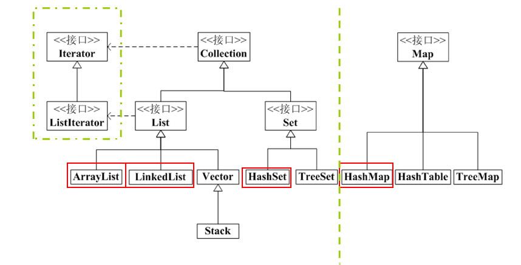

# 0-1Learning


## 集合

### 要点
* Java中的集合类
* Collection接口
    * Set接口
    * List接口
    * Iterator接口
* Collections类
* Map接口
    * Map接口
* 集合中的异常
* 泛型的使用

### Java中的集合类
* 集合的概念
    * Java中集合类是用来存放对象的
    * 集合相当于一个容器，里面包容着一组对象 ——	容器类
    * 其中的每个对象作为集合的一个元素出现
    * Java API提供的集合类位于java.util包内
* Java中数组与集合的比较
    * 数组也是容器，它是定长的，访问较快，但是数组不会自动扩充
    * 数组可以包含基本数据类型或引用类型的对象，而集合中只能包 含引用类型的对象


### Collection接口
* Collection接口
    * 一组称为元素的对象
    * 一个Collection中可以放不同类型的数据
    * 是Set接口和List接口的父类
    * 是否有特定的顺序以及是否允许重复，取决于它的实现
    * Set － 无序的集合；不允许重复
    * HashSet
    * List － 有序的集合；允许重复
    * ArrayList、LinkedList

### Collection接口常用方法
| 方法| 	含义| 
| ---- | ---- |
| boolean add(Object)| 	集合中加入一个对象，成功时返回true| 
| boolean addAll(Collection)| 	集合中加入另外一个集合对象| 
| int size()| 	集合内容纳的元素数量| 
| boolean isEmpty()| 	集合是否为空| 
| boolean contains(Object)| 	集合内是否含有参数对象| 
| Iterator iterator()| 	产生一个迭代器| 
| Object[] toArray()| 	返回一个包含所有元素的对象数组| 
| Object[] toArray(Object[])| 	把所有元素放入对象数组中| 
| boolean remove(Object)| 	从集合中删除对象| 
| boolean removeAll(Collection)| 	清空指定集合| 
| boolean containsAll(Collection)| 	判断集合内是否包含子集| 
| boolean retainAll(Collection)| 	删除子集合不包含的元素| 
| void clear()| 	清空集合| 
| Object[] toArray(Object[])| 	把所有元素放入对象数组中| 

### Set接口

* Set接口	示例	SetDemo.java
    * Collection的子接口
    * 用来包含一组 无序无重复 的对象
    * 无序 — 是指元素存入顺序和集合内存储的顺序不同
    * 无重复 — 两个对象e1和e2，如果e1.equals(e2)返回true，则认为e1和e2重复
    * Set有两种主要的集合实现类：
    * HashSet — HashSet的特性在于其内部对象的散列存取，即采用哈希技术
    * TreeSet — TreeSet存入的顺序跟存储的顺序不同，但是存储是按照排序存储的


### List接口

* List接口	示例	ListDemo.java
    * Collection的子接口
    * 用来包含一组 有序有重复 的对象
    * List中的元素都对应一个整数型的序号，记载其在容器中的位置， 可以根据序号存取容器中的元素
    * List有两种主要的集合实现类：
    * ArrayList
    * LinkedList


#### List接口常用的方法
| 方法| 	含义| 
| ---- | ---- |
| void add(int index,Object element)| 	在列表中的index位置，添加element元素| 
| Object get(int index)| 	返回列表中指定位置的元素| 
| int indexOf(Object o)| 	在list中查询元素的索引值，如不存在， 返回－1。| 
| int lastIndexOf(Object o)	| List中如果存在多个重复元素， indexOf()方法返回第一个匹配元素的index。lastIndexOf(o)是返回最后一个匹配元素的index.| 
| ListIterator listIterator()| 	返回列表中元素的列表迭代器| 
| Object remove(int index)| 	移除列表中指定位置的元素| 
| Object set(int index,Object element)| 	用指定元素替换列表中指定位置的元素| 

### List接口实现类

* ArrayList类
    * ArrayList是线性顺序存储的，是一种线性表
    * 它的特性和数组很接近，数组大小是不变的，而ArrayList的大小 是可以动态改变的
* ArrayList的构造方法
* LinkedList类
    * 是数据结构中链表的java实现
    * 相对于List来说，LinkedList最主要的功能方面的增强是可以在List  的头部和尾部添加、删除、取得元素，直接提供了这些方法的实现。所以它可以非常方便的实现我们数据结构中的常见的Stack( 栈)、queue(队列)等
* LinkedList类的构造方法
``````
 	LinkedList 变量名 = new	LinkedList() ;	
 	LinkedList 变量名 = new LinkedList(Collection c) ;
``````

#### LinkedList类特有的方法
| 方法| 	含义| 
| ---- | ---- |
| void addFirst(Object o)| 	将给定元素插入此列表的开头| 
| void addLast(Object o)| 	将给定元素追加到此列表的结尾| 
| Object getFirst()| 	返回此列表的第一个元素| 
| Object getLast()	| 返回此列表的最后一个元素| 
| Object removeFirst()	| 移除并返回此列表的第一个元素| 
| Object removeLast()| 	移除并返回此列表的最后一个元素| 

#### ArrayList与LinkedList的比较
* 存储结构
    * ArrayList是线性顺序存储
    * LinkedList对象间彼此串连起来的一个链表
* 操作性能
    * ArrayList适合随机查询的场合
    * LinkedList元素的插入和删除操作性高
    * 从功能上，LinkedList要多一些


### Iterator接口
* Iterator接口
    * Iterator对象称作迭代器，用来方便的实现对容器内的元素进行遍 历操作
    * 所有实现了Collection接口的集合类都有一个iterator(	)方法，返回一个实现了Iterator接口的对象
    * Iterator对象实现了统一的一个用来遍历Collection中对象的方法
    * Iterator是为遍历而设计，能够从集合中取出元素和删除元素，但是没有添加元素的功能
    * Iterator的功能上比较简单，使用中，只能单向移动

### Iterator接口常用方法
| 方法| 	含义| 
| ---- | ---- |
| Object next()	| 返回游标右边的元素并将游标移动到下一个位置| 
| boolean hasNext()	| 判断游标右边是否有元素| 
| void remove()	| 删除游标左边的元素，在执行完next之后，该操作只能执行一次| 


### Collections类
    * Collections
        * Collections类是类似于Arrays类的公用工具类 ,它提供了一些static方法供集合类使用或操作集合类 。

#### Collections类常用方法
| 方法| 	含义| 
| ---- | ---- |
|Objectmax(Colectionc,Comparatorcomp)|	max算法采用Comparator比较算法|
|Objectmax(colectionc)|	返回集合中的最大元素，需要考虑比较接口的实现|
|Objectmin(Colectionc)|	返回集合中的最小元素|
|voidreverse(Colectionc	)| 把集合中的元素顺序反转|
|voidcopy(Listdest,Listsrc)|	src集合中元素复制到dest集合|
|voidfil(Listlist,Objecto)|	填充list集合，填充元素为o|
|intbinarySearch(List|
|list,Objectkey)|	对排序后的集合list进行查询元素操作|
|voidsort(Listlist)|对一种List做排序|

### Map接口
* Map接口
    * Map内存储的是键/值对这样以成对的对象组(可以把一组对象当成 一个元素)，通过“键”对象来查询“值”对象
    * Map是不同于Collection的另外一种集合接口
    * Map中，key值是唯一的(不能重复)，而key对象是 与value对象关联在一起的

* Map接口有两个实现：
    * HashMap — key/value对是按照Hash算法存储的
    * TreeMap — key/value对是排序(按key排序)存储的

#### Map常用方法
| 方法| 	含义| 
| ---- | ---- |
| Object put(Object key,Object value)	| 将指定的值与此映射中的指定键相关联| 
| void putAll(Map t)	| 将映射t中所有映射关系复制到此映射中| 
| Object get(Object key)	| 返回此映射中映射到指定键的值| 
| Object remove(Object key)	| 若存在此键的映射关系,将其从映射中移除| 
| boolean containsKey(Object key)| 	若此映射包含指定键的映射关系，返回true| 
| boolean containsValue(Object value)| 	若此映射为指定值映射一个或多个键, 返回 true| 
| int size()	| 返回此映射中的键-值映射对数| 
| void clear()| 从此映射中移除所有映射关系| 
| boolean isEmpty()	| 若此映射未包含键-值映射关系,返回 true| 
| Set keySet()| 	返回此映射中包含的键的 set 视图| 

#### Map实现类
* HashMap类	示例	HashMapDemo.java
    * 基于哈希表的 Map 接口的实现
    * HashMap的构造方法
``````
 	HashMap 变量名 = new	HashMap() ;	
 	HashMap  变量名 = new HashMap(int capacity) ;	
 	HashMap 变量名 = new HashMap(int capacity,float lodeFactor) ;	
 	HashMap 变量名 = new HashMap(Map m) ;
``````

#### HashMap与TreeMap的比较
* HashMap与TreeMap的比较
    * HashMap基于哈希表实现。TreeMap基于树实现。
    * HashMap可以通过调优初始容量和负载因子，优化HashMap空间 的使用。TreeMap没有调优选项，因为该树总处于平衡状态
    * HashMap性能优于TreeMap。

#### HashMap与Hashtable的比较
* HashMap与Hashtable的比较
    * Hashtable是基于陈旧的Dictionary类的，HashMap是Java	1.2引进的Map接口的一个实现。
    * Hashtable是线程安全的，也就是说是同步的，而HashMap是线 程序不安全的，不是同步的。
    * HashMap允许将null作为一个entry的key或者value，而Hashtable不允许。

### 集合类选择
    * Set内存放的元素不允许重复，List存放的元素有一定的顺序。
    * Map的应用主要在利用键/值对进行快速查询。
    * ArrayList和LinkedList的区别在于随机查询性能上ArrayList要好， 但LinkedList的中间元素的插入与删除性能好 。
    * HashSet和TreeSet的区别在于集合内元素是否排序 。

### 集合种的异常
* 使用集合类时常见的异常

| 方法| 	含义| 
| ---- | ---- |
| ClassCastException| 	从集合中取得元素对象在进行类型转换的时候类型不匹配| 
| UnsupportedOperationException	| 当底层实现没有实现上层的相关方法的时候由Collection抛出该异常。Collection接口(或其他集合超类)中的一些函数在java doc中是标明”可有可无(Optional)”的函数，这些函数在底层的一些具体实现中，有的实现了，有的没有实现，当我们调用底层实现集合类的这些没有实现的方法时就会抛出该异常。| 
| ConcurrentModificationException	| ConcurrentModificationException 当采用Iterator遍历集合时，如果此时集合中的元素被改变则Iterator遍历抛出此异常| 
| IndexOutOfBoundsException	| 集合中元素引用的索引值超出界限(<0或>size())| 
| NoSuchElementException	| LinkedList中getLast，getFirst等方法取元素的时候List为空| 


### 适用泛型
* 集合在使用上的问题	示例	CollectionException.java
    * 集合中的add( )方法接受的是一个Object对象的参数 ，在获取集合中的对象时，必须进行造型（强制类型转换）操作。
    * 造型操作可能出现问题，一般在程序运行时才能发生，发现问题 比较困难。

* 泛型的出现
    * 在对象放入集合前，为其作个限制
    * 在获取集合中的对象时，不用进行造型的操作
    * 当有不同类型的对象添加到集合中的时候，编译时就能检查出错 误

* 泛型的定义
    * 泛型经常被称为参数化类型，它能够像方法一样接受不同类型的 参数。
    * 定义方式    ArrayList<E> 变量名 ;	
    * E是变量类型

``````
ArrayList<String>	arr;
arr = new ArrayList<String>();
HashMap<Integer,String>  hm = new	HashMap<Integer,String>();
``````
