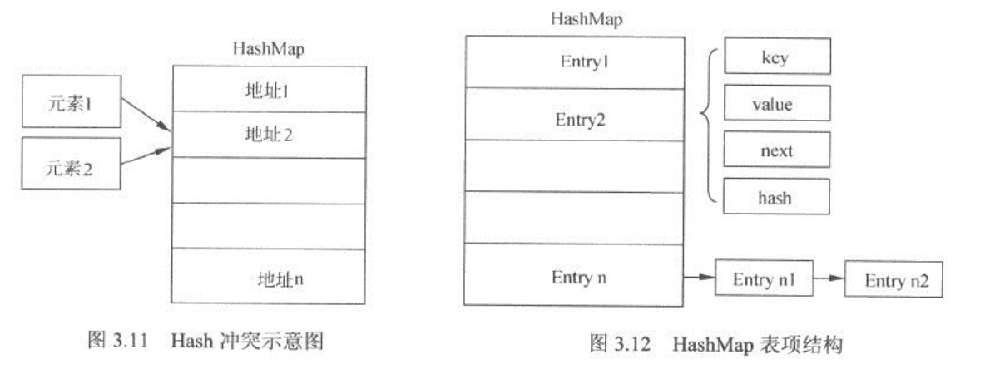

# 0-1Learning

## hashmap和hashtable和concurrenthashmap的底层实现和区别

###
​在讨论哈希表之前，我们先大概了解下其他数据结构在新增，查找等基础操作执行性能

数组：采用一段连续的存储单元来存储数据。对于指定下标的查找，时间复杂度为O(1)；通过给定值进行查找，需要遍历数组，逐一比对给定关键字和数组元素，时间复杂度为O(n)，当然，对于有序数组，则可采用二分查找，插值查找，斐波那契查找等方式，可将查找复杂度提高为O(logn)；对于一般的插入删除操作，涉及到数组元素的移动，其平均复杂度也为O(n)

线性链表：对于链表的新增，删除等操作（在找到指定操作位置后），仅需处理结点间的引用即可，时间复杂度为O(1)，而查找操作需要遍历链表逐一进行比对，复杂度为O(n)

二叉树：对一棵相对平衡的有序二叉树，对其进行插入，查找，删除等操作，平均复杂度均为O(logn)。

哈希表：相比上述几种数据结构，在哈希表中进行添加，删除，查找等操作，性能十分之高，不考虑哈希冲突的情况下（后面会探讨下哈希冲突的情况），仅需一次定位即可完成，时间复杂度为O(1)，接下来我们就来看看哈希表是如何实现达到惊艳的常数阶O(1)的。

我们知道，数据结构的物理存储结构只有两种：顺序存储结构和链式存储结构（像栈，队列，树，图等是从逻辑结构去抽象的，映射到内存中，也这两种物理组织形式），而在上面我们提到过，在数组中根据下标查找某个元素，一次定位就可以达到，哈希表利用了这种特性，哈希表的主干就是数组。
比如我们要新增或查找某个元素，我们通过把当前元素的关键字 通过某个函数映射到数组中的某个位置，通过数组下标一次定位就可完成操作。
　　
这个函数可以简单描述为：存储位置 = f(关键字) ，这个函数f一般称为哈希函数，这个函数的设计好坏会直接影响到哈希表的优劣。

### HashMap的实现原理
* HashMap就是将key做hash算法，然后将hash所对应的数据映射到内存地址，直接取得key所对应的数据。
* 在HashMap中。底层数据结构使用的是数组，所谓的内存地址即数组的下标索引。
* HashMap ：线程不安全，可以接收空值
* 1.7和1.8区别：1.8加入红黑树用尾插法，扩容后数据存储位置的计算方式也不一样
* hashmap中默认的数组大小为16
* 扩容机制：元素个数超过数组大小*loadFactor时，loadFactor的默认值为0.75
* 第一次扩容：16\*0.75=12，就把数组的大小扩展为2\*16=32，即扩大一倍

* HashMap的高性能需要保证以下几点：
    * hash算法必须高效
    * hash值到内存地址(数组索引)的算法是快速的
    * 根据内存地址(数组索引)可以直接取得对应的值
    * 如何保证hash算法高效,hash算法有关的代码如下：
~~~~
int hash = hash(key.hashCode());
public native int hashCode();
static int hash(int h){
    h ^= (h >>> 20) ^ (h >>> 12);
    return h ^ (h >>> 7) ^ (h >>> 4);
}
~~~~

#### HashMap的hashcode的作用？
1. hashCode的存在主要是用于查找的快捷性，如Hashtable，HashMap等，hashCode是用来在散列存储结构中确定对象的存储地址的；
2. 如果两个对象相同，就是适用于equals(java.lang.Object) 方法，那么这两个对象的hashCode一定要相同；
3. 如果对象的equals方法被重写，那么对象的hashCode也尽量重写，并且产生hashCode使用的对象，一定要和equals方法中使用的一致，否则就会违反上面提到的第2点；
4. 两个对象的hashCode相同，并不一定表示两个对象就相同，也就是不一定适用于equals(java.lang.Object) 方法，只能够说明这两个对象在散列存储结构中，如Hashtable，他们“存放在同一个篮子里”。

#### hashcode应用
* Java中的集合（Collection）有两类，一类是List，再有一类是Set。
* 区别
    * 前者集合内的元素是有序的，元素可以重复；
    * 后者元素无序，但元素不可重复。
* 那么这里就有一个比较严重的问题了：要想保证元素不重复，可两个元素是否重复应该依据什么来判断呢？这就是 Object.equals方法了。
* 但是，如果每增加一个元素就检查一次，那么当元素很多时，后添加到集合中的元素比较的次数就非常多了。也就是说，如果集合中现在已经有1000个元素，那么第1001个元素加入集合时，它就要调用1000次equals方法。这显然会大大降低效率。   
* 于是，Java采用了哈希表的原理。哈希算法也称为散列算法，是将数据依特定算法直接指定到一个地址上。
* 关于哈希算法，这里就不详细介绍。可以这样简单理解，hashCode方法实际上返回的就是对象存储位置的映像。   
* 这样一来，当集合要添加新的元素时，先调用这个元素的hashCode方法，就能定位到它应该放置的存储位置。
* 如果这个位置上没有元素，它就可以直接存储在这个位置上，不用再进行任何比较了；
* 如果这个位置上已经有元素了，就调用它的equals方法与新元素进行比较，相同的话就不存了，不相同就表示发生冲突了，散列表对于冲突有具体的解决办法，但最终还会将新元素保存在适当的位置。这样一来，实际调用equals方法的次数就大大降低了，几乎只需要一两次。   

#### 什么时候需要重写hashCode
* 一般的地方不需要重载hashCode，只有当类需要放在HashTable、HashMap、HashSet等等hash结构的集合时才会重载hashCode，那么为什么要重载hashCode呢？就HashMap来说，好比HashMap就是一个大内存块，里面有很多小内存块，小内存块里面是一系列的对象，可以利用hashCode来查找小内存块hashCode%size(小内存块数量)，所以当equal相等时，hashCode必须相等，而且如果是object对象，必须重载hashCode和equal方法。

#### Hash冲突
如图3.11所示，需要存放到HashMap中的两个元素1和2，通过hash计算后，发现对应在内存中的同一个地址，如何处理？

其实HashMap的底层实现使用的是数组，但是数组内的元素并不是简单的值。而是一个Entry类的对象。因此，对HashMap结构贴切描述如图3.12所示。

* 可以看到，HashMap的内部维护着一个Entry数组，每一个Entry表项包括key、value、next和hash几项。
* next部分指向另外一个Entry。进一步阅读HashMap的put()方法源码，可以看到当put()操作有冲突时，新的Entry依然会被安放在对应的索引下标内，并替换原有的值。同时为了保证旧值不丢失，会将新的Entry的next指向旧值。这便实现了在一个数组索引空间内存放多个值项。因此，如图3.12所示，HashMap实际上是一个链表的数组。
~~~~
public V put(K key, V value){
    if(key == null)
        return putForNullKey(value);
    int hash = hash(key.hashCode());
    int i = indexFor(hash, table.length);
    for(Entry<K, V> e = table[i]; e != null; e = e.next){
        Object k;
        //如果当前的key已经存在于HashMap中
        if(e.hash == hash && ((k = e.key) == key || key.equals(k)))
        {
            V oldValue = e.value;    //取得旧值
            e.value = value;
            e.recordAccess(this);
            return oldValue;     //返回旧值
        }
    }
    modCount++;
    addEntry(hash, key, value, i);    //添加当前的表项到i位置
    return null;
}
~~~~
addEntry()方法的实现如下：
~~~~
void addEntry(int hash, K key, V value, int bucketIndex){
    Entry<K,V> e = table[bucketIndex];
    //将新增元素放到i的位置，并让它的next指向旧的元素
    table[bucketIndex] = new Entry<K,V>(hash, key, value, e);
    if(size++ >= threshold){
        resize(2 * table.length);
    }
}
~~~~
基于HashMap的这种实现机制，只要hashCode和hash()方法实现的足够好，能够尽可能的减少冲突的产生，那么对HashMap的操作几乎等价于对数组的随机访问操作，具有很好的性能。但是，如果hashCode()或者hash()方法实现较差，在大量冲突产生的情况下，HashMap事实上就退化为几个链表，对HashMap的操作等价于遍历链表，此时性能很差。

#### 如何解决哈希冲突？

1. 链表法（chaining）
在哈希表中，每一个桶（bucket）或者槽（slot）都会对应一条链表，所有哈希值相同的元素放到相同槽位对应的链表中。
在插入的时候，我们可以通过散列函数计算出对应的散列槽位，将元素插入到对应的链表即可，时间复杂度为O（1）；在查找或删除元素时，我们同样通过散列函数计算出对应的散列槽位，然后再通过遍历链表进行查找或删除，时间复杂度为O（k），k为链表长度。

2. 开放寻址法
核心思想：如果出现散列冲突，我们就重新探测一个空闲位置，再将元素插入。
一种比较简单的探测方法：线性探测法（Linear Probing）

线性探测法：当我们往散列表中插入元素时，如果某个数据经过散列函数散列之后，存储位置已经被占用了，那么我们就从当前位置开始，依次往后遍历，直到找到空余的位置插入为止（插入第一个空余的位置，方便查找）

在查找元素时，先将要查找元素键值通过散列函数变成散列值，然后与下标为散列值的元素比较，若相等，则说明这是我们要找的元素；若不相等，则顺序往后遍历查找，如果遍历到数组中的空余位置还是没有找到，说明要查找的元素不在散列表中。
删除元素时，删除操作不能简单地把元素设置为空，而是要特殊标记为deleted，因为如果简单设置为空，在查找元素的过程中遇到这个被删除元素的位置就会停下，而不是继续往后遍历，会使查找算法失效；但是如果特色标记为deleted，当线性探测查找时，遇到标记为deleted的位置就会往下探测。
线性探测法的缺点：当插入的数据越来越多时，散列冲突发生的可能性会越来越大，空余位置会越来越少，线性探测的时间会越来越长，最坏时间复杂度为O（n）。

另外的两种探测方法是二次探测法（Quadratic probing）和双重散列法（Double hashing）。

#### 适用hash查找流程
1. hashcode是用来查找的，如果你学过数据结构就应该知道，在查找和排序这一章有
~~~~
例如内存中有这样的位置
0  1  2  3  4  5  6  7  
而我有个类，这个类有个字段叫ID,我要把这个类存放在以上8个位置之一，如果不用hashcode而任意存放，那么当查找时就需要到这八个位置里挨个去找，或者用二分法一类的算法。
但如果用hashcode那就会使效率提高很多。我们这个类中有个字段叫ID,那么我们就定义我们的hashcode为ID％8，然后把我们的类存放在取得得余数那个位置。比如我们的ID为9，9除8的余数为1，那么我们就把该类存在1这个位置，如果ID是13，求得的余数是5，那么我们就把该类放在5这个位置。这样，以后在查找该类时就可以通过ID除 8求余数直接找到存放的位置了。

~~~~
2. 但是如果两个类有相同的hashcode怎么办那（我们假设上面的类的ID不是唯一的）
~~~~
例如9除以8和17除以8的余数都是1，那么这是不是合法的，回答是：可以这样。那么如何判断呢？在这个时候就需要定义 equals了。
也就是说，我们先通过 hashcode来判断两个类是否存放某个桶里，但这个桶里可能有很多类，那么我们就需要再通过 equals 来在这个桶里找到我们要的类。
~~~~
* 重写了equals()，为什么还要重写hashCode()呢？
* 想想，你要在一个桶里找东西，你必须先要找到这个桶啊，你不通过重写hashcode()来找到桶，光重写equals()有什么用啊

#### hashMap容量参数
* 除hashCode()的实现外，影响HashMap性能的还有它的容量参数。
* 和ArrayList和Vector一样，这种基于数组的结构，不可避免的需要在数组空间不足时，进行扩展。
* 而数组的重组相对而言较为耗时，因此对其作一定了解有助于优化HashMap的性能。
* HashMap提供了两个可以指定初始化大小的构造函数：
~~~~
public HashMap(int initialCapacity)
public HashMap(int initialCapacity, float loadFactor)
~~~~
* 其中initialCapacity指定了HashMap的初始容量，loadFactor指定了其负载因子。初始容量即数组的大小，HashMap会使用大于等于initialCapacity并且是2的指数次幂的最小的整数作为内置数组的大小。负载因子又叫填充比，它是介于0和1之间的浮点数，它决定了HashMap在扩容之前，其内部数组的填充度。默认情况下，HashMap初始大小为16，负载因子为0.75。
* **负载因子 ＝ 元素个数/内部数组总大小**
* 在实际使用中，负载因子也可以设置为大于1的数，但如果这样做，HashMap将必然产生大量冲突，因为这无疑是在尝试往只有10个口袋的包里放15件物品，必然有几只口袋要大于一个物件。因此，通常不会这么使用。
* 在HashMap内部，还维护了一个threshold变量，它始终被定义为当前数组总容量和负载因子的乘积，它表示HashMap的阈值。当HashMap的实际容量超过阈值时，HashMap便会进行扩容。因此，HashMap的实际容量超过阈值时，HashMap便会进行扩容。因此，HashMap的实际填充率不会超过负载因子。
* HashMap扩容的代码如下：
~~~~
void resize(int newCapacity){
    Entry[] oldTable = table;
    int oldCapacity= oldTable.length;
    if(oldCapacity == MAXMUM_CAPACITY){
        threhold = Integer.MAX_VALUE;
        return;
    }
    //建立新的数组
    Entry[] newTable = new Entry[newCapacity];
    //将原有数组转到新的数组中
    transfer(newTable);
    table = newTable;
    //重新设置阈值，为新的容量和负载因子的乘积
    threshold = (int)(newCapacity * loadFactory);
}
~~~~
其中，数组迁移逻辑主要在transfer()函数中实现，该函数实现和注释如下：
~~~~
void transfer(Entry[] newTable){
    Entry[] src = table;
    int newCapacity = newTable.length;
    //遍历数组内所有表项
    for(int j = 0; j < src.length; j++){
        Entry<K,V> e = src[j];
        //当该表项索引有值存在时，则进行迁移
        if(e != null){
            src[j] = null;
            do{
                //进行数据迁移
                Entry<K,V> next = e.next;
                //计算该表现在新数组内的索引，并放置到新的数组中
                //建立新的链表关系
                int i = indexFor(e,hash, newCapacity);
                e.next = newTable[i];
                newTable[i] = e;
                e = next;
            }while(e != null)
        }
    }
}
~~~~
很明显，HashMap的扩容操作会遍历整个HashMap，应该尽量避免该操作发生，设置合理的初始大小和负载因子，可以有效的减少HashMap扩容的次数。

### HashMap和HashTable的底层实现和区别，两者和ConcurrentHashMap的区别
1. Hashtable的大部分方法做了同步，HashMap没有，因此，HashMap不是线程安全的。
2. Hashtable不允许key或者value使用null值，而HashMap可以。
3. 在内部算法上，它们对key的hash算法和hash值到内存索引的映射算法不同。
4. HashTable线程安全则是依靠方法简单粗暴的sychronized修饰，HashMap则没有相关的线程安全问题考虑。。

* 在ConcurrentHashMap中，引入了一个“分段锁”的概念，具体可以理解为把一个大的Map拆分成N个小的HashTable，根据key.hashCode()来决定把key放到哪个HashTable中。就是把Map分成了N个Segment，put和get的时候，都是现根据key.hashCode()算出放到哪个Segment中。
* 通过把整个Map分为N个Segment（类似HashTable），可以提供相同的线程安全，但是效率提升N倍。
