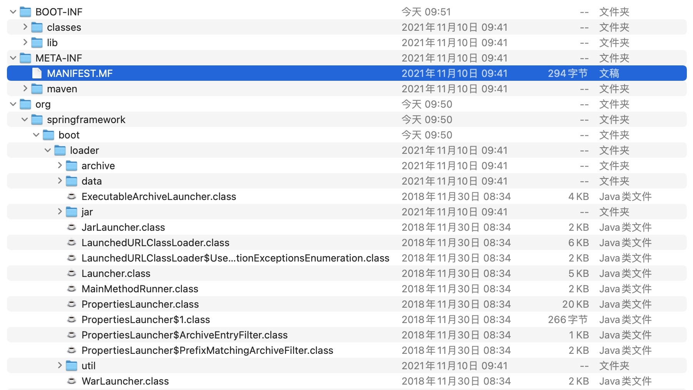
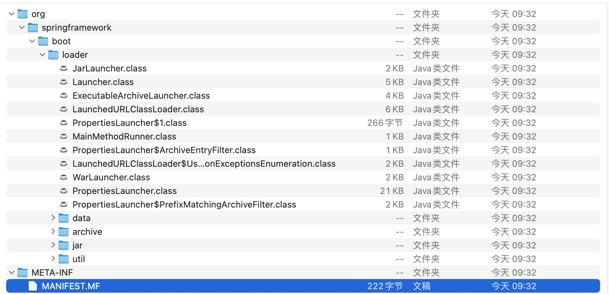

# 0-1Learning


## Spring Boot Loader源码分析

分析Spring Boot Loader源码其实就是在搞懂为何Spring Boot打成jar包可以直接运行起来。


### 1. 解压任意项目jar包
解压项目打包成的jar包，我们可以得到三个文件夹：



- BOOT-INF，内部是classes（存放项目相关字节码文件）和lib（存放项目所依赖第三方jar包）


- META-INF，关于项目的一些元数据
    ```
    Manifest-Version: 1.0
    Start-Class: con.soonphe.timber.BootstrapApplication
    Spring-Boot-Classes: BOOT-INF/classes/
    Spring-Boot-Lib: BOOT-INF/lib/
    Build-Jdk-Spec: 1.8
    Spring-Boot-Version: 2.2.7.RELEASE
    Created-By: Maven Archiver 3.4.0
    Main-Class: org.springframework.boot.loader.JarLauncher
    ```
  属性说明：
  - Start-Class，为我们项目启动类的全类路径
  - Main-Class，为JarLauncher的全类路径，即Java规定的启动jar包类

- org，其实是 Spring Boot 提供的 spring-boot-loader 项目，即便我们项目中并没有明确指定loader的存在，但Spring Boot也会帮我们将其代码拷贝放到jar包内。
    ```
    <!-- 如果需要研究loader的源码，我们还得在pom.xml中引入相关依赖 -->
    <dependency>
        <groupId>org.springframework.boot</groupId>
        <artifactId>spring-boot-loader</artifactId>
        <version>2.2.7.RELEASE</version>
    </dependency>
    ```


### 2. 解压 spring-boot-loader 源码jar包
解压结构树：


查看META-INF文件夹下的MANIFEST.MF文件内容：
```
Manifest-Version: 1.0
Implementation-Title: Spring Boot Loader
Automatic-Module-Name: spring.boot.loader
Implementation-Version: 2.2.7.RELEASE
Built-By: Spring
Build-Jdk-Spec: 1.8
Created-By: Maven Archiver 3.4.0
```
由Main-Class的属性值，我们可以得出，要想分析Spring Boot Loader的源码，得从org.springframework.boot.loader.JarLauncher开始。

### 3. JarLauncher
```
/**
 * {@link Launcher} for JAR based archives. This launcher assumes that dependency jars are
 * included inside a {@code /BOOT-INF/lib} directory and that application classes are
 * included inside a {@code /BOOT-INF/classes} directory.
 */
public class JarLauncher extends ExecutableArchiveLauncher {
	public JarLauncher() {
	}

	public static void main(String[] args) throws Exception {
		new JarLauncher().launch(args);
	}
}

```
  从JarLauncher的main方法开始。

1. 创建JarLauncher对象，我们可以看到，JarLauncher的无参构造方法没有代码，但由于JarLauncher类继承了ExecutableArchiveLauncher抽象类，所以会调用ExecutableArchiveLauncher的无参构造方法。

2. ExecutableArchiveLauncher的无参构造方法主要是为了创建JarFileArchive对象并进行字段赋值。

    其中createArchive()由Launcher进行调用。
    ```
    public abstract class ExecutableArchiveLauncher extends Launcher {
    private final Archive archive;
    
        public ExecutableArchiveLauncher() {
            try {
                this.archive = createArchive();
            }
            catch (Exception ex) {
                throw new IllegalStateException(ex);
            }
        }
    }
    ```

3. 创建JarLauncher对象后，调用launch方法。

launch方法实际上调用的是Launcher的launch。
```
// org.springframework.boot.loader.JarLauncher#main
public static void main(String[] args) throws Exception {
    new JarLauncher().launch(args);
}
```
```
// org.springframework.boot.loader.Launcher#launch(java.lang.String[])
/**
 * Launch the application. This method is the initial entry point that should be
 * called by a subclass {@code public static void main(String[] args)} method.
 * @param args the incoming arguments
 */
protected void launch(String[] args) throws Exception {
    JarFile.registerUrlProtocolHandler();
    ClassLoader classLoader = createClassLoader(getClassPathArchives());
    launch(args, getMainClass(), classLoader);
}
```


### 4. ExecutableArchiveLauncher
我们刚才分析得出，new JarLauncher().launch(args)会调用Launcher#launch方法。

其中getClassPathArchives()是一个抽象方法，这里的具体实现是由ExecutableArchiveLauncher#getClassPathArchives完成。
```
// org.springframework.boot.loader.Launcher#launch(java.lang.String[])
protected void launch(String[] args) throws Exception {
    JarFile.registerUrlProtocolHandler();
    ClassLoader classLoader = createClassLoader(getClassPathArchives());
    launch(args, getMainClass(), classLoader);
}

```
```
// ExecutableArchiveLauncher#getClassPathArchives
@Override
protected List<Archive> getClassPathArchives() throws Exception {
    List<Archive> archives = new ArrayList<>(this.archive.getNestedArchives(this::isNestedArchive));
    postProcessClassPathArchives(archives);
    return archives;
}

```


1. this::isNestedArchive 代码段，创建了 EntryFilter 匿名实现类，用于过滤 jar包不需要的目录。
```
/**
 * Strategy interface to filter {@link Entry Entries}.
 */
interface EntryFilter {
	/**
	 * Apply the jar entry filter.
	 * @param entry the entry to filter
	 * @return {@code true} if the filter matches
	 */
	boolean matches(Entry entry);
}

```

2. 但由于isNestedArchive在ExecutableArchiveLauncher是抽象方法，其具体实现在JarLauncher中完成。
```
// org.springframework.boot.loader.JarLauncher#isNestedArchive
@Override
protected boolean isNestedArchive(Archive.Entry entry) {
    if (entry.isDirectory()) {
        return entry.getName().equals(BOOT_INF_CLASSES);
    }
    return entry.getName().startsWith(BOOT_INF_LIB);
}

```
3、getNestedArchives是Archive接口的一个方法。由于我们上面已经知道ExecutableArchiveLauncher在初始化时，会给this.archive赋值为JarFileArchive类型的对象。所以getNestedArchives最终调用会由JarFileArchive完成。
```
// JarFileArchive#getNestedArchives
@Override
public List<Archive> getNestedArchives(EntryFilter filter) throws IOException {
    List<Archive> nestedArchives = new ArrayList<>();
    for (Entry entry : this) {
        // 此时，当执行matches方法的时候，就是执行JarLauncher#isNestedArchive
        if (filter.matches(entry)) {
            nestedArchives.add(getNestedArchive(entry));
        }
    }
    return Collections.unmodifiableList(nestedArchives);
}

```
4、只有符合以"BOOT-INF/classes/"作为文件夹名称，以及前缀为"BOOT-INF/lib/"的文件才会被添加到嵌套归档集合中来。
```
public class JarLauncher extends ExecutableArchiveLauncher {
	static final String BOOT_INF_CLASSES = "BOOT-INF/classes/";
	static final String BOOT_INF_LIB = "BOOT-INF/lib/";

	@Override
	protected boolean isNestedArchive(Archive.Entry entry) {
		if (entry.isDirectory()) {
			return entry.getName().equals(BOOT_INF_CLASSES);
		}
		return entry.getName().startsWith(BOOT_INF_LIB);
	}
}

```


### 5. Launcher
我们再次回到Launcher#launch方法。

我们刚才通过调用ExecutableArchiveLauncher#getClassPathArchives方法获得项目需要的归档对象集合。

接下来就是根据归档对象集合创建类加载器。
```
// org.springframework.boot.loader.Launcher#launch(java.lang.String[])
protected void launch(String[] args) throws Exception {
    JarFile.registerUrlProtocolHandler();
    ClassLoader classLoader = createClassLoader(getClassPathArchives());
    launch(args, getMainClass(), classLoader);
}

```
```
protected ClassLoader createClassLoader(List<Archive> archives) throws Exception {
    List<URL> urls = new ArrayList<>(archives.size());
    for (Archive archive : archives) {
        urls.add(archive.getUrl());
    }
    return createClassLoader(urls.toArray(new URL[0]));
}

```
1. 创建LaunchedURLClassLoader类加载器。

其主要作用是支持加载 BOOT-INF/classes 目录下的所有 .class 文件，以及 BOOT-INF/lib 目录下的 所有依赖jar 包。
```
protected ClassLoader createClassLoader(URL[] urls) throws Exception {
    return new LaunchedURLClassLoader(urls, getClass().getClassLoader());
}
```


2、调用ExecutableArchiveLauncher#getMainClass方法，根据META-INF文件夹的MANIFEST.MF文件内容取出属性Start-Class的值，也就是我们项目启动类的全类路径。
```
// org.springframework.boot.loader.ExecutableArchiveLauncher#getMainClass
@Override
protected String getMainClass() throws Exception {
    Manifest manifest = this.archive.getManifest();
    String mainClass = null;
    if (manifest != null) {
        mainClass = manifest.getMainAttributes().getValue("Start-Class");
    }
    if (mainClass == null) {
        throw new IllegalStateException("No 'Start-Class' manifest entry specified in " + this);
    }
    return mainClass;
}

```
3、调用Launcher#launch的重载方法。准备启动项目应用。

会将我们刚才创建好的LaunchedURLClassLoader作为当前线程的线程上下文类加载器。

并且创建MainMethodRunner对象并进行程序的启动。
```
// org.springframework.boot.loader.Launcher#launch(java.lang.String[], java.lang.String, java.lang.ClassLoader)
protected void launch(String[] args, String mainClass, ClassLoader classLoader) throws Exception {
    Thread.currentThread().setContextClassLoader(classLoader);
    createMainMethodRunner(mainClass, args, classLoader).run();
}

```

### 6. MainMethodRunner
MainMethodRunner对象在Launcher#launch中的创建只是简单的字段赋值。

```
// org.springframework.boot.loader.Launcher#createMainMethodRunner
protected MainMethodRunner createMainMethodRunner(String mainClass, String[] args, ClassLoader classLoader) {
    return new MainMethodRunner(mainClass, args);
}
```
```
public MainMethodRunner(String mainClass, String[] args) {
    this.mainClassName = mainClass;
    this.args = (args != null) ? args.clone() : null;
}

```

1、调用MainMethodRunner的run方法启动项目。

本质还是通过反射的机制来创建我们项目的主启动类。

通过调用项目主启动类的main方法来最终启动。

```
public void run() throws Exception {
    Class<?> mainClass = Thread.currentThread().getContextClassLoader().loadClass(this.mainClassName);
    Method mainMethod = mainClass.getDeclaredMethod("main", String[].class);
    mainMethod.invoke(null, new Object[] { this.args });
}

```


