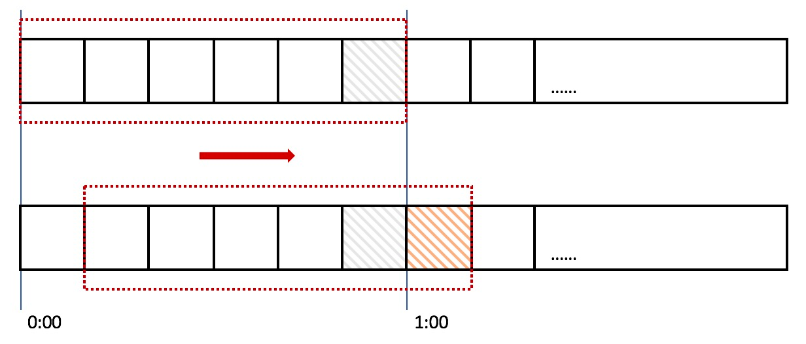

# 0-1Learning


## APM全链路追踪监控解决方案
APM （Application Performance Management）是对企业的应用系统进行实时监控，它是用于实现对应用程序性能管理和故障管理的系统化的解决方案。

### APM主要解决的问题：
- 集中式度量系统
- 分布式全链接追踪系统
- 集中式日志系统（elk）

1. 全链路监控：对请求源头到底层服务的调用链路中间的所有环节进行监控。
2. 为什么需要：对于单体应用，我们可以很容易地监控和分析它的性能。对于微服务，编程语言不同、服务器数量庞大、可能跨多个服务/区域，那么面对复杂的请求调用链路，就会有一系列问题，只有全链路监控才能处理，例如： 
   - 如何快速发现有问题的服务？
   - 如何判断故障影响范围？
   - 如何梳理服务间依赖关系？
   - 如何分析链路性能问题？
   - 对于一次慢请求，如何找到慢请求的来源？
3. 和其他监控组件的定位区别
   - 和日志监控Logs区别：日志监控侧重于单个业务的代码bug分析。虽然利用MDC可以追踪一个请求，但不能追踪跨线程、跨服务、跨区的情况，且对中间件、数据库的请求无法追踪，当然也可以手动传递MDC，本质上也就是实现了全链路监控的追踪功能。
   - 和Prometheus监控Metrics区别：Prometheus监控侧重于报警和业务指标监控。对于接口间的延迟等不能很好地处理，当然也可以在接口出入口计时，本质上也就是实现了一个全链路监控的性能分析功能。


### 分布式调用追踪（APM）一览
1. google的Drapper--未开源，最早的APM
2. 阿里-鹰眼--未开源
3. 大众点评——CAT--跨服务的跟踪功能与点评内部的RPC框架集成，这部分未开源且项目在2014.1已经停止维护。服务粒度的监控，通过代码埋点的方式来实现监控，比如： 拦截器，注解，过滤器等，对代码的侵入性较大，集成成本较高。
4. Hydra-京东: 与dubbo框架集成，对于服务级别的跟踪统计，现有业务可以无缝接入。对于细粒度的兴趣点，需要业务人员手动添加.开源项目已于2013年6月停止维护
5. PinPoint-naver，字节码探针技术，代码无侵入，体系完善不易修改，支持java,技术栈支持dubbo.其他语言社区支援中
6. zipkin--java方便集成于springcloud，社区支持的插件也包括dubbo,rabbit,mysql,httpclient等(https://github.com/openzipkin/brave/tree/master/instrumentation)，同时支持php,go,js等语言客户端，界面功能较为简单，本身无告警功能，可能需要二次开发。代码入侵度小。
7. uber-jaeger， Jaeger支持java/c++/go/node/php，在界面上较为完善（对比zipkin），但是也无告警功能。代码入侵度小。dubbo目前无插件支持，可二次开发。（jaeger下载：https://www.jaegertracing.io/download/）
8. skywalking -华为，类似于PinPoint，目前还在apache孵化中，网上吞吐量对比中强于pinpoint,实际未验证。本身支持dubbo

### 方案对比

| |pinpoint| zipkin| jaeger |skywalking|
|---|---|---|---|---|
|OpenTracing兼容| 否| 是| 是| 是|
|客户端支持语言 |java、php| java,c#,go,php等| java,c#,go,php等| Java, .NET Core, NodeJS and PHP|
|存储| hbase| ES，mysql,Cassandra,内存| ES，kafka,Cassandra,内存| ES，H2,mysql,TIDB,sharding sphere|
|传输协议支持| thrift| http,MQ| udp/http| gRPC|
|ui丰富程度| 高| 低| 中| 中|
|实现方式-代码侵入性| 字节码注入，无侵入| 拦截请求，侵入| 拦截请求，侵入| 字节码注入，无侵入|
|扩展性| 低 |高 |高| 中|
|trace查询| 不支持| 支持 |支持| 支持|
|告警支持| 支持| 不支持 |不支持| 支持|
|jvm监控| 支持| 不支持 |不支持| 支持|
|性能损失| 高| 中| 中| 低|


### 三种常见的限流算法（漏桶、令牌桶、滑动窗口）
1. 令牌桶算法
   - 所有的请求在处理之前都需要拿到一个可用的令牌才会被处理；
   - 根据限流大小，设置按照一定的速率往桶里添加令牌；
   - 桶设置最大的放置令牌限制，当桶满时、新添加的令牌就被丢弃或者拒绝；
   - 请求达到后首先要获取令牌桶中的令牌，拿着令牌才可以进行其他的业务逻辑，处理完业务逻辑之后，将令牌直接删除；
   - 令牌桶有最低限额，当桶中的令牌达到最低限额的时候，请求处理完之后将不会删除令牌，以此保证足够的限流；

令牌桶算法既能够将所有的请求平均分布到时间区间内，又能接受服务器能够承受范围内的突发请求，因此是目前使用较为广泛的一种限流算法。

代码实现思路：可以准备一个队列，用来保存令牌，另外通过一个线程池定期生成令牌放到队列中，每来一个请求，就从队列中获取一个令牌，并继续执行。
可以参考Google开源的guava包，通过RateLimiter类的create方法，创建限流器。
```
<dependency>
   <groupId>com.google.guava</groupId>
   <artifactId>guava</artifactId>
   <version>18.0</version>
</dependency>

public class RateLimiterMain {

   public static void main(String[] args) {
      RateLimiter rateLimiter = RateLimiter.create(10);
      for (int i = 0; i < 10; i++) {
         new Thread(new Runnable() {
            @Override
            public void run() {
               rateLimiter.acquire()
               System.out.println("pass");
            }
         }).start();
      }
   }
}
```

2. 漏桶算法
   漏桶算法其实很简单，可以粗略的认为就是注水漏水过程，往桶中以一定速率流出水，以任意速率流入水，当水超过桶流量则丢弃，因为桶容量是不变的，保证了整体的速率。

缺点
不管流量多大，超出的部分都会直接丢弃，即使服务器还有大量空闲资源也是直接丢弃，无法处理突发流量。

漏桶算法的缺陷也很明显，当短时间内有大量的突发请求时，即便此时服务器没有任何负载，每个请求也都得在队列中等待一段时间才能被响应。

漏桶算法和令牌桶算法比较

|  |漏桶算法|	令牌桶算法|
|---|---|---|
|请求何时拒绝	|流入请求速率任意，常量固定速率流出请求。当流入请求数积累到漏桶容量时，则拒绝新请求|	固定速率往桶中添加令牌，如果桶中令牌不够，则拒绝新请求|
|速率限制	|限制常量流出速率（流出速率是固定值），从而 平滑突发流入速率	|限制平均流入速率，允许一定程度的突发请求（支持一次拿多个令牌）|

一句话总结两者关系：漏桶取的速度是固定的，令牌桶放的速度是固定的。

3. 滑动窗口

3.1 计数器算法
     计数器算法是限流算法里最简单也是最容易实现的一种算法。比如我们规定，对于A接口来说，我们1分钟的访问次数不能超过100个。那么我们可以这么做：在一开 始的时候，我们可以设置一个计数器counter，每当一个请求过来的时候，counter就加1，如果counter的值大于100并且该请求与第一个 请求的间隔时间还在1分钟之内，那么说明请求数过多；如果该请求与第一个请求的间隔时间大于1分钟，且counter的值还在限流范围内，那么就重置 counter，具体算法的示意图如下：
```
public class CounterTest {
    public long timeStamp = getNowTime();
    public int reqCount = 0;
    public final int limit = 100; // 时间窗口内最大请求数
    public final long interval = 1000; // 时间窗口ms
 
    public boolean grant() {
        long now = getNowTime();
        if (now < timeStamp + interval) {
            // 在时间窗口内
            reqCount++;
            // 判断当前时间窗口内是否超过最大请求控制数
            return reqCount <= limit;
        } else {
            timeStamp = now;
            // 超时后重置
            reqCount = 1;
            return true;
        }
    }
 
    public long getNowTime() {
        return System.currentTimeMillis();
    }
}
```
这个算法虽然简单，但是有一个十分致命的问题，那就是临界问题。

假设有一个恶意用户，他在0:59时，瞬间发送了100个请求，并且1:00又瞬间发送了100个请求，那么其实这个用户在 1秒里面，瞬间发送了200个请求。我们刚才规定的是1分钟最多100个请求，也就是每秒钟最多1.7个请求，用户通过在时间窗口的重置节点处突发请求， 可以瞬间超过我们的速率限制。用户有可能通过算法的这个漏洞，瞬间压垮我们的应用。

聪明的朋友可能已经看出来了，刚才的问题其实是因为我们统计的精度太低。那么如何很好地处理这个问题呢？或者说，如何将临界问题的影响降低呢？我们可以看下面的滑动窗口算法。


3.2 滑动窗口算法
滑动窗口，又称rolling window。为了解决这个问题，我们引入了滑动窗口算法。如果学过TCP网络协议的话，那么一定对滑动窗口这个名词不会陌生。下面这张图，很好地解释了滑动窗口算法：



在上图中，整个红色的矩形框表示一个时间窗口，在我们的例子中，一个时间窗口就是一分钟。然后我们将时间窗口进行划分，比如图中，我们就将滑动窗口 划成了6格，所以每格代表的是10秒钟。每过10秒钟，我们的时间窗口就会往右滑动一格。每一个格子都有自己独立的计数器counter，比如当一个请求 在0:35秒的时候到达，那么0:30~0:39对应的counter就会加1。

那么滑动窗口怎么解决刚才的临界问题的呢？我们可以看上图，0:59到达的100个请求会落在灰色的格子中，而1:00到达的请求会落在橘黄色的格 子中。当时间到达1:00时，我们的窗口会往右移动一格，那么此时时间窗口内的总请求数量一共是200个，超过了限定的100个，所以此时能够检测出来触 发了限流。

我再来回顾一下刚才的计数器算法，我们可以发现，计数器算法其实就是滑动窗口算法。只是它没有对时间窗口做进一步地划分，所以只有1格。

由此可见，当滑动窗口的格子划分的越多，那么滑动窗口的滚动就越平滑，限流的统计就会越精确。
 

### OpenTelemetry
OpenTelemetry（也称为 OTel）是一个开源可观测能力框架，由一系列工具、API 和 SDK 组成，使 IT 团队能够检测、生成、收集和导出远程监测数据以进行分析和了解软件性能和行为。

opentelemetry是一个CNCF的项目，合并了CNCF的 `OpenTracing` 和Goole的 `OpenCensus` 标准，目标是实现log、tracing、metrics统一的sdk，支持多语言。

opentelemetry项目迄今为止已获得了Zipkin, Jaeger, skywalking, Prometheus等众多知名中间件的支持。

目前官方推荐的是Logging→Fluentd，Metrics→Prometheus，Tracing→Jaeger。

形成的标准化：
- 方案一: opentelemetry标准，collector计算层，jaeger-query查询代理，es存储
- 方案二: otel标准 tempo（grafana跟踪后端）+loki（grafana开发，像 Prometheus，但用于日志）+普罗米修斯

但现在OpenTelemetry还处于沙盒状态，且Jaeger比Skywalking的使用体验差了非常多，侵入性强，功能缺失，还出过生产事故（因为数据加载耗费太多内存导致节点崩溃），因此目前用skywalking是没有什么问题的。

skywalking本身支持OpenTracing，因此OpenTelemetry的支持也是OK的。

无论是prometheus，还是jaeger，还是kibana什么的，官方提供的架构来来去去总归是agent或exporter将数据放到一个数据中心里，有些公司付得起钱直接怼买机器堆磁盘，有些公司没那么多钱想要节省成本那就会想着怎么把这个东西做轻一点，或是降低采样率，或是定时清数据，或是只收集错误日志，又或是将一些主要的信息存到存储中心里，然后通过一些别的映射关系分散的去各个机器上搜寻，如果是服务器或容器不同种部署方式就又涉及到本身日志挂盘或者机器上的agent推送问题，没有任何开源的东西是能够开箱即用的，总归是要“魔改”的....

#### OpenTracing重要概念
Span（跨度）指代系统中具有“操作名称”、“开始时间”和“执行时长”的逻辑运行单元。

Trace（追踪）指代一个分布式的、可能存在并行数据和轨迹的系统，直观上看就是一次请求在分布式系统中行进的生命周期，本质上是多个span组成的有向无环图（DAG）。

Operation Names（操作名称）：每个span都有一个操作名称，操作名称应该是一个抽象的、通用的标识，具备统计意义的名称。以数据库插入动作为例：

Inter-Span References（内部跨度引用关系）：1个span可以和1个或多个span存在因果关系，目前只支持父子节点之间的直接因果关系ChildOf和FollowsFrom。 
- ChildOf：父span依赖子span，如RPC调用服务器和客户端、ORM的save和mysql的insert、countdownlatch。
- Follows From：父span不以任何形式依赖子span结果

Logs（日志），每个span可以进行多次logs操作，logs反映了瞬间的状态，带有一个时间戳，以及至少一个k-v对。例如msyql访问失败，可能出现这样的信息：

Tags（标签），每个span可以携带多个标签，标签存在于span的整个生命周期里，能够提供很多有效信息。注意tags是不会传递给子span的。例如mysql可能出现这样的信息：

SpanContexts（跨度上下文），当需要跨越进程进行传递时（例如RPC调用），需要使用到跨度上下文来延续请求调用链
- 分span和trace的信息：通常是TraceId和SpanId
- baggage（随行数据）：k-v集合，在Trace的所有span内全局传输，可以用来存储业务数据（如customerID等）。存储数量量太大或元素太多，可能降低吞吐量、增加RPC延迟。

#### OpenTracing API相关概念
Tracer的Inject/Extract

我们跨进程调用的方式有很多，HTTP、gRPC、Dubbo、Kafka等，为了抽象出统一的概念，OpenTracing提出了Tracer的API（io.opentracing.Tracer）通过carrier去操作spanContext，有两个方法：

inject(spanContext, format, carrier)
extract(format, carrier)
format有几个选项：

TEXT_MAP：k-v集合
BINARY：字节数组
HTTP_HEADERS：和k-v类似，但保证了HTTP Header的安全性（保证了key、value的格式合法）


