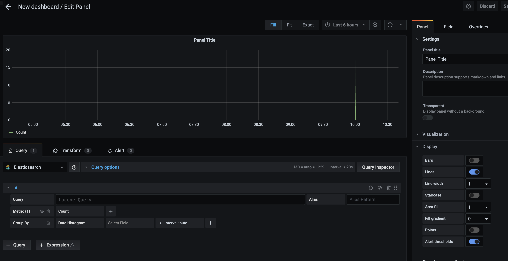
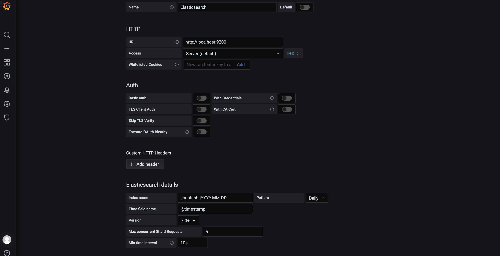

# 0-1Learning


## Jenkins

### Mac使用brew安装
brew search grafana
brew install grafana
brew services start grafana

启动后打开地址：http://localhost:3000/
用户名密码：admin admin
安装路径：/usr/local/Cellar/grafana/version

###  Linux安装 (CentOS, Fedora, OpenSuse, Red Hat)基于RPM
参考文档：https://grafana.com/docs/grafana/latest/

1. 下载和安装
您可以从 YUM 存储库安装 Grafana，使用 YUM 手动安装，使用 RPM 手动安装，或通过下载二进制 .tar.gz 文件。

从 YUM 存储库安装
如果从 YUM 存储库安装，则每次运行 sudo yum update 时都会自动更新 Grafana。
Grafana Version	Package	Repository
Grafana OSS	grafana	https://packages.grafana.com/oss/rpm
Grafana OSS (Beta)	grafana	https://packages.grafana.com/oss/rpm-beta
Grafana Enterprise	grafana-enterprise	https://packages.grafana.com/enterprise/rpm
Grafana Enterprise (Beta)	grafana-enterprise	https://packages.grafana.com/enterprise/rpm-beta


选择是否要安装 Grafana 的开源版或企业版，并将您选择的版本中的信息输入到 grafana.repo 中。如果您想安装 Grafana 的 Beta 版，您需要将 URL 替换为上表中的 Beta URL。

手动添加 /etc/yum.repos.d/grafana.repo文件：
开源版
```
[grafana]
name=grafana
baseurl=https://packages.grafana.com/oss/rpm
repo_gpgcheck=1
enabled=1
gpgcheck=1
gpgkey=https://packages.grafana.com/gpg.key
sslverify=1
sslcacert=/etc/pki/tls/certs/ca-bundle.crt
```

安装
```
sudo yum install grafana
```

手动下载安装
```
//二进制安装
wget https://dl.grafana.com/oss/release/grafana-8.0.6.linux-amd64.tar.gz
tar -zxvf grafana-8.0.6.linux-amd64.tar.gz

//rpm下载安装
wget https://dl.grafana.com/oss/release/grafana-8.0.6-1.x86_64.rpm
sudo yum install grafana-8.0.6-1.x86_64.rpm
```

2. 启动服务器
使用 systemd 启动服务器
```
sudo systemctl daemon-reload
sudo systemctl start grafana-server
sudo systemctl status grafana-server
```
将 Grafana 服务器配置为在引导时启动：
```
sudo systemctl enable grafana-server
```

使用 初始化文件 启动服务器
```
sudo service grafana-server start
sudo service grafana-server status
```
将 Grafana 服务器配置为在引导时启动：
```
sudo /sbin/chkconfig --add grafana-server
```

二进制启动
运行以下命令启动 Grafana：
```
./bin/grafana-server web
```

### 登录
1. 打开 Web 浏览器并转到 http://localhost:3000/。 Grafana 侦听的默认 HTTP 端口是 3000，除非您配置了其他端口。
2. 在登录页面，输入 admin 作为用户名和密码。
3. 单击登录。如果登录成功，您将看到更改密码的提示。
4. 在提示中单击“确定”，然后更改您的密码。

### 创建仪表板
1. 单击侧面菜单上的 + 图标。
2. 在仪表板上，单击 *Add an empty panel* 。
3. 在新建仪表板/编辑面板视图中，转到 *Query* 选项卡。
4. 通过从数据源选择器中选择 -- Grafana/或你自己添加的数据源 -- 来配置您的查询。这将生成 *Random Walk* 仪表板。
5. 单击屏幕右上角的 *Save* 图标以保存仪表板。
6. 添加描述性名称，然后单击 *Save* 保存。


### grafana 默认的dashboards
- redis ⾯面板：https://grafana.com/grafana/dashboards/11692
- Es ⾯面板：https://grafana.com/grafana/dashboards/3236
- mysql ⾯面板：https://grafana.com/grafana/dashboards/11323
- rocketmq ⾯面板：https://grafana.com/grafana/dashboards/10477
- Druid ⾯面板：https://grafana.com/grafana/dashboards/11157
- JVM ⾯面板：https://grafana.com/grafana/dashboards/4701

操作步骤：
    1. 去网站，点击对应的 *Copy ID to Clipboard*
    2. 去grafana面板，点击 *+* 号，点击 *import* 
    3. 从这里上传复制的ID，仪表板 URL，仪表板 JSON 文件、 或仪表板 JSON 文本直接粘贴到文本区域。


### 添加数据源
1. 将光标移动到侧面菜单上的齿轮图标，该图标将显示 *Configuration* 选项。
2. 单击 *Data Sources* 数据源。数据源页面打开，显示先前为 Grafana 实例配置的数据源列表。
3. 单击 *Add Data Sources* 以查看所有支持的数据源的列表
   ```
   Mysql
   ElasticSearch
   Prometheus
   ...
   ```
4. 通过在搜索对话框中输入名称来搜索特定数据源。或者，您可以滚动浏览按时间序列、日志记录、跟踪和其他类别分组的受支持数据源。
5. 将光标移到要添加的数据源上。 单击 *Select*。数据源配置页面打开, 按照特定于该数据源的说明配置数据源

### mysql数据源配置
1. 数据源选项

|名称| 描述|
|---|---|
|Name |数据源名称。这就是您在面板和查询中引用数据源的方式。|
|Default |默认数据源意味着它将为新面板预先选择。|
|Host |MySQL 实例的 IP 地址/主机名和可选端口。|
|Database |MySQL 数据库的数据库名称。|
|User|用户数据库用户的登录名/用户名|
|Password |数据库用户的密码|
|Session Timezone |指定数据库会话中使用的时区，例如 Europe/Berlin 或 +02:00。如果数据库（或数据库的主机）的时区设置为非 UTC 时区，则这是必要的。使用 SET time_zone='...' 设置会话中使用的值。如果将此字段留空，则不会更新时区。有关更多信息，请参阅 MySQL 文档。|
|Max open| 数据库的最大打开连接数，默认为无限制（Grafana v5.4+）。|
|Max idle |空闲连接池中的最大连接数，默认为 2 (Grafana v5.4+)。|
|Max lifetime |连接可以重用的最长时间（以秒为单位），默认为 14400/4 小时。这应该始终低于 MySQL (Grafana v5.4+) 中配置的 wait_timeout。|

2. Min time interval时间间隔  
$__interval 和 $__interval_ms 变量的下限。
建议设置为写入频率，例如如果您的数据每分钟写入一次，则为1m。也可以在数据源选项下的仪表板面板中覆盖/配置此选项。
请务必注意，此值需要格式化为数字后跟有效时间标识符，例如1m（1 分钟）或 30s（30 秒）。支持以下时间标识符：
```
Identifier	Description
y	year
M	month
w	week
d	day
h	hour
m	minute
s	second
ms	millisecond
```

3. 数据库用户权限（重要！）
```
CREATE USER 'grafanaReader' IDENTIFIED BY 'password';
GRANT SELECT ON mydatabase.mytable TO 'grafanaReader';
```
*如果要授予对更多数据库和表的访问权限，可以使用通配符 ( ) 代替数据库或表。


4. 向数据库中添加数据
建表语句：
```
-- ----------------------------
-- Table structure for mytable
-- ----------------------------
DROP TABLE IF EXISTS `mytable`;
CREATE TABLE `mytable` (
  `id` int(11) NOT NULL AUTO_INCREMENT,
  `name` varchar(255) COLLATE utf8mb4_bin DEFAULT NULL,
  `time` bigint(20) DEFAULT NULL,
  PRIMARY KEY (`id`)
) ENGINE=InnoDB AUTO_INCREMENT=8 DEFAULT CHARSET=utf8mb4 COLLATE=utf8mb4_bin;

SET FOREIGN_KEY_CHECKS = 1;
```
insert语句
```
INSERT INTO `grafana_test`.`mytable` (`id`, `name`, `time`) VALUES (null, rand()*10000, rand()*100000+1626340861);
INSERT INTO `grafana_test`.`mytable` (`id`, `name`, `time`) VALUES (null, rand()*10000, rand()*100000+1626340861);
INSERT INTO `grafana_test`.`mytable` (`id`, `name`, `time`) VALUES (null, rand()*10000, rand()*100000+1626340861);
...
```

5. 查询编辑器
>Only available in Grafana v5.4+.

您可以在面板编辑模式的指标选项卡中找到 MySQL 查询编辑器。您可以通过单击面板标题进入编辑模式，然后进行编辑。
查询编辑器有一个名为的链接Generated SQL，在执行查询后，在面板编辑模式下显示。单击它，它将展开并显示已执行的原始内插 SQL 字符串。

* 选择表、时间列和度量列（FROM）
FROM mytable ：选择表
Time column time： 选择时间列
Metric column none：选择指标列

* 列和聚合函数 (SELECT)
Column: id  选择要查询的列
Aggregate:  avg 设置对应的聚合函数
Alias: id  设置别名

* 过滤数据（WHERE）
WHERE  Macro: $__unixEpochFilter  默认最近6小时

* 分组（GROUP BY）
time ($__interval, none)  默认按时间分组

* 填隙
当你按时间分组时，Grafana 可以填充缺失值。time 函数接受两个参数。第一个参数是您想要分组的时间窗口，第二个参数是您希望 Grafana 填充缺失项的值。


6. 文本编辑器模式 (RAW)
您可以通过单击汉堡包图标并选择Switch editor mode或单击Edit SQL查询下方来切换到原始查询编辑器模式。
>如果您使用原始查询编辑器，请确保您的查询至少具有ORDER BY time返回时间范围的过滤器。 

示例
```
SELECT
  $__unixEpochGroupAlias(time,$__interval),
  avg(id) AS "id",
  avg(name) AS "name"
FROM mytable
WHERE
  $__unixEpochFilter(time)
GROUP BY 1
ORDER BY $__unixEpochGroup(time,$__interval)
```
为了简化语法并允许动态部分，如日期范围过滤器，查询可以包含宏。
```
宏示例	描述
$__time(dateColumn)	将替换为表达式以转换为 UNIX 时间戳并将列重命名为time_sec. 例如，UNIX_TIMESTAMP(dateColumn) 为 time_sec
$__timeEpoch(dateColumn)	将替换为表达式以转换为 UNIX 时间戳并将列重命名为time_sec. 例如，UNIX_TIMESTAMP(dateColumn) 为 time_sec
$__timeFilter(dateColumn)	将被使用指定列名称的时间范围过滤器替换。例如，dateColumn BETWEEN FROM_UNIXTIME(1494410783) AND FROM_UNIXTIME(1494410983)
$__timeFrom()	将替换为当前活动时间选择的开始。例如，FROM_UNIXTIME(1494410783)
$__timeTo()	将替换为当前活动时间选择的结尾。例如，FROM_UNIXTIME(1494410983)
$__timeGroup(dateColumn,'5m')	将被 GROUP BY 子句中可用的表达式替换。例如，*cast(cast(UNIX_TIMESTAMP(dateColumn)/(300) as signed) 300 as signed)，
$__timeGroup(dateColumn,'5m', 0)	与上面相同，但有一个填充参数，因此该系列中的缺失点将由 grafana 添加，0 将用作值。
$__timeGroup(dateColumn,'5m', NULL)	与上述相同，但 NULL 将用作缺失点的值。
$__timeGroup(dateColumn,'5m', previous)	与上述相同，但如果尚未看到任何值，则该系列中的前一个值将用作填充值，将使用 NULL（仅在 Grafana 5.3+ 中可用）。
$__timeGroupAlias(dateColumn,'5m')	将被替换为与 $__timeGroup 相同但添加了列别名（仅在 Grafana 5.3+ 中可用）。
$__unixEpochFilter(dateColumn)	将被使用指定列名的时间范围过滤器替换，时间表示为 Unix 时间戳。例如，dateColumn > 1494410783 AND dateColumn < 1494497183
$__unixEpochFrom()	将被当前活动时间选择的开始替换为 Unix 时间戳。例如，1494410783
$__unixEpochTo()	将被当前活动时间选择的结尾替换为 Unix 时间戳。例如，1494497183
$__unixEpochNanoFilter(dateColumn)	将被使用指定列名的时间范围过滤器替换，时间表示为纳秒时间戳。例如，dateColumn > 1494410783152415214 AND dateColumn < 1494497183142514872
$__unixEpochNanoFrom()	将被当前活动时间选择的开始替换为纳秒时间戳。例如，1494410783152415214
$__unixEpochNanoTo()	将被当前活动时间选择的末尾替换为纳秒时间戳。例如，1494497183142514872
$__unixEpochGroup(dateColumn,'5m', [fillmode])	与 $__timeGroup 相同，但时间存储为 Unix 时间戳（仅在 Grafana 5.3+ 中可用）。
$__unixEpochGroupAlias(dateColumn,'5m', [fillmode])	与上面相同，但还添加了列别名（仅在 Grafana 5.3+ 中可用）。
```

### ElasticSearch数据源
1. 数据源选项

|名称| 描述|
|---|---|
|Name	|数据源名称。这是您在面板和查询中引用数据源的方式.|
|Default	|默认数据源意味着它将为新面板预先选择.|
|Url	|Elasticsearch 服务器的 HTTP 协议、IP 和端口.|
|Access	|服务器（默认）= URL 需要可以从 Grafana 后端/服务器访问，浏览器 = URL 需要可以从浏览器访问。|

访问模式：
* Server access mode (Default)：服务器访问模式（默认）
所有请求都将从浏览器发送到 Grafana 后端/服务器，后者又会将请求转发到数据源，从而绕过可能的跨源资源共享 (CORS) 要求。如果选择此访问模式，则需要可以从 grafana 后端/服务器访问该 URL。

* Browser (Direct) access：浏览器（直接）访问
>警告：浏览器（直接）访问已被弃用，并将在未来版本中删除。

所有请求都将从浏览器直接发送到数据源，并且可能受跨源资源共享 (CORS) 要求的约束。如果选择此访问模式，则需要可以从浏览器访问该 URL。

如果您选择浏览器访问，您必须更新您的 Elasticsearch 配置以允许其他域从浏览器访问 Elasticsearch。您可以通过在 elasticsearch.yml 配置文件中指定这两个选项来完成此操作。
```
http.cors.enabled: true
http.cors.allow-origin: "*"
```

索引设置
```
Index name
Time field 
```

弹性搜索版本
从版本选择下拉列表中选择 Elasticsearch 数据源的版本。不同版本的查询编辑器中提供了不同的查询组合和功能。可用Elasticsearch版本2.x，5.x，5.6+，6.0+，7.0+和7.7+。选择与您的数据源版本最匹配的选项。

Min time interval最小时间间隔
时间间隔  $__interval and $__interval_ms 

Logs日志
有两个参数，消息字段名称和级别字段名称，可以选择从数据源设置页面进行配置，以确定在浏览器中可视化日志时哪些字段将用于日志消息和日志级别。

例如，如果您使用 Filebeat 的默认设置将日志传送到 Elasticsearch，则以下配置应该有效：

* 消息字段名称：message
* 级别字段名称：fields.level

Data links数据链接
数据链接从指定字段创建链接，可在浏览器的日志视图中访问该链接。

每个数据链路配置包括：
* Field - 数据链接使用的字段名称。
* URL/query - 如果链接是外部链接，则输入完整的链接 URL。如果链接是内部链接，则此输入用作对目标数据源的查询。在这两种情况下，您都可以使用 ${__value.raw } 宏从字段中插入值。
* Internal link - 选择链接是内部链接还是外部链接。在内部链接的情况下，数据源选择器允许您选择目标数据源。仅支持跟踪数据源。


在仪表盘中指标查询编辑器

在Elasticsearch 查询编辑器允许您选择多个指标并按多个术语或过滤器分组。
使用右侧的加号和减号图标添加/删除指标或分组依据子句。
某些度量和分组依据子句具有选项，单击选项文本可展开行以查看和编辑度量或分组依据选项。

管道指标
一些指标聚合称为流水线聚合，例如，移动平均和导数。Elasticsearch 管道指标需要基于另一个指标。使用指标旁边的眼睛图标隐藏指标，使其不显示在图表中。这对于仅在查询中用于管道指标的指标很有用。

查询变量
Elasticsearch 数据源支持两种类型的查询，您可以在查询变量的查询字段中使用。查询是使用自定义 JSON 字符串编写的。
询问	描述
{"find": "fields", "type": "keyword"}	返回具有索引类型的字段名称列表keyword。
{"find": "terms", "field": "@hostname", "size": 1000}	使用术语聚合返回字段的值列表。查询将使用当前仪表板时间范围作为查询的时间范围。
{"find": "terms", "field": "@hostname", "query": '<lucene query>'}	使用术语聚合和指定的 lucene 查询过滤器返回字段的值列表。查询将使用当前仪表板时间范围作为查询的时间范围。

在查询中使用变量
有两种语法：
```
$<varname> 示例：@hostname:$hostname
[[varname]] 示例：@hostname:[[hostname]]
```

配置示例：

向elastic中添加一些数据


### Prometheus数据源
数据源选项

|名称| 描述|
|---|---|
|Name	|数据源名称。这就是您在面板和查询中引用数据源的方式。|
|Default	|默认数据源意味着它将为新面板预先选择。|
|Url	|您的 Prometheus 服务器的 URL，例如http://prometheus.example.org:9090.|
|Access	|服务器（默认）= URL 需要可以从 Grafana 后端/服务器访问，浏览器 = URL 需要可以从浏览器访问。|
|Basic Auth	|启用对 Prometheus 数据源的基本身份验证。|
|User	|用于基本身份验证的用户名。|
|Password	|用于基本身份验证的密码。|
|Scrape interval	|将此设置为 Prometheus 中配置的典型抓取和评估间隔。默认为 15 秒。|
|HTTP method	|使用 POST 或 GET HTTP 方法来查询您的数据源。POST 是推荐的和预先选择的方法，因为它允许更大的查询。如果您的 Prometheus 版本低于 2.1 或者 POST 请求在您的网络中受到限制，请将其更改为 GET。|
|Disable metrics lookup	|选中此选项将禁用查询字段自动完成中的指标选择器和指标/标签支持。如果较大的 Prometheus 实例出现性能问题，这会有所帮助。|
|Custom Query Parameters	|将自定义参数添加到 Prometheus 查询 URL。例如timeout，partial_response、dedup、 或max_source_resolution。多个参数应该用“&”连接在一起。|
|Label name	|在标签对象中添加字段的名称。|
|URL	|如果链接是外部链接，则输入完整的链接 URL。您可以使用${__value.raw }宏从字段中插入值。|
|Internal link	|选择链接是内部链接还是外部链接。对于内部链接，数据源选择器允许您选择目标数据源。仅支持跟踪数据源。|

### Prometheus 查询编辑器
|名称| 描述|
|---|---|
|Query expression	|Prometheus query expression, check out the Prometheus documentation.|
|Legend format	|Controls the name of the time series, using name or pattern. For example {{hostname}} is replaced with the label value for the label hostname.|
|Min step	|An additional lower limit for the step parameter of Prometheus range queries and for the $__interval and $__rate_interval variables. The limit is absolute, it cannot modified by the Resolution setting.|
|Resolution	|1/1 sets both the $__interval variable and the step parameter of Prometheus range queries such that each pixel corresponds to one data point. For better performance, lower resolutions can be picked. 1/2 only retrieves a data point for every other pixel, and 1/10 retrieves one data point per 10 pixels. Note that both Min time interval and Min step limit the final value of $__interval and step.|
|Metric lookup	|Search for metric names in this input field.|
|Format as	|Switch between Table, Time series, or Heatmap. Table will only work in the Table panel. Heatmap is suitable for displaying metrics of the Histogram type on a Heatmap panel. Under the hood, it converts cumulative histograms to regular ones and sorts series by the bucket bound.|
|Instant	|Perform an “instant” query, to return only the latest value that Prometheus has scraped for the requested time series. Instant queries return results much faster than normal range queries. Use them to look up label sets.|
|Min time interval	|This value multiplied by the denominator from the Resolution setting sets a lower limit to both the $__interval variable and the step parameter of Prometheus range queries. Defaults to Scrape interval as set in the data source options.|
|Exemplars	|Run and show exemplars in the graph.|

查看可选配置：
Query options：
    Max data points：每个系列的最大数据点。某些数据源直接使用，用于计算自动间隔。对于流数据，此值用于滚动缓冲区。
    Min interval：间隔的下限。建议设置为写入频率，例如如果您的数据每分钟写入一次，则为1m。对于大多数数据源，可以在数据源设置中设置默认值。
    Interval：间隔。发送到数据源并在 $__interval 和 $__interval_ms 中使用的评估间隔
    Relative time ：相对时间
    Time shift：时移


prometheus指标查询步骤：
1. 选择一个指标（选择指标后，只会显示可能的标签。）
2. 选择要搜索的标签（选择标签值后，仅显示可能的标签组合。）
3. 为您的标签选择（多个）值（使用搜索字段在选定标签中查找值。）
4. 结果选择器
   Use query
   Use as rate query
   Validate selector


