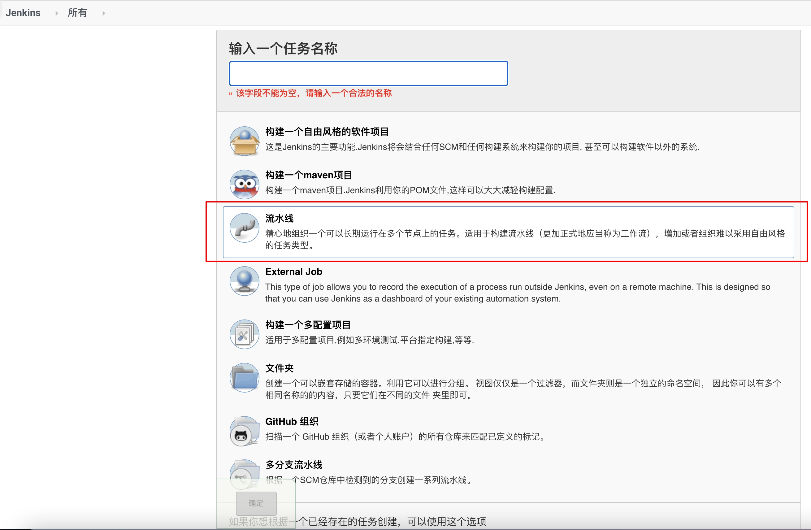
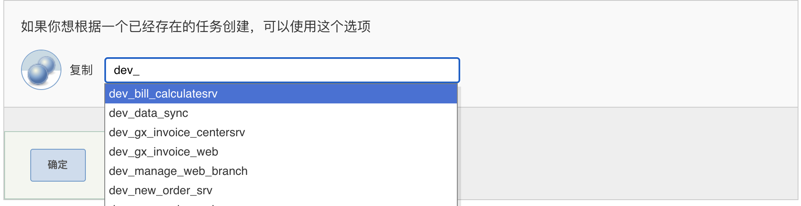
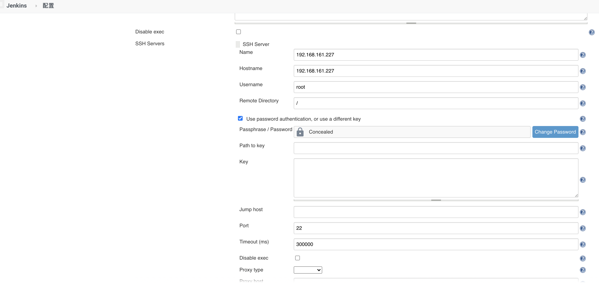

# 0-1Learning


## Jenkins
Jenkins是一个开源软件项目，是基于Java开发的一种持续集成工具，用于监控持续重复的工作，旨在提供一个开放易用的软件平台，使软件项目可以进行持续集成. 
官网：https://www.jenkins.io/zh/
文档地址：https://www.jenkins.io/zh/doc/

### 安装部署
基于brew安装jenkins环境
```
安装最新的 LTS 版本： brew install jenkins-lts
安装特定的 LTS 版本： brew install jenkins-lts@YOUR_VERSION
启动Jenkins服务：brew services start jenkins-lts
重启Jenkins服务：brew services restart jenkins-lts
更新 Jenkins 版本： brew upgrade jenkins-lts
```

基于Docker安装Jenkins环境
```
docker search jenkins
docker pull jenkins
# 启动jenkins
docker run \
--name jenkins \
-d \
-p 8080:8080 \
-p 50000:50000 \
-v jenkins-data:/var/jenkins_home \
-v /opt/edas/jdk/jdk1.8.0_65:/opt/edas/jdk/jdk1.8.0_65 \
-v /opt/maven-3.6.3:/opt/maven-3.6.3 \
-v /root/.nvm/versions/node/v10.10.0:/node
jenkins

docker exec -it jenkins_v /bin/bash #进入jenkins容器
systemctl restart  docker    #重启容器
```

1. 访问http://localhost:8080 jenkins地址
2. 从 Jenkins 控制台日志输出中，复制自动生成的字母数字密码（在 2 组星号之间）。
3. 在解锁 Jenkins页面上，将此密码粘贴到管理员密码字段中，然后单击继续
4. 安装所需的插件（EDAS、Git、Gitlab、NodeJS、Pipeline、Publish Over SSH、SSH plugin、SSH Agent）
5. 创建第一个管理员用户

### 手动安装（不推荐）
> 下载地址：https://jenkins.io/

**rpm安装：**
```
sudo wget -O /etc/yum.repos.d/jenkins.repo https://pkg.jenkins.io/redhat-stable/jenkins.repo
sudo rpm --import https://pkg.jenkins.io/redhat-stable/jenkins.io.key
```

**yum安装：**
```
yum install jenkins
```

**jenkins相关命令：**
```
sudo systemctl daemon-reload    #注册jenkins服务
sudo systemctl start jenkins    #启动jenkins
sudo systemctl status jenkins   #检查 Jenkins 服务的状态
```


### Jenkins全局工具配置
全局工具是打包的基础：例如maven，没有maven工具，打包是进行不了的

配置路径：系统管理——全局工具配置
- JDK环境安装
- Git
- Maven环境安装
- 全局属性-环境变量
> 说明：可以使用宿主机内的环境，需要让docker挂载相应的目录即可，也可以指定版本自动安装
```
jdk1.8
/opt/edas/jdk/jdk1.8.0_65

Default
git

maven
/opt/maven-3.6.3

node
/node
```


### Jenkins pipeline流水线构建：
Jenkins构建一个项目的方式有很多，如自由风格、maven项目、流水线等。 这里主要介绍流水线构建，流水线编写脚本易于配置和迁移，还能和docker联动。

> 脚本的步骤 ：拉取 -> 代码-> 构建 -> 上传到服务器器目录 -> 启动脚本

> 新的项⽬目主要更更改第⼀步的gitlab 地址url和upload 上传⽬目录remoteDirectory

流水线脚本：
```
pipeline {
   agent any

   tools {
      // Install the Maven version configured as "M3" and add it to the path.
      maven "maven"
   }

   stages {
      stage('Clone') {
         steps {
            // Get some code from a GitHub repository
             git branch: 'master', credentialsId: 'gitlab', url: 'http://192.168.102.34/new-platform/new-order'
         }
      }
      stage('Build') {
          steps {
            withMaven(globalMavenSettingsFilePath: '/opt/maven-3.6.3/conf/settings.xml', jdk: 'jdk1.8', maven: 'maven', mavenSettingsFilePath: '/opt/maven-3.6.3/conf/settings.xml') {
            sh "mvn -Dmaven.test.skip=true clean install -U"
            echo "build success ${WORKSPACE},build id ${BUILD_ID},build tag ${BUILD_TAG}"   // some block
            }
        }
      }
      stage('Upload') {
          steps {
              sh 'echo upload start'
              sshPublisher(publishers: [sshPublisherDesc(configName: '192.168.161.168', transfers: [sshTransfer(cleanRemote: true, excludes: '', execCommand: 'echo upload success', execTimeout: 120000, flatten: false, makeEmptyDirs: true, noDefaultExcludes: false, patternSeparator: '[, ]+', remoteDirectory: 'tmp', remoteDirectorySDF: false, removePrefix: 'target', sourceFiles: 'target/*.war')], usePromotionTimestamp: false, useWorkspaceInPromotion: false, verbose: false)])
          }
      }
      stage("exec remote shell"){
          steps {
             sshagent(['dev_server']) {
             sh 'ssh root@192.168.161.168 /home/startOrderCore.sh'
            }
          }
      }
   }
}
```

### Jenkins流水线语法（pipeline-syntax生成流水线脚本）：
> 任意Job 左侧都有流水线语法，如：http://jenkins地址/pipeline-syntax/

> 使用流水线语法可以生成对应的流水线脚本，

> 操作方法：选择对应的操作步骤，如git: Git，输入对的参数，如仓库 URL、分支、凭据等，点击生成流水线脚本即可

示例：
```
git: Git
git branch: 'master', credentialsId: 'gitlab', url: 'http://IP/new-platform/new-order.git'

Sh: Shell Script
sh label: '', script: 'mvn clean package'

sshPublisher: Send build artifacts over SHH
sshPublisher(publishers: [sshPublisherDesc(configName: 'IP', transfers: [sshTransfer(cleanRemote: false, excludes: '', execCommand: '', execTimeout: 120000, flatten: false, makeEmptyDirs: false, noDefaultExcludes: false, patternSeparator: '[, ]+', remoteDirectory: 'tmp', remoteDirectorySDF: false, removePrefix: 'target', sourceFiles: 'target/*.war')], usePromotionTimestamp: false, useWorkspaceInPromotion: false, verbose: false)])

Sshagent: SSH Agent
选择账户或添加账户
```

### tomcat方式部署-服务器脚本
```
#!/bin/bash
/home/admin/tomcat/bin/catalina.sh stop 1 -force
cd /home/admin/tomcat/deploy
rm -rf new-order
rm -rf new-order.war
cp /tmp/new-order.war /home/admin/tomcat/deploy/
/home/admin/tomcat/bin/catalina.sh start                                                                        
```
注：startup.sh的源代码，其实就是执行catalina.sh start

### vue构建-Pipeline脚本
```
pipeline {
   agent any

   stages {
      stage('clone') {
         steps {
            git credentialsId: 'github', url: 'https://github.com/new-platform/timber-vue.git'
         }
      }
      stage('build') {
          steps {
              sh 'npm install'
              sh 'npm run build:prod'
          }
      }
      stage('upload') {
          steps {
            sshPublisher(publishers: [sshPublisherDesc(configName: '123.56.232.61', transfers: [sshTransfer(cleanRemote: true, excludes: '', execCommand: '', execTimeout: 120000, flatten: false, makeEmptyDirs: false, noDefaultExcludes: false, patternSeparator: '[, ]+', remoteDirectory: 'www/wwwroot/shutuadmin', remoteDirectorySDF: false, removePrefix: '', sourceFiles: 'dist/**')], usePromotionTimestamp: false, useWorkspaceInPromotion: false, verbose: false)])
          }
      }
   }
}
```


### jar包方式部署-步骤说明

#### 1.新建任务
操作步骤：新建任务 - 输入任务名称 - 选择流水线方式构建

> 也可以使用底部的复制选项，选择已创建的任务进行复制操作
> 

#### 2.jar包方式部署-Pipeline脚本
操作步骤：流水线 - 选择Pipeline script - 编写脚本 
```
pipeline {
   agent any

   tools {
      // Install the Maven version configured as "M3" and add it to the path.
      maven "maven"
   }

   stages {
      stage('Clone') {
         steps {
            // Get some code from a GitHub repository
             git branch: 'master', credentialsId: 'gitlab', url: 'http://192.168.102.34/new-platform/timber'
         }
      }
      stage('Build') {
          steps {
            withMaven(globalMavenSettingsFilePath: '/opt/maven-3.6.3/conf/settings.xml', jdk: 'jdk1.8', maven: 'maven', mavenSettingsFilePath: '/opt/maven-3.6.3/conf/settings.xml') {
            sh "mvn -Dmaven.test.skip=true clean install -U"
            echo "build success ${WORKSPACE},build id ${BUILD_ID},build tag ${BUILD_TAG}"   // some block
            }
        }
      }
      stage('Upload') {
          steps {
              sh 'echo upload start'
              sshPublisher(publishers: [sshPublisherDesc(configName: '192.168.162.65', transfers: [sshTransfer(cleanRemote: true, excludes: '', execCommand: '/home/startOrderCore.sh', execTimeout: 120000, flatten: false, makeEmptyDirs: true, noDefaultExcludes: false, patternSeparator: '[, ]+', remoteDirectory: 'tmp', remoteDirectorySDF: false, removePrefix: 'target', sourceFiles: 'target/*.tar.gz')], usePromotionTimestamp: false, useWorkspaceInPromotion: false, verbose: false)])
          }
      }

   }
}
```
> 说明： 
> 1.和war包方式部署相比，Clone和Build没有改动，Clone拉取代码、Build时候用mvn打包、Upload识别文件上传，只有Upload环节改动了要去识别tar包文件 
>
> 2./home/startOrderCore.sh 脚本的编写也不相同，war包依赖于tomcat启动，jar使用命令行启动，需要注意

#### 3.jar包方式部署-服务器脚本
脚本放置路径：/home/startOrderCore.sh
```
#!/bin/bash
/opt/timber/bin/start.sh stop
echo 'stop success'
cd /opt/
rm -rf timber
rm -rf timber.tar.gz
cp /tmp/timber.tar.gz /opt
tar -zxvf timber.tar.gz
/opt/timber/bin/start.sh start
```
> 说明： 
> 1.脚本需要授权jenkins用户执行权限：chmod -R a+rwx /home/startOrderCore.sh 
> 
> 2.这里的start.sh为自行编写，脚本可根据需要自行改动路径或者start.sh

#### 4.jar包方式部署-配置jenkins能访问模板服务器
> 操作路径：Jenkins - 系统管理 - 系统配置 - Publish over SSH - SSH Servers

> 需要配置：Hostname + Username + Remote Directory + Passphrase / Password



### 构建多分支流水线任务
1. 新建任务——多分支流水线
2. 输入Git仓库地址、凭据
3. 项目中添加jenkinsfile，内容同上面的pipline
4. Jenkins——系统管理——系统设置——设置 SSH Servers：输入IP、用户名、密码、远程目录


### 常见问题解析

#### shell脚本执行nohup java -jar 失败，手动执行脚本成功 
解决：可能是java环境变量在当前用户找不到，shell脚本添加source /etc/profile


#### 解决“Jenkins 主机密钥验证失败”
1. ssh-keygen命令生成公钥私钥
   2.去--> cat /var/lib/jenkins/.ssh/id_rsa.pub 从 id_rsa.pub 复制密钥（也可以使用scp命令）
   3.文本复制
   ssh登录目标服务器：ssh -l root 192.168.161.168
   touch /root/.ssh/authorized_keys
   vi .ssh/authorized_keys  粘贴复制的密钥

4.scp复制
scp复制公钥：scp /root/.ssh/id_rsa.pub root@192.168.1.181:/root/.ssh/authorized_keys
由于还没有免密码登录的，所以要输入一次B机的root密码。

5.修改权限
需要特别注意的是：B主机的.ssh文件的所有者要是root，如果不是要改：
chown -R root:root .ssh
同时，B主机的authorized_keys文件，要是600权限的，如果不是，也要改：
chmod 600 authorized_keys
如果执行权限不够报错：-bash: ./startup.sh: 权限不够
使用：chmod u+x *

6.手动登录mercurial服务器
注意：请手动登录，否则 jenkins 会再次报错“主机验证失败”
ssh -l root 192.168.1.181

#### jenkins打包vue 全局工具中找不到node版本
解决办法
去官网找个文件 （文末带百度云共享文件 2018年12月22日10:20:07）

hudson.plugins.nodejs.tools.NodeJSInstaller

这个文件就是nodejs文件版本信息文件

放在jenkins 的目录下 /var/jenkins_home/updates

docker cp ./hudson.plugins.nodejs.tools.NodeJSInstaller jenkins:/var/jenkins_home/updates


