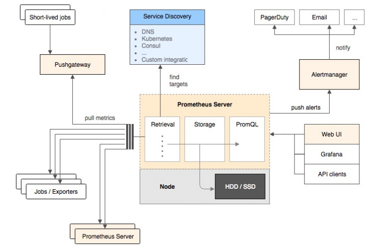

# 0-1Learning


## Prometheus
官网安装包下载：https://prometheus.io/download/
github地址：https://github.com/prometheus/prometheus

### prometheus基本原理
Prometheus基本原理是通过HTTP协议周期性抓取被监控组件的状态，这样做的好处是任意组件只要提供HTTP接口就可以接入监控系统，不需要任何SDK或者其他的集成过程。这样做非常适合虚拟化环境比如VM或者Docker 。

Prometheus应该是为数不多的适合Docker、Mesos、Kubernetes环境的监控系统之一。

输出被监控组件信息的HTTP接口被叫做exporter 。目前互联网公司常用的组件大部分都有exporter可以直接使用，比如Varnish、Haproxy、Nginx、MySQL、Linux 系统信息 (包括磁盘、内存、CPU、网络等等)，具体支持的源看：https://github.com/prometheus。

与其他监控系统相比，Prometheus的主要特点是：
- 一个多维数据模型（时间序列由指标名称定义和设置键/值尺寸）。
- 非常高效的存储，平均一个采样数据占~3.5bytes左右，320万的时间序列，每30秒采样，保持60天，消耗磁盘大概228G。
- 一种灵活的查询语言。
- 不依赖分布式存储，单个服务器节点。
- 时间集合通过HTTP上的PULL模型进行。
- 通过中间网关支持推送时间。
- 通过服务发现或静态配置发现目标。
- 多种模式的图形和仪表板支持。

### Prometheus架构概览

它的服务过程是这样的Prometheus daemon负责定时去目标上抓取metrics(指标) 数据，每个抓取目标需要暴露一个http服务的接口给它定时抓取。

Prometheus：支持通过配置文件、文本文件、zookeeper、Consul、DNS SRV lookup等方式指定抓取目标。支持很多方式的图表可视化，例如十分精美的Grafana，自带的Promdash，以及自身提供的模版引擎等等，还提供HTTP API的查询方式，自定义所需要的输出。

Alertmanager：是独立于Prometheus的一个组件，可以支持Prometheus的查询语句，提供十分灵活的报警方式。

PushGateway：这个组件是支持Client主动推送metrics到PushGateway，而Prometheus只是定时去Gateway上抓取数据。

### prometheus数据模型
Prometheus从根本上所有的存储都是按时间序列去实现的，相同的metrics(指标名称) 和label(一个或多个标签) 组成一条时间序列，不同的label表示不同的时间序列。为了支持一些查询，有时还会临时产生一些时间序列存储。

metrics name&label指标名称和标签
每条时间序列是由唯一的”指标名称”和一组”标签（key=value）”的形式组成。
指标名称：一般是给监测对像起一名字，例如http_requests_total这样，它有一些命名规则，可以包字母数字_之类的的。通常是以应用名称开头_监测对像_数值类型_单位这样。例如：push_total、userlogin_mysql_duration_seconds、app_memory_usage_bytes。
标签：就是对一条时间序列不同维度的识别了，例如一个http请求用的是POST还是GET，它的endpoint是什么，这时候就要用标签去标记了。最终形成的标识便是这样了：http_requests_total{method=”POST”,endpoint=”/api/tracks”}。

记住，针对http_requests_total这个metrics name无论是增加标签还是删除标签都会形成一条新的时间序列。
查询语句就可以跟据上面标签的组合来查询聚合结果了。

如果以传统数据库的理解来看这条语句，则可以考虑http_requests_total是表名，标签是字段，而timestamp是主键，还有一个float64字段是值了。（Prometheus里面所有值都是按float64存储）。

### Prometheus四种数据类型
Counter
Counter用于累计值，例如记录请求次数、任务完成数、错误发生次数。一直增加，不会减少。重启进程后，会被重置。
例如：http_response_total{method=”GET”,endpoint=”/api/tracks”} 100，10秒后抓取http_response_total{method=”GET”,endpoint=”/api/tracks”} 100。

Gauge
Gauge常规数值，例如 温度变化、内存使用变化。可变大，可变小。重启进程后，会被重置。
例如： memory_usage_bytes{host=”master-01″} 100 < 抓取值、memory_usage_bytes{host=”master-01″} 30、memory_usage_bytes{host=”master-01″} 50、memory_usage_bytes{host=”master-01″} 80 < 抓取值。

Histogram
Histogram（直方图）可以理解为柱状图的意思，常用于跟踪事件发生的规模，例如：请求耗时、响应大小。它特别之处是可以对记录的内容进行分组，提供count和sum全部值的功能。
例如：{小于10=5次，小于20=1次，小于30=2次}，count=7次，sum=7次的求和值。

Summary
Summary和Histogram十分相似，常用于跟踪事件发生的规模，例如：请求耗时、响应大小。同样提供 count 和 sum 全部值的功能。
例如：count=7次，sum=7次的值求值。
它提供一个quantiles的功能，可以按%比划分跟踪的结果。例如：quantile取值0.95，表示取采样值里面的95%数据。


### 安装运行Prometheus(docker版)
下面介绍如何使用Prometheus和Grafana对本机服务器性能进行监控
监控本机，只需要一个exporter：*node_exporter* – 用于机器系统数据收集
Grafana是一个开源的功能丰富的数据可视化平台，通常用于时序数据的可视化。它内置了prometheus等数据源的支持

1. 下载拉取镜像
docker search prometheus
docker pull prom/node-exporter
docker pull prom/prometheus
docker pull grafana/grafana

2. 启动node-exporter
```
docker run -d -p 9100:9100 \
--name="node-exporter" \
-v "/proc:/host/proc:ro" \
-v "/sys:/host/sys:ro" \
-v "/:/rootfs:ro" \
prom/node-exporter

```
3. 访问url
```
http://192.168.91.132:9100/metrics
```
界面上都是收集到数据，有了它就可以做数据展示了

4. 启动prometheus
新建目录prometheus，编辑配置文件prometheus.yml
```
mkdir /opt/prometheus
cd /opt/prometheus/
vim prometheus.yml
```
prometheus.yml文件内容：
```
global:
  scrape_interval:     60s
  evaluation_interval: 60s
 
scrape_configs:
  - job_name: prometheus
    static_configs:
      - targets: ['localhost:9090']
        labels:
          instance: prometheus
 
  - job_name: linux
    static_configs:
      - targets: ['10.10.30.64:9100']
        labels:
          instance: localhost
```
启动prometheus
```
docker run  -d \
--name="prometheus" \
-p 9090:9090 \
-v /opt/prometheus/prometheus.yml:/etc/prometheus/prometheus.yml  \
prom/prometheus

docker run -d --name="prometheus" -p 9090:9090 -v /Users/luoxiaosheng/path/to/prometheus.yml:/etc/prometheus/prometheus.yml prom/prometheus

```
访问url：http://192.168.91.132:9090/graph
访问targets：http://192.168.91.132:9090/targets

5. 启动grafana
```
   mkdir /opt/grafana-storage
   chmod 777 -R /opt/grafana-storage
```
因为grafana用户会在这个目录写入文件，直接设置777，比较简单粗暴！

docker启动grafana
```text
docker run -d \
--name="grafana" \
  -p 3000:3000 \
  --name=grafana \
  -v /opt/grafana-storage:/var/lib/grafana \
  grafana/grafana  
```
6. grafana添加数据源
添加仪表盘
查看
node_load15  #系统15分钟的负载
node_memory_MemTotal_bytes  #总内存


### promethes.yml配置说明
```
#全局配置
global:
  scrape_interval:     15s # 设置抓取间隔，默认为1分钟
  evaluation_interval: 15s #估算规则的默认周期，每15秒计算一次规则。默认1分钟
  # scrape_timeout  #默认抓取超时，默认为10s

#Alertmanager相关配置
alerting:
  alertmanagers:
  - static_configs:
    - targets:
      # - alertmanager:9093

#规则文件列表，使用'evaluation_interval' 参数去抓取
rule_files:
    #- "first_rules.yml"
    #- "second_rules.yml"
    - "mysql_rules.yml"

#远程写文件
remote_write:
  - url: http://remote1/push
    name: drop_expensive
    write_relabel_configs:
    - source_labels: [__name__]
      regex:         expensive.*
      action:        drop
    oauth2:
      client_id: "123"
      client_secret: "456"
      token_url: "http://remote1/auth"

  - url: http://remote2/push
    name: rw_tls
    tls_config:
      cert_file: valid_cert_file
      key_file: valid_key_file
    headers:
      name: value

# 远程读文件
remote_read:
  - url: http://remote1/read
    read_recent: true
    name: default
  - url: http://remote3/read
    read_recent: false
    name: read_special
    required_matchers:
      job: special
    tls_config:
      cert_file: valid_cert_file
      key_file: valid_key_file

#  抓取配置列表
scrape_configs:

  # prometheus抓取job
  - job_name: 'prometheus'
    static_configs:
    - targets: ['localhost:9090']

  # mysql抓取job
  - job_name: mysql
    basic_auth:
      username: root
      password: "Sgcc_1234"
    static_configs:
      - targets: ['192.168.160.178:3306']
        labels:
          instance: mysql
```

### 3、创建prometheus的用户及数据存储目录（不是必须）
为了安全，使用普通用户来启动prometheus服务。作为一个时序型的数据库产品，prometheus的数据默认会存放在应用所在目录下。
```
	• 创建用户，并指定家目录
[root@prometheus /]# groupadd prometheus
[root@prometheus /]# useradd -g prometheus -m -d /var/lib/prometheus -s /sbin/nologin prometheus
	• 创建数据目录
[root@prometheus ~]# mkdir /export/prometheus/data -p
	• 修改目录属主
[root@prometheus /]# chown prometheus.prometheus -R /usr/local/prometheus
```

### 4、启动prometheus（默认端口9090）
```
前台启动
[root@prometheus ~]# cd /usr/local/prometheus/
[root@prometheus prometheus]# ./prometheus
后台启动
[root@prometheus prometheus]# nohup ./prometheus &
配置文件启动
./prometheus --config.file=prometheus.yml
```
默认情况下，Prometheus 将其数据库存储在 ./data（标志 --storage.tsdb.path）。

docker启动：
```
docker run -p 9090:9090 -v /Users/luoxiaosheng/path/to/prometheus.yml:/etc/prometheus/prometheus.yml prom/prometheus
```
查看prometheus指标：http://localhost:9090/metrics
查看prometheus图表：http://localhost:9090/graph
查询prometheus实例：http://localhost:9090/targets

### prometheus表达式语句
官网文档：https://prometheus.io/docs/prometheus/latest/querying/basics/
promhttp_metric_handler_requests_total：Prometheus 服务器已服务的请求总数
promhttp_metric_handler_requests_total{code="200"}： HTTP请求为200
count(promhttp_metric_handler_requests_total)：计算返回的时间序列的数量
rate(promhttp_metric_handler_requests_total{code="200"}[1m])：每秒 HTTP 请求率返回状态代码 200 的图表

在 Prometheus 的表达式语言中，表达式或子表达式可以计算为以下四种类型之一：
- 即时向量- 一组时间序列，每个时间序列包含一个样本，所有时间序列都共享相同的时间戳
- 范围向量- 一组时间序列，包含每个时间序列随时间变化的数据点范围
- 标量- 一个简单的数字浮点值
- String - 一个简单的字符串值；目前未使用

### 保存热加载prometheus：
curl  -XPOST localhost:9090/-/reload


### prometheus报警、规则配置案例
官网地址：https://awesome-prometheus-alerts.grep.to/
github地址：https://github.com/samber/awesome-prometheus-alerts

示例：
配置mysql报警

可以使用groups聚合
```
groups:
- name: MySQLStatsAlert
  rules:
  - alert: MysqlDown
  。。。

```

2.1.1. MySQL down
MySQL instance is down on {{ $labels.instance }}[copy]
```
  - alert: MysqlDown
    expr: mysql_up == 0
    for: 0m
    labels:
      severity: critical
    annotations:
      summary: MySQL down (instance {{ $labels.instance }})
      description: "MySQL instance is down on {{ $labels.instance }}\n  VALUE = {{ $value }}\n  LABELS = {{ $labels }}"


```

2.1.2. MySQL too many connections (> 80%)
More than 80% of MySQL connections are in use on {{ $labels.instance }}
```
  - alert: MysqlTooManyConnections(>80%)
    expr: avg by (instance) (rate(mysql_global_status_threads_connected[1m])) / avg by (instance) (mysql_global_variables_max_connections) * 100 > 80
    for: 2m
    labels:
      severity: warning
    annotations:
      summary: MySQL too many connections (> 80%) (instance {{ $labels.instance }})
      description: "More than 80% of MySQL connections are in use on {{ $labels.instance }}\n  VALUE = {{ $value }}\n  LABELS = {{ $labels }}"
```

2.1.3. MySQL high threads running
More than 60% of MySQL connections are in running state on {{ $labels.instance }}
```
  - alert: MysqlHighThreadsRunning
    expr: avg by (instance) (rate(mysql_global_status_threads_running[1m])) / avg by (instance) (mysql_global_variables_max_connections) * 100 > 60
    for: 2m
    labels:
      severity: warning
    annotations:
      summary: MySQL high threads running (instance {{ $labels.instance }})
      description: "More than 60% of MySQL connections are in running state on {{ $labels.instance }}\n  VALUE = {{ $value }}\n  LABELS = {{ $labels }}"
```


### Prometheus ——exporter
exporter 导出系统中已经存在的指标。然后上传到Prometheus ，地址 https://prometheus.io/docs/instrumenting/exporters/
- mysql exporter 地址:https://github.com/prometheus/mysqld_exporter
- es exporter 地址：https://github.com/justwatchcom/elasticsearch_exporter
- rocketmq 地址：https://github.com/apache/rocketmq-exporter
- redis exporter 地址：https://github.com/oliver006/redis_exporter

>各种exporter 需要在服务器器上安装，按照安装⽂文档操作即可。


