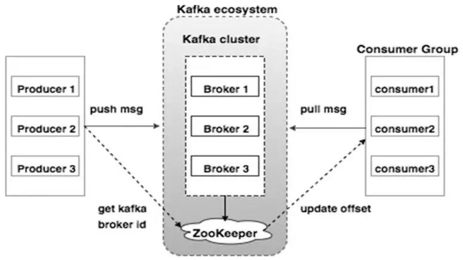

# 0-1Learning


## kafka

### 简介：
Kafka是最初由Linkedin公司开发，用scala语言编写的，是一个分布式、支持分区的（partition）、多副本的（replica），基于zookeeper协调的分布式消息系统。

Kafka以集群的方式运行，天生就是分布式的，特色在于其负载均衡能力和处理性能、容错能力。

### kafka组成
关键概念：
1. 生产者Producer：将向Kafka topic发布消息的程序成为producers.
2. 消费者Consumer：将订阅topics并消费消息的程序成为consumer.
3. broker：由一个或多个kafka服务(server)组成，每个服务叫做一个broker. 生产者通过网络将消息发送到Kafka集群，集群向消费者提供消息。
4. Topic：消息的主题或分类，kafka对消息保存时根据Topic进行归类，每条消息都属于且只属于一个topic，
   - 生产者在发送消息时、消费者在接收消息时都必须指定消息的topic。
   - 一个topic中可以包含多个partition（每个 Topic 至少有一个分区），同一 topic 下的不同分区包含的消息是不同的。
   - 为Topic创建分区时，分区数最好是broker数量的整数倍，这样才能是一个Topic的分区均匀的分布在整个Kafka集群中，如果不是整数倍，会造成分步不均匀的问题
5. Partition：
   - 每个partition(分区)在Kafka集群的若干服务(server)中都有副本/备份，这样这些持有副本的服务可以共同处理数据和请求，副本数量是可以配置的。
   - 每个分区有一个leader服务器，若干个followers服务器，leader负责处理消息的读和写，followers则去复制leader，如果leader down了，followers中的一台则会自动成为leader。
   - 可以理解为一个partition物理上对应一个文件夹。
   - 一个partition只分布于一个broker上（不考虑备份的情况下），每个partition都是一个有序队列，分为多个大小相等的segment（对用户透明）,每个segment对应一个文件，而segment文件由一条条不可变的记录组成（消息发出后就不可变更了），这里面的数据记录就是生产者发送的消息内容。
   - 每个消息在被添加到分区时，都会被分配一个 offset（称之为偏移量），它是消息在此分区中的唯一编号，kafka 通过 offset保证消息在分区内的顺序，offset 的顺序不跨分区，即 kafka只保证在同一个分区内的消息是有序的
   - 默认情况下，Kafka根据传递消息的key来进行分区的分配，即hash(key) % numPartitions，这就保证了相同key的消息一定会被路由到相同的分区。
   - 如果没有指定key，Kafka几乎就是随机找一个分区发送无key的消息，然后把这个分区号加入到缓存中以备后面直接使用——当然了，Kafka本身也会清空该缓存（默认每10分钟或每次请求topic元数据时）

- 补充：
无论是kafka集群，还是producer和consumer都依赖于zookeeper来保证系统可用性，zookeeper保存kafka集群的meta（元数据）信息（broker/consumer）。



### 消息发布模式
对于kafka来说，发布消息通常有两种模式：
* 点对点/队列模式（queuing）：
    * 一般基于拉取或轮询来接收消息，在队列模式中，可以有多个consumers同时在queue（队列）中侦听同一消息，但一条消息只会被一个consumer接收。
    既支持即发即弃的消息传送方式也支持同步请求/应答的消息传送方式。
* 发布/订阅模式(publish-subscribe)：
    * 既可以支持推送来接收消息，也可以通过拉取或轮询的形式来接收。发布到一个topic（主题）的消息可以被多个订阅者接收，解耦能力更强。

发布-订阅模式中消息被广播到所有的consumer，Consumers可以加入一个consumer 组，共同竞争一个topic，topic中的消息将被分发到组中的一个成员中。同一组中的consumer可以在不同的程序中，也可以在不同的机器上。
 
如果所有的consumer都在一个组中，这就成为了传统的队列模式，在各consumer中实现负载均衡。
如果所有的consumer都不在不同的组中，这就成为了发布-订阅模式，所有的消息都被分发到所有的consumer中。
更常见的是，每个topic都有若干数量的consumer组，每个组都是一个逻辑上的“订阅者”，为了容错和更好的稳定性，每个组由若干consumer组成。这其实就是一个发布-订阅模式，只不过订阅者是个组而不是单个consumer。


### kafka的message格式是什么样的
一个Kafka的Message组成：
    * 一个固定长度的header和
    * 一个变长的消息体body组成

* header部分由一个字节的magic(文件格式)和四个字节的CRC32(用于判断body消息体是否正常)构成。
当magic的值为1的时候，会在magic和crc32之间多一个字节的数据：attributes(保存一些相关属性，比如是否压缩、压缩格式等等);如果magic的值为0，那么不存在attributes属性

* body是由N个字节构成的一个消息体，包含了具体的key/value消息


### kafka中consumer group 是什么概念
同样是逻辑上的概念，是Kafka实现单播和广播两种消息模型的手段。
同一个topic的数据，会广播给不同的group；
同一个group中的worker，只有一个worker能拿到这个数据。
换句话说，对于同一个topic，每个group都可以拿到同样的所有数据，但是数据进入group后只能被其中的一个worker消费。
group内的worker可以使用多线程或多进程来实现，也可以将进程分散在多台机器上，worker的数量通常不超过partition的数量，且二者最好保持整数倍关系，因为Kafka在设计时假定了一个partition只能被一个worker消费（同一group内）。


### kafka中的broker 是干什么的
broker 是消息的代理，Producers往Brokers里面的指定Topic中写消息，Consumers从Brokers里面拉取指定Topic的消息，然后进行业务处理，broker在中间起到一个代理保存消息的中转站。


### kafka 为什么那么快
Cache Filesystem Cache PageCache缓存

顺序写 由于现代的操作系统提供了预读和写技术，磁盘的顺序写大多数情况下比随机写内存还要快。 
顺序写原理：每个topic有不同的分区，而每个分区下包含若干个只能追加写的提交日志：新消息被追加到文件的最末端。最直接的证明就是Kafka源码中只调用了FileChannel.write(ByteBuffer)，而没有调用过带offset参数的write方法，说明它不会执行随机写操作。
磁盘顺序读或写的速度400M/s，能够发挥磁盘最大的速度。 随机读写，磁盘速度慢的时候十几到几百K/s。

Zero-copy 零拷贝技术减少拷贝次数
零拷贝原理：零拷贝并不是不需要拷贝，而是减少不必要的拷贝次数。通常是说在IO读写过程中。
传统IO：
1、第一次：将磁盘文件，读取到操作系统内核缓冲区；
2、第二次：将内核缓冲区的数据，copy到application应用程序的buffer；
3、第三步：将application应用程序buffer中的数据，copy到socket网络发送缓冲区(属于操作系统内核的缓冲区)；
4、第四次：将socket buffer的数据，copy到网卡，由网卡进行网络传输。
第二次和第三次数据copy 其实在这种场景下没有什么帮助反而带来开销，数据可以直接从读缓冲区传输到套接字缓冲区，这也正是零拷贝出现的意义
数据直接在内核完成输入和输出，不需要拷贝到用户空间再写出去。 kafka数据写入磁盘前，数据先写到进程的内存空间。

Batching of Messages 批量量处理。合并小的请求，然后以流的方式进行交互，直顶网络上限。

Pull 拉模式 使用拉模式进行消息的获取消费，与消费端处理能力相符。

mmap文件映射
虚拟映射只支持文件； 在进程 的非堆内存开辟一块内存空间，和OS内核空间的一块内存进行映射，
kafka数据写入、是写入这块内存空间，但实际这块内存和OS内核内存有映射，也就是相当于写在内核内存空间了，且这块内核空间、内核直接能够访问到，直接落入磁盘。
这里，我们需要清楚的是：内核缓冲区的数据，flush就能完成落盘。

### 零拷贝
1. JVM向OS发出read()系统调用，触发上下文切换，从用户态切换到内核态。
2. 从外部存储（如硬盘）读取文件内容，通过直接内存访问（DMA）存入内核地址空间的缓冲区。
3. 将数据从内核缓冲区拷贝到用户空间缓冲区，read()系统调用返回，并从内核态切换回用户态。
4. JVM向OS发出write()系统调用，触发上下文切换，从用户态切换到内核态。
5. 将数据从用户缓冲区拷贝到内核中与目的地Socket关联的缓冲区。
6. 数据最终经由Socket通过DMA传送到硬件（如网卡）缓冲区，write()系统调用返回，并从内核态切换回用户态。

“基础的”零拷贝机制：
通过上面的分析可以看出，第2、3次拷贝（也就是从内核空间到用户空间的来回复制）是没有意义的，数据应该可以直接从内核缓冲区直接送入Socket缓冲区。零拷贝机制就实现了这一点。


### kafka中的 zookeeper 起到什么作用，可以不用zookeeper么

zookeeper 是一个分布式的协调组件，早期版本的kafka用zk做meta信息存储，consumer的消费状态，group的管理以及 offset的值。考虑到zk本身的一些因素以及整个架构较大概率存在单点问题，新版本中逐渐弱化了zookeeper的作用。新的consumer使用了kafka内部的group coordination协议，也减少了对zookeeper的依赖，

但是broker依然依赖于ZK，zookeeper 在kafka中还用来选举controller 和 检测broker是否存活等等。


### Kafka中的ISR、AR又代表什么？ISR的伸缩又指什么

ISR:In-Sync Replicas 副本同步队列
AR:Assigned Replicas 所有副本
ISR是由leader维护，follower从leader同步数据有一些延迟（包括延迟时间replica.lag.time.max.ms和延迟条数replica.lag.max.messages两个维度, 当前最新的版本0.10.x中只支持replica.lag.time.max.ms这个维度），任意一个超过阈值都会把follower剔除出ISR, 存入OSR（Outof-Sync Replicas）列表，新加入的follower也会先存放在OSR中。AR=ISR+OSR。

### 什么情况下一个 broker 会从 isr中踢出去

leader会维护一个与其基本保持同步的Replica列表，该列表称为ISR(in-sync Replica)，每个Partition都会有一个ISR，而且是由leader动态维护 ，如果一个follower比一个leader落后太多，或者超过一定时间未发起数据复制请求，则leader将其重ISR中移除 。


### kafka follower如何与leader同步数据

Kafka的复制机制既不是完全的同步复制，也不是单纯的异步复制。完全同步复制要求All Alive Follower都复制完，这条消息才会被认为commit，这种复制方式极大的影响了吞吐率。而异步复制方式下，Follower异步的从Leader复制数据，数据只要被Leader写入log就被认为已经commit，这种情况下，如果leader挂掉，会丢失数据，kafka使用ISR的方式很好的均衡了确保数据不丢失以及吞吐率。Follower可以批量的从Leader复制数据，而且Leader充分利用磁盘顺序读以及send file(zero copy)机制，这样极大的提高复制性能，内部批量写磁盘，大幅减少了Follower与Leader的消息量差。


### kafka producer如何优化打入速度

增加线程

提高 batch.size

增加更多 producer 实例

增加 partition 数

设置 acks=-1 时，如果延迟增大：可以增大 num.replica.fetchers（follower 同步数据的线程数）来调解；

跨数据中心的传输：增加 socket 缓冲区设置以及 OS tcp 缓冲区设置。


### kafka producer 中，ack  为 0， 1， -1 的时候代表啥

1（默认）  数据发送到Kafka后，经过leader成功接收消息的的确认，就算是发送成功了。在这种情况下，如果leader宕机了，则会丢失数据。
0 生产者将数据发送出去就不管了，不去等待任何返回。这种情况下数据传输效率最高，但是数据可靠性确是最低的。
-1 producer需要等待ISR中的所有follower都确认接收到数据后才算一次发送完成，可靠性最高。当ISR中所有Replica都向Leader发送ACK时，leader才commit，这时候producer才能认为一个请求中的消息都commit了。


### 消息如何保证幂等性——重复消费？
主要是看你对消息队列数据重复消费的问题

为什么会出现重复消费？ 分析:在什么场景会出现消息重复消费？比如说消费端已经消费了 offset=2，offset=3，offset=4 的三条数据，正准备把这个 offset 的值传给 kafka，这时候消费端机器宕机了，这个数据没传过去；重启之后，消费端同步 kafka，kafka 那边消费的记录 offset 还是 1，那么 kafka 会认为之前的 2、3、4 都没有消费过，会把这几个数据在传给消费端；这样消费端这边就重复对这几条数据进行消费了。在数据库里面可能就多了很多重复的数据。 像其他的 MQ，也是一样，消费端再返回给 MQ 的时候，当机了或者重启了，那么都会出现重复消费的问题。
问题解决：

幂等性：一个请求，不管重复来多少次，结果是不会改变的。

每个消息都会有唯一的消息 id。 
1）、先查再保存 每次保存数据的时候，都先查一下，如果数据存在了那么就不保存。这个情况是并发不高的情况。

2）、业务表添加约束条件 如果你的数据库将来都不会分库分表，那么可以在业务表字段加上唯一约束条件（UNIQUE），这样相同的数据就不会保存为多份。

3）、添加消息表 再数据库里面，添加一张消息消费记录表，表字段加上唯一约束条件（UNIQUE），消费完之后就往表里插入一条数据。因为加了唯一约束条件，第二次保存的时候，mysql 就会报错，就插入不进去；通过数据库可以限制重复消费。

4）、使用 redis 如果你的系统是分布式的，又做了分库分表，那么可以使用 redis 来做记录，把消息 id 存在 redis 里，下次再有重复消息 id 在消费的时候，如果发现 redis 里面有了就不能进行消费。

5）、高并发下 如果你的系统并发很高，那么可以使用 redis 或者 zookeeper 的分布式对消息 id 加锁，然后使用上面的几个方法进行幂等性控制。


### kafka中的幂等和事务
幂等和事务是Kafka 0.11.0.0版本引入的两个特性，以此来实现EOS（exactly once semantics，精确一次处理语义）。

幂等，简单地说就是对接口的多次调用所产生的结果和调用一次是一致的。生产者在进行重试的时候有可能会重复写入消息，而使用Kafka的幂等性功能之后就可以避免这种情况。

开启幂等性功能的方式很简单，只需要显式地将生产者客户端参数enable.idempotence设置为true即可（这个参数的默认值为false）。

Kafka是如何具体实现幂等的呢？Kafka为此引入了producer id（以下简称PID）和序列号（sequence number）这两个概念。每个新的生产者实例在初始化的时候都会被分配一个PID，这个PID对用户而言是完全透明的。

对于每个PID，消息发送到的每一个分区都有对应的序列号，这些序列号从0开始单调递增。生产者每发送一条消息就会将对应的序列号的值加1。

broker端会在内存中为每一对维护一个序列号。对于收到的每一条消息，只有当它的序列号的值（SN_new）比broker端中维护的对应的序列号的值（SN_old）大1（即SN_new = SN_old + 1）时，broker才会接收它。

如果SN_new< SN_old + 1，那么说明消息被重复写入，broker可以直接将其丢弃。如果SN_new> SN_old + 1，那么说明中间有数据尚未写入，出现了乱序，暗示可能有消息丢失，这个异常是一个严重的异常。

引入序列号来实现幂等也只是针对每一对而言的，也就是说，Kafka的幂等只能保证单个生产者会话（session）中单分区的幂等。幂等性不能跨多个分区运作，而事务可以弥补这个缺陷。

事务可以保证对多个分区写入操作的原子性。操作的原子性是指多个操作要么全部成功，要么全部失败，不存在部分成功、部分失败的可能。

为了使用事务，应用程序必须提供唯一的transactionalId，这个transactionalId通过客户端参数transactional.id来显式设置。事务要求生产者开启幂等特性，因此通过将transactional.id参数设置为非空从而开启事务特性的同时需要将enable.idempotence设置为true（如果未显式设置，则KafkaProducer默认会将它的值设置为true），如果用户显式地将enable.idempotence设置为false，则会报出ConfigException的异常。

transactionalId与PID一一对应，两者之间所不同的是transactionalId由用户显式设置，而PID是由Kafka内部分配的。


### 如何保证消息不丢失，可靠性传输
生产者投递消息到MQ，MQ存储消息，消费者从MQ消费消息：
要分别确保上述三个过程都是成功的，有如下做法：

* 对于生产消息阶段：
Kafka消息发送有两种方式：同步（sync）和异步（async），默认是同步方式，可通过producer.type属性进行配置。Kafka通过配置request.required.acks属性来确认消息的生产：
0---表示不进行消息接收是否成功的确认；
1---表示当Leader接收成功时确认；
-1---表示Leader和Follower都接收成功时确认；
综上所述，有6种消息生产的情况，下面分情况来分析消息丢失的场景：
（1）acks=0，不和Kafka集群进行消息接收确认，则当网络异常、缓冲区满了等情况时，消息可能丢失；
（2）acks=1、同步模式下，只有Leader确认接收成功后但挂掉了，副本没有同步，数据可能丢失；
解决：
    * 发送时启用消息事务，channel发送失败就回滚。但是不推荐使用，因为事务时同步的，性能会下降。
    * 发送时使用confirm模式（就是回调模式）。推荐使用，因为是异步的，吞吐量高。消息发送后，回调消息发送成功或者失败的接口。那么业务层面也就可以根据是否发送成功和失败做处理，比如发送前缓存到redis，发送成功后从redis中移除，对于在redis中一直没有处理的，再进行重发操作。

* MQ持久化本身丢数据
主要是因为kafka的多分区机制，当数据从leader的partition同步到其他follower的partition时，刚好leader挂了，此时选举某个同步慢的follower为leader，此时未同步的数据就丢失。需要从如下三个方面进行配置：

    1. 每个topic的partition副本应该大于1；以确保数据有备份；
    2. leader能够感知到至少有一个follower与自己是快速同步不掉队的；以确保切换leader是可行的；
    3. 数据在所有follower的partition中存储完成后，才给生成者发送ack消息；以确保所有partition的消息保持一致；
    4. 生产者可设置发送失败后无限重试（也就会卡住，消息不会丢）；

* 消费者丢数据
Kafka消息消费有两个consumer接口，Low-level API和High-level API：
Low-level API：消费者自己维护offset等值，可以实现对Kafka的完全控制；
High-level API：封装了对parition和offset的管理，使用简单；
如果使用高级接口High-level API，可能存在一个问题就是当消息消费者从集群中把消息取出来、并提交了新的消息offset值后，还没来得及消费就挂掉了，那么下次再消费时之前没消费成功的消息就“诡异”的消失了；    

解决办法：
        针对消息丢失：同步模式下，确认机制设置为-1，即让消息写入Leader和Follower之后再确认消息发送成功；异步模式下，为防止缓冲区满，可以在配置文件设置不限制阻塞超时时间，当缓冲区满时让生产者一直处于阻塞状态；
        针对消息重复：将消息的唯一标识保存到外部介质中，每次消费时判断是否处理过即可。

与rabbit情况相同，主要是autoACK模式造成offset自动提交，建议都做成手动提交offset。


### 如何保证消息队列是高可用的？
一个典型的Kafka集群中包含若干Producer（可以是web前端产生的Page View，或者是服务器日志，系统CPU、Memory等），
若干broker（Kafka支持水平扩展，一般broker数量越多，集群吞吐率越高），若干Consumer Group，以及一个Zookeeper集群。

Kafka通过Zookeeper管理集群配置，选举leader，以及在Consumer Group发生变化时进行rebalance。
Producer使用push模式将消息发布到broker，Consumer使用pull模式从broker订阅并消费消息。


### Kafka中是怎么体现消息顺序性的？
kafka每个partition中的消息在写入时都是有序的。

消费时，每个partition只能被每一个group中的一个consumer消费，不能投递给同组内两个consumer，只是同组内的consumer却可以消费多个partition。

Kafka只能保证一个分区之内消息的有序性，在不同的分区之间是不可以的，这已经可以满足大部分应用的需求。

如果需要整个topic中所有消息的有序性，有两种方案：
- 让这个topic只有一个分区，即将partition调整为1，当然也就只有一个consumer组消费它。
- 生产者可以设定一个key，同一个key的可以发送到同一个partition中，这样同一个key的消息在partition中是保序；

如果kafka在消费端开启多线程,也会出现乱序。
解决方案：
可以在消费端加队列，按照业务保序增加内存队列，这样队列中的消息与partition中顺序是一致的，然后多线程从队列中取数据，每次取一个完整顺序的消息进行处理即可。

### kafka是怎么保证消息写入是有序的，即顺序落盘的
不保证全局有序，只保证partition级别的有序性。

因为是采用尾插法添加消息到分区的。


### 消费者提交消费位移时提交的是当前消费到的最新消息的offset还是offset+1?
offset+1


### 什么Kafka不支持读写分离？
在 Kafka 中，生产者写入消息、消费者读取消息的操作都是与 leader 副本进行交互的，从 而实现的是一种主写主读的生产消费模型。
Kafka 并不支持主写从读，因为主写从读有 2 个很明 显的缺点:

(1)数据一致性问题。数据从主节点转到从节点必然会有一个延时的时间窗口，这个时间 窗口会导致主从节点之间的数据不一致。某一时刻，在主节点和从节点中 A 数据的值都为 X， 之后将主节点中 A 的值修改为 Y，那么在这个变更通知到从节点之前，应用读取从节点中的 A 数据的值并不为最新的 Y，由此便产生了数据不一致的问题。

(2)延时问题。类似 Redis 这种组件，数据从写入主节点到同步至从节点中的过程需要经 历网络→主节点内存→网络→从节点内存这几个阶段，整个过程会耗费一定的时间。而在 Kafka 中，主从同步会比 Redis 更加耗时，它需要经历网络→主节点内存→主节点磁盘→网络→从节 点内存→从节点磁盘这几个阶段。对延时敏感的应用而言，主写从读的功能并不太适用。

 
### 队列积压
当消费者出现异常，很容易引起队列积压，如果一秒钟1000个消息，那么一个小时就是几千万的消息积压，是非常可怕的事情，但是生产线上又有可能会出现；
当消息积压来不及处理，rabbitMQ如果设置了消息过期时间，那么就有可能由于积压无法及时处理而过期，这消息就被丢失了；

解决方案：
1. 修复consumer代码故障，确保consumer逻辑正确可以消费；
2. 停止consumer，新建topic，新建10倍20倍的partition个数；
    * 创建对应原topic的partition个数的临时的consumer程序，消费原来的topic，并把消息写入到扩建的新topic中；
    * 再开启对应新partition个数的consumer对新的topic进行消费；
    * 这种做法相当于通过物理资源扩充了10倍来快速消费；
3. 当消费完成后，需要恢复原有架构，开启原来的consumer进行正常消费；


### kafka如何实现延迟队列？

Kafka并没有使用JDK自带的Timer或者DelayQueue来实现延迟的功能，而是基于时间轮自定义了一个用于实现延迟功能的定时器（SystemTimer）。JDK的Timer和DelayQueue插入和删除操作的平均时间复杂度为O(nlog(n))，并不能满足Kafka的高性能要求，而基于时间轮可以将插入和删除操作的时间复杂度都降为O(1)。时间轮的应用并非Kafka独有，其应用场景还有很多，在Netty、Akka、Quartz、Zookeeper等组件中都存在时间轮的踪影。

底层使用数组实现，数组中的每个元素可以存放一个TimerTaskList对象。TimerTaskList是一个环形双向链表，在其中的链表项TimerTaskEntry中封装了真正的定时任务TimerTask.

Kafka中到底是怎么推进时间的呢？Kafka中的定时器借助了JDK中的DelayQueue来协助推进时间轮。具体做法是对于每个使用到的TimerTaskList都会加入到DelayQueue中。Kafka中的TimingWheel专门用来执行插入和删除TimerTaskEntry的操作，而DelayQueue专门负责时间推进的任务。再试想一下，DelayQueue中的第一个超时任务列表的expiration为200ms，第二个超时任务为840ms，这里获取DelayQueue的队头只需要O(1)的时间复杂度。如果采用每秒定时推进，那么获取到第一个超时的任务列表时执行的200次推进中有199次属于“空推进”，而获取到第二个超时任务时有需要执行639次“空推进”，这样会无故空耗机器的性能资源，这里采用DelayQueue来辅助以少量空间换时间，从而做到了“精准推进”。Kafka中的定时器真可谓是“知人善用”，用TimingWheel做最擅长的任务添加和删除操作，而用DelayQueue做最擅长的时间推进工作，相辅相成。


### 操作示例
安装zookeeper服务（已完成）端口2181 
安装kafka服务（已完成）端口9092

~~~~
如果没有zookeeper服务，则可以启动kafka自带的zookeeper服务
> bin/zookeeper-server-start.sh config/zookeeper.properties

启动kafka服务
> bin/kafka-server-start.sh config/server.properties &


命令行创建topic，生产消息，消费消息，远程ip访问

创建topic：
bin/kafka-topics.sh --create --zookeeper 47.98.121.127:2181 --replication-factor 1 --partitions 1 --topic test
查看已创建的topic信息：
bin/kafka-topics.sh --list --zookeeper 47.98.121.127:2181
发送消息：
bin/kafka-console-producer.sh --broker-list 47.98.121.127:9092 --topic test
消费消息：
bin/kafka-console-consumer.sh --bootstrap-server 47.98.121.127:9092 --topic test --from-beginning

备注——
使用kafka自带zookeeper可能会让consumer连接失败
kafka版本与spring-boot版本过高也会出现bug
~~~~

### 项目集成示例
1. 依赖
```
		<dependency>
			<groupId>org.springframework.cloud</groupId>
			<artifactId>spring-cloud-starter-stream-kafka</artifactId>
			<version>2.2.0.RELEASE</version>
		</dependency>
```

2. 配置文件
消息发送者：
```
#kafka
spring.cloud.stream.kafka.binder.brokers=192.168.1.20:9092
spring.cloud.stream.kafka.binder.zk-nodes=192.168.1.20:2182
spring.cloud.stream.kafka.binder.auto-add-partitions=true
spring.cloud.stream.kafka.binder.auto-create-topics=true
spring.cloud.stream.kafka.binder.min-partition-count=1
 
spring.cloud.stream.bindings.member.destination=mytopic
spring.cloud.stream.bindings.member.content-type=text/plain
spring.cloud.stream.bindings.member.producer.partitionCount=1

# yml
  cloud:
    stream:
      kafka:
        binder:
          brokers:
            - 192.168.171.11:9092
            - 192.168.171.207:9092
            - 192.168.171.239:9092
#          zk-nodes: 192.168.1.20:2182
          auto-add-partitions: true
          auto-create-topics: true
          min-partition-count: 1
      bindings:
        rds1Output: # 输出的管道名
          destination: qfjs_jwtf_01-ord_order_consume # topic
          content-type: application/json # 类型
          producer:
            partitionCount: 1
```

消息接收者
```
spring.cloud.stream.kafka.binder.brokers=192.168.1.20:9092
spring.cloud.stream.kafka.binder.zk-nodes=192.168.1.20:2182
spring.cloud.stream.kafka.binder.auto-add-partitions=true
spring.cloud.stream.kafka.binder.auto-create-topics=true
 
#这个得跟发送消息端的名称一致
spring.cloud.stream.bindings.member.destination=mytopic
#加上就能接收到之前发送没接收到的消息.
spring.cloud.stream.bindings.member.group=s1
```

### 编写一个接口,output里是通道名称,通过这个名称,消费者与接收者进行关联.
```
package com.buba.api.rabbitmq;
 
import org.springframework.cloud.stream.annotation.Output;
import org.springframework.messaging.SubscribableChannel;
 
public interface SendService {
 
    @Output("member")
    SubscribableChannel sendMember();
}
```

### 启动类注解
启动类加上监听管道注解@EnableBinding,值为通道对应的接口class
下面为同时配置发送和监听通道：
```
@SpringBootApplication
@EnableDiscoveryClient
@EnableFeignClients(basePackages = {"com.soonphe.ywzt.adminauth.api"})
@EnableBinding({Sink.class, Source.class})
public class BootstrapApplication {

  public static void main(String[] args) {
    SpringApplication.run(BootstrapApplication.class, args);
  }

}
```

### 发送消息
```
    @Autowired
    SendService sendService;
 
    @RequestMapping("sendMember")
    public String sendMember(){
        Message build = MessageBuilder.withPayload("hello,rabbitmq".getBytes()).build();
 
        Boolean send = sendService.sendMember().send(build);
 
        return send.toString();
    }
```

### 接收消息
```
package com.buba.rabbitmq;
 
import org.springframework.cloud.stream.annotation.Input;
import org.springframework.messaging.SubscribableChannel;
 
public interface ReceiveService {
 
    @Input("member")
    SubscribableChannel subscribableChannel();
}
```
启动类加上监听管道注解,与发送消息那边的名称一致 
```
@EnableBinding(ReceiveService.class)
```


