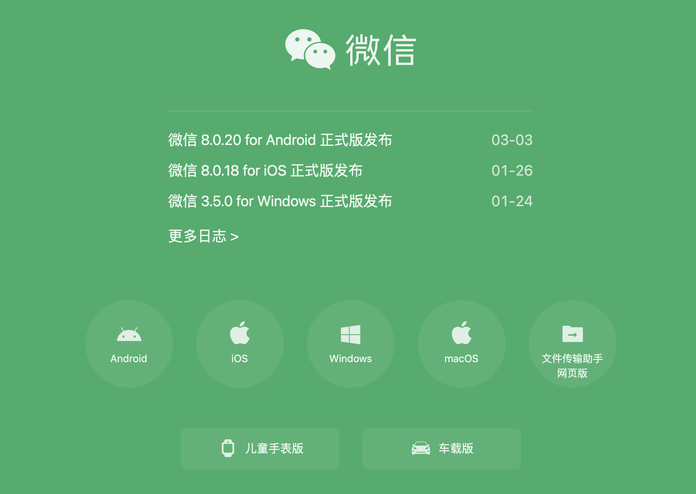

# 0-1Learning

## Mac电脑常用软件
  第一次用Mac的可能会发现，很多软件在windows平台有，mac上没有。
  
  windows下载下来的是exe，是无法被mac电脑识别的。
  
  Mac下载渠道也少得很，常见的下载渠道：APP store，官网，其他第三方网站。

  如何下载一个软件呢？

  - APP store
    
    - 直接点击下载就行，跟Iphone上是一样的，但软件较少，只能下载一些基础软件。
  - 官网
    
    - 一般的正规软件有官网的可能会提供mac下载通道，不过大部分可能是收费软件
  - 第三方网站
    - [xclient](https://xclient.info/)
    - [lemon](https://lemon.qq.com/lab/)
      
    - 大部分的软件的破解版都有，没有的再搜搜，还有软件下载量排行，按需下载即可

  安装步骤：
  - mac上一般下载下来的是.dmg文件，或者包装了一层.pkg文件
  - dmg就直接单机拖动到Applications文件夹就行了
    - 
  - pkg就双击，按照提示顺序安装就行
    - 

### 目录

- [必备软件](#必备软件)
- [文档软件](#文档软件)
- [设计软件](#设计软件)
- [音视频软件](#音视频软件)
- [Chrome浏览器插件](#Chrome浏览器插件)
  - [油猴脚本](#油猴脚本)
- [游戏软件](#游戏软件)
- [开发软件](#开发软件)

### 必备软件
- 一般软件：wechat，QQ，钉钉，腾讯会议等，还有影音、娱乐等软件，都可以在官网或者APP store中下载 
- 浏览器软件：
  - chrome：谷歌浏览器（快，支持各种插件，国内浏览器大部分采用的都是chromium的内核）
    - 国内官网地址：https://www.google.cn/intl/zh-CN/chrome/
  - firefox：火狐浏览器（也是老牌浏览器了，不用chrome的可以选择）
    - 国内官网地址：http://www.firefox.com.cn/
  - Edge：windows浏览器，在国内各端同步都不错（也是老牌浏览器了，不用chrome的可以选择）
  - safari：mac系统自带，可以与iphone无缝衔接
- office全家桶
  - word
  - excel
  - ppt
  - 说明：现在都需要破解，觉得麻烦的可以走淘宝
- 在线文档：
  - onenote：windows、mac、ios、android各平台账户互通，免费，只能说得益于windows的强大生态。推荐使用
  - 印象笔记、有道云笔记等：功能各有特色
- 翻译软件：
  - mate translate：推荐
  - google translate：现在好像不更新了
- 清理软件：
  - MacBooster：简单，功能实用
  - 腾讯柠檬清理
    - 官网：https://lemon.qq.com/
- 音视频播放软件
  - IINA：视频播放软件
- 下载软件
  - Downie：视频下载软件
  - Motrix：文件下载软件
- 其他软件
  - Alfred 4：工作流工具
  - SwitchResX：显示器分辨率切换工具
  - NTFSTool：NTFS U盘工具软件
  - OBS：直播推流软件
  - Snipaste：截屏软件
    - 官网：https://www.snipaste.com/
  - GIPHY CAPTURE：mac上gif制作软件,windows上可以用ScreenToGif
  - Parallels Desktop：虚拟化多系统工具,收费软件，可以找找破解版
- 翻墙软件：
  - ShadowsocksX-NG
  - V2rayU
    

### 文档软件
- drawio-desktop：开源的流程图软件，windows、mac都有（推荐使用开源软件）
  - 下载地址：https://github.com/jgraph/drawio-desktop
- Xmind/MindMaster：流程图、思维导图都可以画（收费、需要破解）
  - 下载地址：https://www.xmind.cn/
- OmniGraffle： Mac上流程图软件（收费、需要破解）
- ProcessOn： 免费在线流程图思维导图
  - 下载地址：https://processon.com/
- marktext：开源markdown文本编辑器。
  - github地址：https://github.com/marktext/marktext
  - 安装命令：brew install --cask mark-text
  - 直接下载：https://github.com/marktext/marktext/releases/download/v0.16.3/marktext.dmg
- Typora：markdown文本编辑器（不推荐了，已变为收费软件）

### 设计软件
- Adobe全家桶：
  - Ps(photoShop)：图片编辑
    - 官网地址：https://www.adobe.com/cn/products/photoshop
  - Pr(premier)：视频剪辑
    - 官网地址：https://www.adobe.com/products/premiere
  - AE(adobe after)：视频动效
    - 官网地址：https://www.adobe.com/cn/products/aftereffects
  - PDF(adobe arcobat)：PDF阅读器，激活后可以编辑
    说明：Adobe系列的软件都可以通过Creative Cloud平台去安装,破解可以用adobe zii破解，详情参加xclient网站
- Sketch：网页、图标、界面设计
- Principle：原型设计工具
- Axure：原型设计工具
- XD：Adobe原型设计工具
- figma：在线协作设计平台
  - https://www.figma.com/downloads/
- 取色器软件：
  - ColorSnapper2（设置Shift+Command+C 快捷取色）
  - Sip
- 图床：Ipic
  - 官网地址：https://ipic.ca

### 音视频软件
- 视频播放软件
  - IINA
  - Movist Pro
- Arctime：视频字幕制作，免费，支持windows和mac
  - 下载地址：https://github.com/acely/Arctime-Pro/releases/download/3.1.1/ARCTIME_PRO_3.1.1_MAC+.zip
- screenFlow：录屏软件
  - xclient下载即可
- quicktime player：Mac自带录屏软件
  - 录屏没有声音解决：soundFlow：https://zhuanlan.zhihu.com/p/343145329

### 游戏软件
- 暴雪：
  - 炉石
  - 魔兽
- steam：
  - dota2

  
### Chrome浏览器插件

chrome最好注册一个账户（需要翻墙），不同设备登录会自动同步插件、书签、保存的数据等
Chrome网上应用商店：https://chrome.google.com/webstore?utm_source=chrome-ntp-icon
国内的可以走插件猫：https://chrome.pictureknow.com/（下载后手动安装）

- chrome必装插件： 
  - Tampermonkey油猴脚本：脚本管理（更强的浏览器拓展和脚本管理工具）
  - AdBlock：屏蔽网页广告
  - 谷歌翻译：网页翻译必备
  - Proxy SwitchyOmega：chrome代理翻墙工具
  - EditThisCookie：cookie管理工具
  - Awesome Screenshot：截图与录屏
  - Talend API Tester：网页接口测试
  - JSONVue：json数据结构化展示
  - Octotree - GitHub code tree：github可视化代码树
  - Awesome Screenshot 截图录屏
  - Chrome清理大师：一键清理浏览器垃圾，让你的Chrome更快
  - Proxy SwitchyOmega：chrome代理翻墙

#### 油猴脚本
油猴本身就是一个插件，但这个插件又支持很多脚本。

脚本下载地址：
- GreasyFork：https://greasyfork.org/
- Userscript.Zone Search：https://www.userscript.zone/?utm_source=tm.net&utm_medium=scripts

常见脚本列表：
  - AC-baidu-重定向优化百度搜狗谷歌必应搜索_favicon_双列：https://greasyfork.org/scripts/14178
  - Github 增强 - 高速下载：https://greasyfork.org/scripts/412245
  - 懒人专用，全网VIP视频免费破解去广告、全网音乐直接下载、百度网盘直接下载等多合一版。：https://greasyfork.org/scripts/370634
  - 护眼模式：https://greasyfork.org/scripts/426377
  - 破解VIP会员视频集合：https://greasyfork.org/scripts/27530
  - 网页限制解除(改)：https://greasyfork.org/scripts/28497
  - 贴吧全能助手：https://greasyfork.org/scripts/26992
  - CSDN广告完全过滤：https://greasyfork.org/scripts/378351
  - 知乎增强
  - 购物党比价工具

---

## mac常用开发软件

### java开发环境：JDK(Java开发工具包)
官网地址：https://www.oracle.com/java/technologies/javase/javase-jdk8-downloads.html
- windows一般下载Windows x64，mac选择对应即可
- 直接官网下载，1.8版本就行，再往上用得比较少了，可能出现不兼容的问题
- 注意：会需要oracle账户，注册一个即可

### node开发环境
官网地址：`https://nodejs.org/zh-cn/download/`

- npm
  - 包管理工具
  - 官网地址：www.npmjs.com/

### 数据库：mysql
官网地址：https://www.mysql.com/cn/downloads/
注意：下载5.7版本即可，8.0以上版本会有很多类型不兼容
- 安装文件：https://cdn.mysql.com/archives/mysql-5.7/mysql-5.7.31-macos10.14-x86_64.dmg
- 使用brew安装
- 使用docker安装
- 使用npm安装

### 数据库管理工具：
- navicat： 
  - 官网地址：http://www.navicat.com.cn/
  - 注意：需要破解，mac可使用xclient网站下载破解，windows下载注册机破解
- DataGrip：
  - jetbrain出品的数据库管理工具
  - 官网：www.jetbrains.com/
- DBeaver：
  - 开源数据库管理软件，有授权问题的公司或个人可以使用
  - 官网：dbeaver.io/
  
### 项目部署容器：tomcat & nginx
- tomcat
  - 官网地址：http://tomcat.apache.org/
  - 注意：下载8.5或者更高即可
- nginx：
  - 官网地址：http://nginx.org/en/download.html

### 开发工具
首推jetbrain开发的编辑器
- 官网地址：https://www.jetbrains.com/
- 旧版本地址：https://www.jetbrains.com/idea/download/other.html
- 注意：IDEA和WebStorm需要破解，Android Studio不需要

  - java程序开发：IDEA
  - html网页开发：WebStorm html
  - android APP开发：Android Studio
- ios APP开发：XCode
- 其他编辑器：VS CODE, Sublime, HBuilder

### IDEA开发插件
- ignore：版本忽略，
- Lombok：简化代码，不用写get、set
- jrebel：热部署
- gsonFormat：gson解析实体
- maven helper：maven依赖检查
- alibaba Java Coding：阿里巴巴代码检查
- IdeaVim:Vim插件（默认键位是Ctrl+Alt+V）
- Frees-Mybatis：mybatis mapper跳转
- Easy-code：代码生成插件
- VisualVM：可视化查询VM结构

### 其他辅助开发工具
- 版本工具Git
  - 官网地址：https://git-scm.com/
- Navicat Premium：数据库访问工具
- Terminus：SSH访问工具（类似windows上的xshell）
  - mac使用Termius：https://www.termius.com/windows
  - Termius已更名：tabby。
  - 下载地址：https://github.com/cferdinandi/tabby。
  - 国内地址：https://gitee.com/mirrors/tabby
  - mac其他ssh：
    - Iterm2：https://www.iterm2.com/
    - Royal TS：https://www.royalapps.com/
- ForkLift：FTP工具
- Docker：Docker虚拟化
- Postman：接口测试工具
  https://www.postman.com/
- PowerDesigner：数据库设计工具
  http://powerdesigner.de/
- Medis：Redis客户端工具
- RedisDesktop：windows redis客户端工具
  https://redisdesktop.com/download
- Robomongo：mongo客户端工具
  https://robomongo.org/download
- Charles：代理拦截工具
- JMeter：压力测试工具
  - 官网地址 ：https://jmeter.apache.org
- JVisualVM：监控GC、内存、线程
  - 官网地址 ：http://visualvm.github.io

### 中间件

- 缓存Redis服务端
  - 官网地址：https://redis.io/
  - 客户端工具：windows使用redisDeskManager，mac推荐Medis
  
- 消息队列mq(rocket/kafka)
  - rocketMq：https://github.com/apache/rocketmq-externals
  - RocketMq-console可视化mq控制台：https://github.com/apache/rocketmq-externals。安装参考https://www.jianshu.com/p/5f70e34448ce
  - kafka官网地址：http://kafka.apache.org/downloads
  - kafka可视化工具：https://github.com/yahoo/CMAK
  
- ELK(ElasticSearch、Logstash、kibana)
  - ElasticSearch官网地址：elastic.co/cn/downloads/
  
- Nosql存储Mongodb
  - 官网地址：https://www.mongodb.com/try/download/community
  
- nacos：分布式配置中心。https://nacos.io/zh-cn/index.html
- skywalking：调用链监控。https://skywalking.apache.org/downloads/
- Confluence：文档管理平台
- jira：事件追踪。https://www.atlassian.com/software/jira/update
- jumpserver：开源堡垒机。https://github.com/jumpserver/jumpserver
- sqlaudit：开源数据库审计平台。https://github.com/hhyo/Archery
- nexus：maven私服。https://www.sonatype.com/download-oss-sonatype

- arthas：开源java诊断工具。https://arthas.aliyun.com/doc/

- jmeter功能和性能分析程序：https://jmeter.apache.org/download_jmeter.cgi
- jprofile：https://www.ej-technologies.com/download/jprofiler/version_92（使用参考：https://blog.csdn.net/wytocsdn/article/details/79258247）

- oos/minio
  - 官网地址：www.minio.org.cn/

- 其他中间件平台：
  - aliyun
  - AWS

### 常见安装方式
Brew安装：Mysql，Redis，grafana，nginx，ELK
Docker安装：Prometheus，Jenkins，minio
网站安装：skywalking，nacos
部署项目：Xxl-job，knife4j

